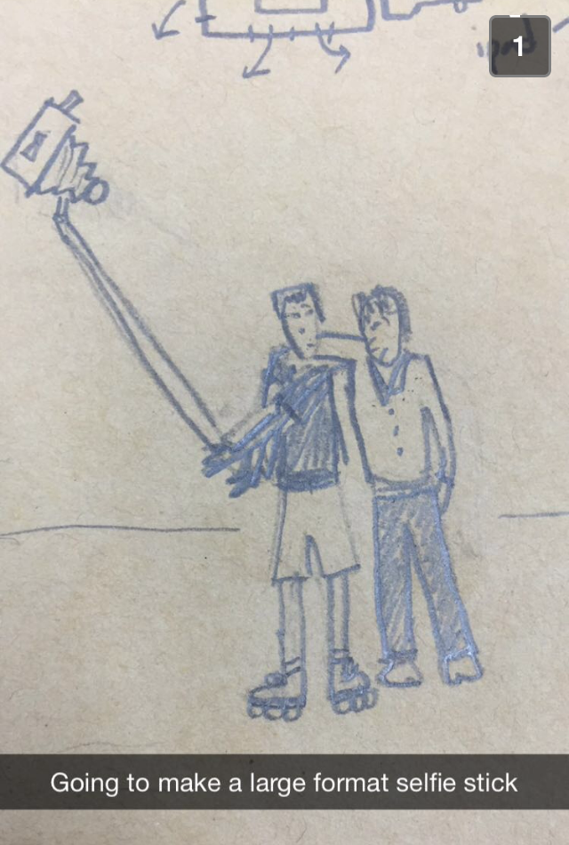
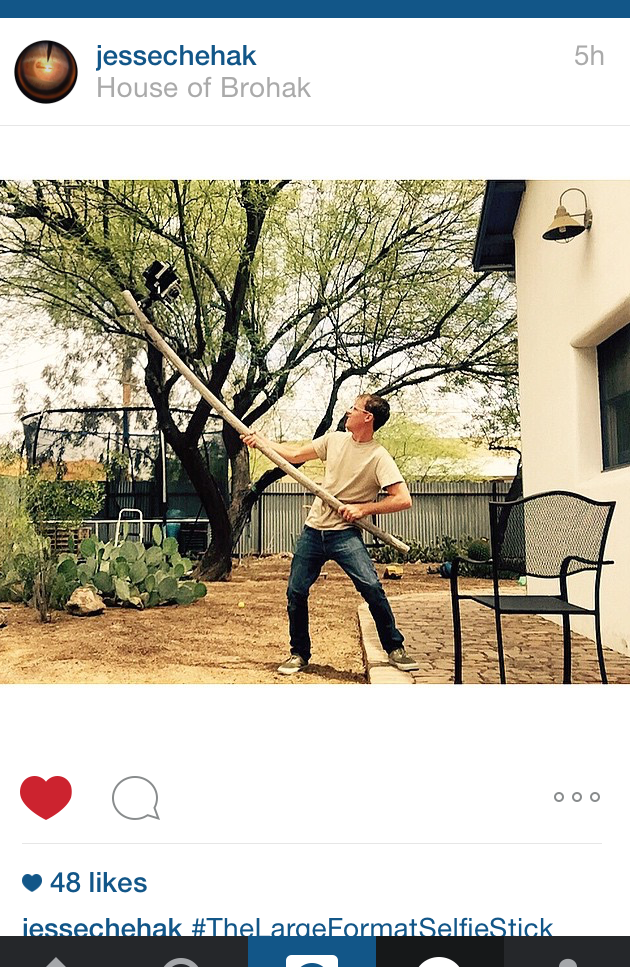
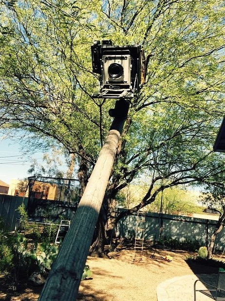
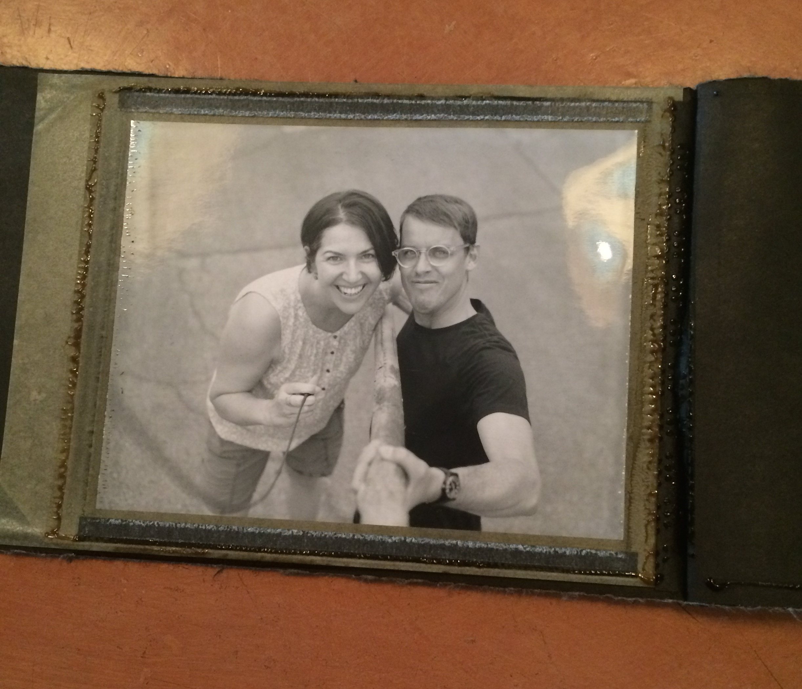

I was introduced to the Large Format Selfie Stick via Snapchat which, in hindsight, seems just perfect. As friends of mine know, I’ve developed a mild obsession with the app, on which the default setting is for photographs to disappear shortly after they are viewed. I’ll be writing about Snapchat more in posts to come, but for now I’ll say that the alternative it proposes to our cultural captivation with the promises of the archive has been irresistible to me. And so, it was fitting to find a sketch for the Large Format Selfie Stick in that conceptually charged viewing setting because it offered a glimpse – but just a glimpse – at an idea that seemed to simultaneously resist and embrace one of the most popular, and popularly-loathed, contemporary photographic manias: the selfie. It also seemed to address the heart of that loathing – at least that part of it which might be summarized as the large format photography community – while gently mocking its pretensions to superiority over the “common” photographers of daily life, people who have in the past been disparagingly referred to as amateurs, shutterbugs, hobbyists, or, my favorite, “enthusiastic Button Pressers”.

Despite my interest in the circulation and exchange of images through various social media platforms, I’m not particularly interested in selfies, on the whole, but I am interested in how cranky they make people (and mildly interested in how many branches of academic study have taken up studying selfies: there are scholarly study groups in selfies; conferences and panels devoted to selfies; and, certainly, many dissertations in progress, all from a range of academic fields including sociology, media studies, communication, and literature). By extension, I’m interested in how selfie sticks also elicit a certain disgust, and fascinated by the real cultural questions that have come up for museums and other institutions that must now navigate not just the rules of photography in their cultural spaces but also the rules governing selfie sticks. 

The idea alone prompted a number of questions: Was the Large Format Selfie Stick the key to ameliorating the disdain many serious photographers seem to naturally feel for the selfie, a form whose casual populism flies in the face of values that hold craftsmanship, careful composition, and thoughtful intention of purpose, so dear? Would people who hated the very idea of selfies, made on the fly with smartphone cameras and uploaded onto social networking sites to garner likes and comments, feel differently if they could make selfies with a “real” camera? Would it parse out which aspects of selfies and selfie sticks people hated most? (was it the little mobile camera? the awkward stick? the seemingly narcissistic subject? the instant circulation?)  Did the Large Format Selfie Stick, in fact, address the root of the anxieties of serious photographers in today’s age of photographic ubiquity? 

I almost never screenshot Snapchats (it’s the easiest way to save a Snapchat, but I mostly think of it as cheating myself out of a properly ephermeral experience), but I did screenshot the LFFS because, like everyone else, I like to think I know genius when I see it:

<figure class="figure">
	
	<figcaption>
		from May 2015
	</figcaption>
</figure>

<figure class="figure">
	
	<figcaption>
		(this lovely little drawing came later via text)
	</figcaption>
</figure>

The snap came from the photographer Jesse Chehak. Chehak is a “real” photographer, by which I mean he takes the medium very seriously, has produced several bodies of work (mostly made with large format cameras), knows his way around a range of photographic equipment, knows his photographic history, and identifies with the world of photography. He’s also conceptually-minded, experimental, and willing to engage with photography across the spectrum, from its most populist expressions to its tightest community of insiders. But the question of how, exactly, to engage with a cultural phenomenon while still retaining one’s artistic credibility is, I think, a very real question and a nuanced territory to tread.

I’ve seen enough brilliant and playful ideas sketched out in his studio that it somehow didn’t occur to me that Chehak would go to the trouble of actually fabricating the thing, and, anyway, it existed provocatively enough just as an idea and a sketch. But a few weeks later, this showed up on Instagram: 

<figure class="figure">
	
	<figcaption>
		
	</figcaption>
</figure>

And this, for a better view, tagged, naturally #TheLargeFormatSelfieStick:

<figure class="figure">
	
	<figcaption>
		
	</figcaption>
</figure>

Clearly I had to try it myself, so the next time I was in Tucson, where Chehak was living at the time (he’s since moved to Milwaukee with his family), we made a date. And I should be clear here: I’m not opposed to selfies and I’ve made plenty of them myself, whether or not I’ve posted them publically. (This 2012 essay by Jerry Saltz covers most of what I think is interesting and notable about selfies, and this recent article is a nice supplement for any ongoing confusion about what a selfie is.) The process of making this large format selfie, however, was both familiar and strange as two worlds collided in practice. First of all, as was clear from the initial images I had seen, but all the more evident in person: the contraption is a beast, made particularly unwieldy by the physics of extending a heavy object out a pole and trying to hold it from the other end. It was a two-person job: Chehak wrangled the 8-foot pole and camera and I had the honor of holding the shutter release cord. As there was one sheet of film in the camera, we made one exposure:

<figure class="figure">
	
	<figcaption>
		
	</figcaption>
</figure>

Choosing a large format camera typically signals that a serious project is underway: its use today, when a panoply of other options are available to capture photographic images, is, more than ever, an expression of desire for a photographic experience that is anything but casual. The Large Format Selfie Stick was, in this case, outfitted with a 4x5” Graflex press camera. And the choice of film is as significant as the camera: Polaroid Type 55. This particularly beloved film was discontinued in 2008 when the troubled Polaroid company ceased production of all instant film. Unlike typical Polaroid film that quickly produces a print, Type 55 is unusual in that its (relatively) instant development produces both a print and a negative. Since being discontinued, it has become highly sought after; boxes currently command several hundred dollars on eBay. It turned out that this particular exposure was one of 13 sheets of Type 55 film Chehak came across several months ago, each of which he intends to use with the Large Format Selfie Stick. It is fairly common, now, for photographers to collect discontinued and expired film, but I think it’s reasonable to assume that most of them are putting that paper – now perceived as precious and rare – to more seemingly serious ends. 

It wasn’t until later that I started wondering if we’d really made a selfie, after all. If we had, wouldn’t it be simpler to post on Instagram? Instead we had a negative that required its chemicals to be carefully washed off, and a print that had to be hand-coated in a fixing agent. We’d have to re-photograph it for it to exist outside of that moment and place and fulfill its selfie promise. But by the time I’d had that thought, we had both already made new photographs with our phones, compelled to digitally document our non-digital selfie because we knew it to be a singular occasion. I was even sure to document the print before Chehak pulled it out of its paper development housing to better preserve the object quality of the process. 

Ultimately, I can’t think of protests against selfies and selfie sticks without thinking of Alfred Stieglitz’s essay, “The Hand Camera and its Present Importance”, which he wrote in 1897 as he and his friends were grappling with what to make of all the amateur shutterbugs they saw as devaluing the craftsmanship of serious photography as the masses got their grubby mitts on handheld cameras. Photography had, at the time, recently been made appallingly easy by George Eastman’s newly launched Kodak camera, and the photographers who had been treating the medium as a potential art form were suspicious, at best. It’s an essay I include in my classes almost every year, and – I confess – it always makes me laugh: in a nutshell, Stieglitz – known as the father of American fine art photography – expresses that he has decided to embrace the pedestrian hand camera considered so lowly by his photographic peers, but only because he’s found a way to make it difficult: by standing for hours on a street corner in the blinding snow and howling wind, enduring the elements to get the perfect “snap”. (Serious photographers have always been gluttons for punishment.)

Stieglitz optimistically but mistakenly predicted that the “photography fad” was on its last legs in 1897, which he argued would be a blessing for anyone who considered himself a “champion of the tripod” (though he realized it would not be a blessing for camera manufacturers). He was wrong about the “fad” ending, but another point he makes continues to be relevant: manufacturers don’t always either know or market the possibilities of the technology or equipment they are using. Just because “hand cameras” (I put it in quotes because Stieglitz was using a 4x5 as a hand camera, which, in relation to an 8x10, it was) were typically associated with the craftless work of unthinking amateurs didn’t mean they had to be. And while it is perfectly obvious to point out that photography is an evolving medium, it’s a little bit harder to know what to make of the changes as they are happening. Maybe someone can do something interesting with a regular selfie stick – I’d like to think so. Instead of scorning their presence – or, at least, in addition to scorning their presence – I’d like to think there is room for a thoughtful or subversive or (gasp) disruptive approach to how we think about this new development. And that that possibility – that question – is, in fact, serious. As Chehak put it, “Isn’t that what serious photographers are always trying to do, understand what photography is?”
