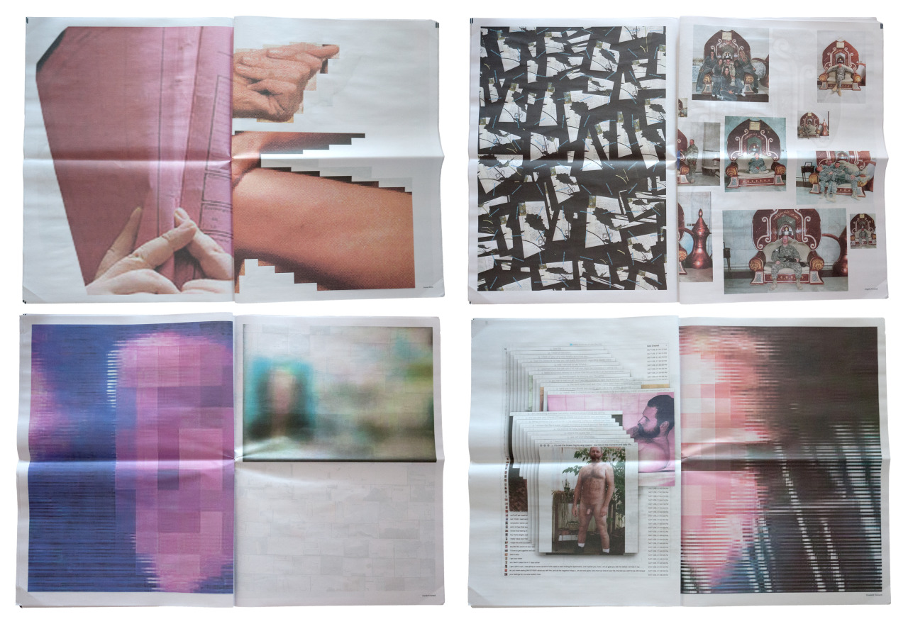
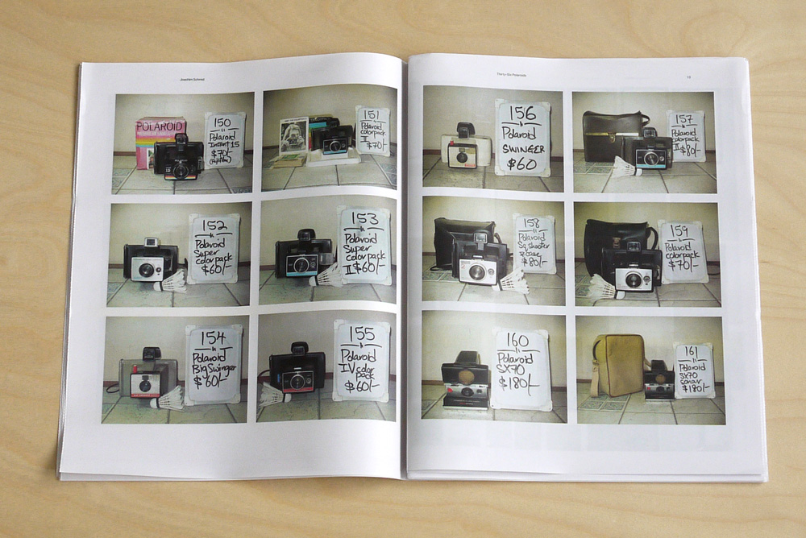
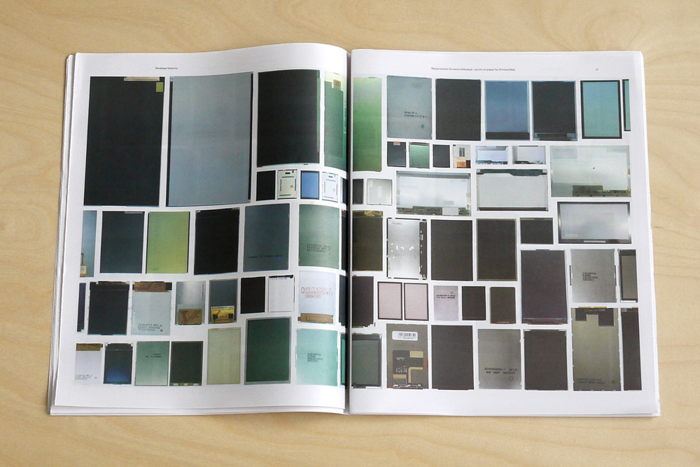
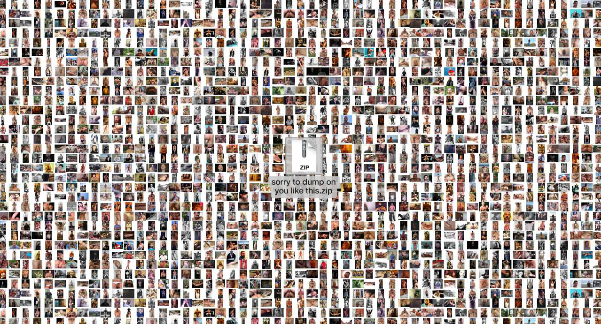
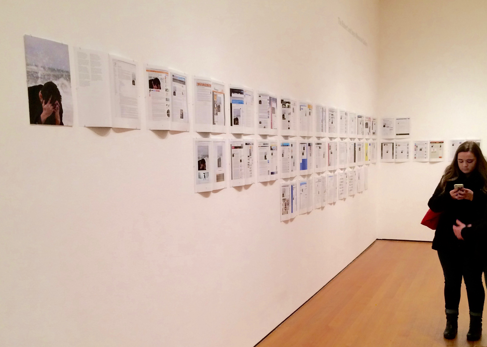
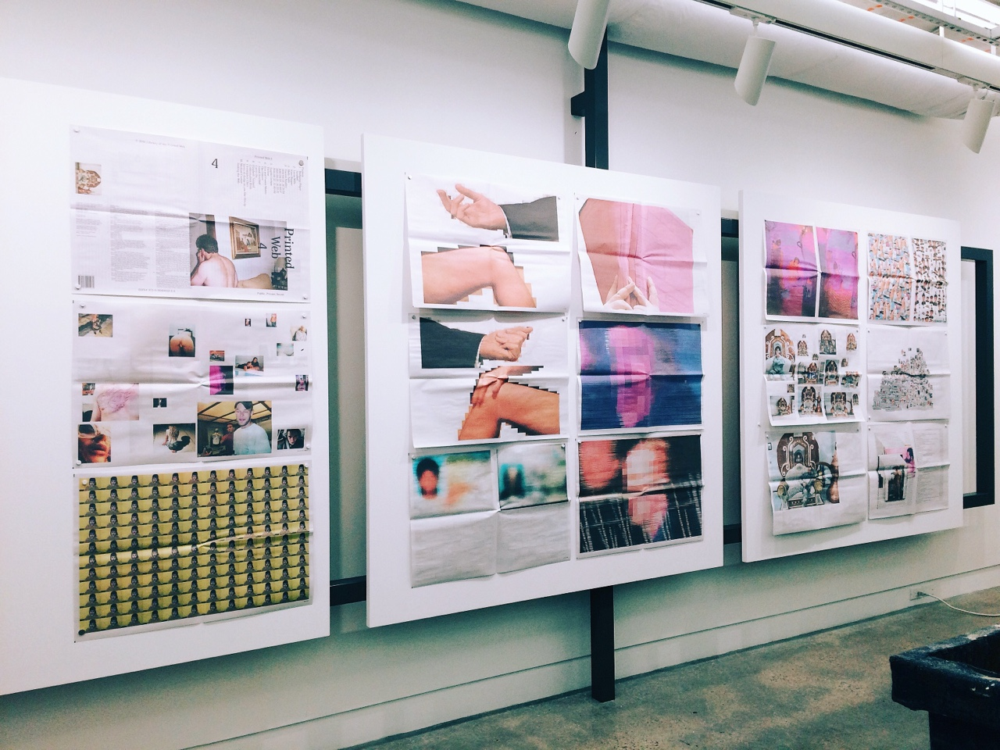
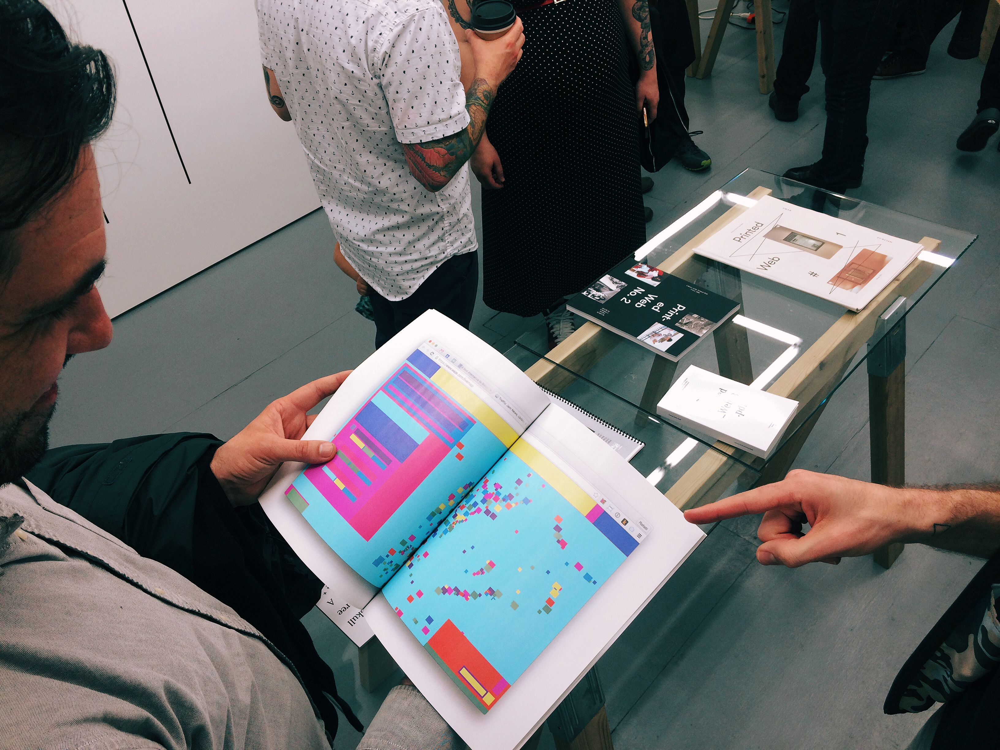
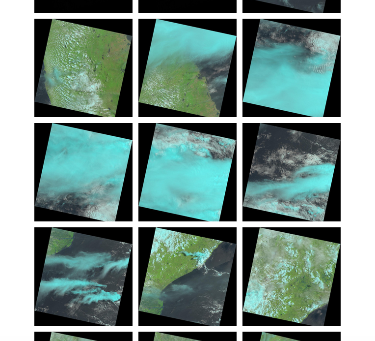
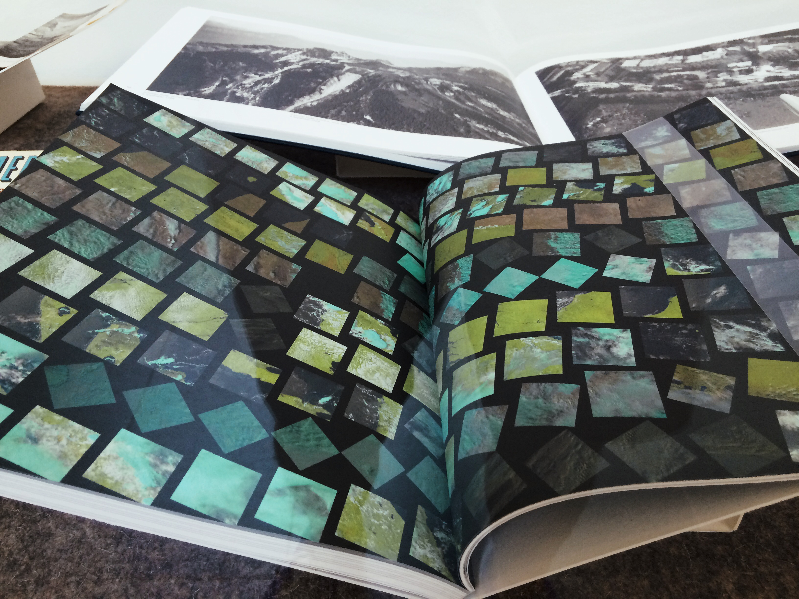

*Paul Soulellis is, [among many other things](http://soulellis.com/about/), the founder of [Library of the Printed Web](Printedweb.org), a project that encompasses a physical archive, research, teaching and experimental publishing. Printed Web #4, “Public, Private, Secret” debuted in June 2016 as a 40-page print-on-demand newsprint and PDF download featuring projects by [Wolfgang Plöger](http://www.wolfgang-ploeger.com/), [Lorna Mills](https://en.wikipedia.org/wiki/Lorna_Mills), [Molly Soda](http://mollysoda.tumblr.com/), [Travess Smalley](http://www.travesssmalley.com/), [Angela Genusa](http://cargocollective.com/angelagenusa), [Eva and Franco Mattes](http://0100101110101101.org/), [Anouk Kruithof](http://www.anoukkruithof.nl/), [Elisabeth Tonnard](https://elisabethtonnard.com/), and [Christopher Clary](http://christopherclary.com/), with a text titled “Folding the Web” by [Michael Connor](http://rhizome.org/profile/michaelconnor3/), artistic director of Rhizome. It was co-published with the [International Center of Photography](https://www.icp.org/) on the occasion of [“Public, Private, Secret”](http://www.publicprivatesecret.org/) (June 2016 – January 2017), the inaugural exhibition at ICP Museum’s new location at 250 Bowery, organized by curator-in-residence [Charlotte Cotton](https://www.icp.org/news/charlotte-cotton-joins-icp-as-first-curator-in-residence-for-250-bowery).*

**********************
<figure class="figure-lg">
	
	<figcaption>
	Page spreads from Printed Web #4
	</figcaption>
</figure>

**Kate Palmer Albers:** Immaterial modes of photography are being used with ever greater frequency by both artists and casual photographers. In many cases, artists are working both with material and immaterial photographic images. I’m curious about how this shift affects the exhibition, collecting, and preservation goals or priorities of those working in photography generally, and your work with Library of the Printed Web, specifically. To start, what are the challenges or opportunities you face in publishing photographs—or other work—made in immaterial, or partially immaterial, modes?

**Paul Soulellis:** These are exactly the challenges and opportunities that I’m interested in with the Printed Web project. Since I work primarily with artists who engage with network culture, materiality is always a concern. So these challenges come in various forms. I find that the more immaterial or ephemeral the artist’s work, like a fleeting screenshot, or something grabbed directly from the web, the more I can elevate its perceived value, simply by shifting its form and context. And specifically, giving it the context of a publication. *Printed Web #3*, which was an open call, was filled with this kind of work—lots of single JPGs, screenshot assemblages, desktop gestures.

When these quick images are committed to haptic substrate (like paper or fabric), and then multiplied and dispersed, they take on new kinds of value. Printed zines and books are meant to circulate by hand, which can be a more considered action, or at least a slower one. So this kind of circulation value might be quite different from how a JPG or GIF moves on digital networks. But I’m most excited when I’m able to do both—to simultaneously publish both material and digital versions of these works, like when I post a PDF of a printed publication online and set it in motion. This allows me to experiment with multiple positions at once, and it sets up a kind of vibrational quality, as the works exist in various states. It's this lack of fixity that allows me to frame Printed Web as a digital project.

**KPA:** I want to pause on what you’ve said here about value, and I really like this idea of a “vibrational quality” of images or objects occupying multiple positions at once. I’ve been thinking about ways that images accrue value in our culture, whether material or immaterial, and I think you’re right that making something material almost automatically elevates it, maybe even analogously to how photographing something from the world elevates it—a  small act of paying attention, of extracting something from a larger and otherwise almost imponderable array, that becomes contagious. I’m most curious, though, about how it can work either the other way around, or simultaneously (“vibrationally”, I suppose)—how the different forms work in concert to produce a kind of value that might be a bit more foreign than object value. And I wonder how that kind of value is expressed or articulated.

**PS:** I definitely see the vibrations expanding in multiple directions. An obvious example might be how digitizing books or archives can suddenly open up access to otherwise unseen material objects. The value increases because the digital copy is created, circulated and ultimately locatable on the network (encoded). This idea that we might be flooded with digital copies while the original artifact disappears (or remains illusive) reverses the older model of printed copies dispersed haphazardly into the world, forever lost. So I think the value that you’re asking about can be expressed in the idea of the copy. So many artists have explored this, from Sherrie Levine’s *After Walker Evans* (1981) to Michael Mandiberg’s *After Sherrie Levine* (2001). David Horvitz’s *Mood Disorder* (2015) is the perfect example of the copied image that increases in value and meaning as it circulates. Another is *The Others* by Eva and Franco Mattes, which I just published in *Printed Web #4*—10,000 photos appropriated from unaware users and re-circulated in new contexts (for this version, they selected 52 images).    

**KPA:** Do you find that your interests or considerations shift or differ depending on whether something is considered vernacular material vs. fine art?

**PS:** Ideas about vernacular material and fine art naturally mix within Printed Web, and I think this is one of the strengths of the project. So far, I have mostly engaged with artists. I think of Printed Web as a curatorial practice, so I’m interested in how artists are working with the network's new conditions of materiality, and how this is informing (and changing) larger trajectories and discourse within art history.

<figure class="figure">
	
	<figcaption>
	Printed Web #1 spreads featuring Joachim Schmid's "Thirty-Six Polaroids", 2014
	</figcaption>
</figure>

<figure class="figure">
	
	<figcaption>
	Printed Web #1 spread featuring Penelope Umbrico's "Replacement Screens", 2014
	</figcaption>
</figure>

In any issue of Printed Web we’ll find artists working with the accumulation of material afforded by network conditions. I think of these artists as collectors, grabbing stuff from one archive or platform and re-staging it on another, in order to articulate something about our relationship with network culture. We see this with Penelope Umbrico’s *Replacement Screens* and Joachim Schmid’s *Thirty-Six Polaroids* projects in *Printed Web #1* (2014), and Christopher Clary’s investigation of web-based porn and images of masculinity in “Sorry to dump on you like this.zip” in *Printed Web #4* (2016). I find these projects to be most effective when they position the material in a straight-forward way, presenting the accumulation itself as a formal composition. Kenneth Goldsmith characterizes these works as “dumb”—amplifying one specific condition and leaving it at that, like an ethnographic study. Although the visual result is usually anything but simple.

<figure class="figure-lg">
	
	<figcaption>
	Screenshot of download page for Christopher Clary's "Sorry to dump on you like this.zip" on Rhizome.org
	</figcaption>
</figure>

**KPA:** That particular trio of examples—Umbrico, Schmid, Clary—allows me to ask more specifically about your use of the term “substrate” above. There you used “substrate” conventionally, to talk about a material surface onto which something (like an image) is overlaid, or printed, but I know you also think a lot about different types of immaterial substrates… which actually have very specific parameters, different types of possibilities and limitations (and “immaterial” is probably not the best word here for just those reasons). How important do you think it is for viewers to be aware of the substrate, or shifting substrates, as part of the content?

**PS:** I find substrate to be essential, because whether it is material or not, it is political. Ultimately, these surfaces—or platforms, say, if an image is posted on social media or a bulletin board—provide context. And context changes the meaning of an artist’s work. I think it’s our responsibility as readers, viewers and curators to examine substrate as we search for meaning. Does the work acknowledge how it’s been printed, and who can access these copies? Has the artist created work that can occupy several (social, commercial) positions, depending on how it flows from one substrate to another—or is it locked into a fixed relationship with its host? Can I change the work’s context myself, say, if the primary experience of the work is to download it to my desktop? Questions like these are critical when interpreting works that exist in relation to fluid networks. Less fixity means more opportunities to create (or shift) meaning.

**KPA:** You know I’m interested in how museums and curators (or, photo institutions generally) are incorporating programming or experimenting with exhibiting practices to accommodate photographic work that doesn’t follow a model that is typical for a photography department or institution (which might be characterized as a print that can be hung, framed, or boxed in a standard print room, solander box, or gallery configuration)... what has your experience been either (or both) with exhibiting Printed Web, or your seeing work you’ve printed exhibited?

**PS:** When I began Printed Web it was with a strong idea to explore the circulating publication as exhibition. I was directly inspired by Seth Siegelaub’s *[Xerox Book](http://www.primaryinformation.org/product/siegelaub-carl-andre-robert-barry-douglas-huebler-joseph-kosuth-sol-lewitt-robert-morris-lawrence-weiner/)* (1968) and other Siegelaub projects that positioned the group exhibition outside the context of the gallery system and within the container of the publication. Shortly thereafter I learned about Mel Bochner’s *[Working Drawings and Other Visible Things on Paper Not Necessarily Meant to Be Viewed as Art](https://www.specificobject.com/objects/info.cfm?inventory_id=9648&object_id=5079&page=1&options=#.V5EM1I5bxFU)* (1966), which was less about circulation and more about an unconventional presentation of a group show within a series of loose-leaf binders, exhibited on pedestals within a gallery space. Here, the book form was an essential aspect of the work (binding and assembling a collection of material), but because the books don’t circulate, they are experienced more as artifacts.

At that point I began to imagine how an artist’s publication might occupy multiple material positions, both as circulating copies and as a more fixed presentation of the work in space. At MoMA’s [“Ocean of Images”](http://www.moma.org/calendar/exhibitions/1539) show last year Horvitz’s *Mood Disorder* was exhibited as multiple copies of the publication, each open to a different spread and pinned to the wall. For me this was a stunning display and I think it was the first time that I saw a publication presented in a way that both reinforced its “publication-ness” and enabled a physical, visual experience of the entire work at once, in space.

<figure class="figure">
	
	<figcaption>
	"Mood Disorder" by David Horvitz on view at the Museum of Modern Art in Ocean of Images
	</figcaption>
</figure>

I brought up the Horvitz example as a primary reference when Charlotte Cotton and I discussed how to exhibit *Printed Web #4* for “Public, Private, Secret” at International Center of Photography, and we did something similar. Each spread was shown on the wall by using multiple copies of the publication. In this case, since the project was printed as a loose folio of newsprint sheets, we were easily able to separate the pages and fix them to the wall with magnets.

<figure class="figure-lg">
	
	<figcaption>
	Printed Web #4 on view in "Public, Private, Secret" at International Center of Photography, 2016
	</figcaption>
</figure>

Typically, my publications are displayed as objects to be handled (like here at “Publish or Perish,” Transmitter Gallery, Brooklyn, April 2016), which sometimes feel “retail-y” but ultimately this is a very good way to experience the work. The viewer is able to engage directly with the publication. Because Printed Web publications are cheaply printed, they show the honest wear and tear of handling. I don’t mind that they bear these physical effects; this is a kind of evidence of the publication’s haecceity (its “what-it-is”), with its own material lifespace. I think of my publications as “poor media.” Because Printed Web is always print-on-demand, copies are easily replaced.

<figure class="figure">
	
	<figcaption>
	Printed Web publications displayed at Transmitter Gallery, Brooklyn, NY, April 2016
	</figcaption>
</figure>
Right now, *Printed Web #2* (2014) is included in a small show at MoMA Library organized by Jennifer Tobias. A single spread of James Bridle’s [*laaaaaaandsat.tumblr.com*](http://laaaaaaandsat.tumblr.com/) project is shown. It’s exhibited as an object under glass, which works well thematically for the exhibition, highlighting a portion of a single artist’s work. But the viewer has no agency to explore the publication; it’s a more conventional museum display of printed matter that privileges institutional control over user engagement. I’m not against this kind of presentation but it’s a less effective way to explore the specifics of the Printed Web project, like print-on-demand, tactility, assembling, poor media, etc.

<figure class="figure">
	
	<figcaption>
	Screenshot of James Bridle's "laaaaaaandsat.tumblr.com"
	</figcaption>
</figure>

<figure class="figure">
	
	<figcaption>
	James Bridle's "laaaaaaandsat.tumblr.com", in Printed Web #2, on view at current MoMA library exhibition, "Aerial Imagery In Print, 1860-Today", 2016
	</figcaption>
</figure>

**KPA:** Your phrase “poor media" makes me think of [Hito Steyerl’s “In Defense of the Poor Image”](http://www.e-flux.com/journal/in-defense-of-the-poor-image/) and what she’s articulated about how we might value the qualities of degraded, corrupt, low-res, or otherwise seemingly compromised forms of images -- images with which, as she puts it, “one might imagine another form of value defined by velocity, intensity, and spread.” Steyerl covers a lot in that essay, and I’m certainly sympathetic with what I take as the central impulse of it. So what I wonder is how you see the relationship between poor images (which I understand to be -- within the context of Steyerl's essay, anyway -- always immaterial) and poor media, which I understand in your use above as perhaps a material extension of a related value system.

**PS:** My use of the phrase “poor media” comes directly from Silvio Lorusso’s [“Digital Publishing: In Defense of Poor Media,”](http://silviolorusso.com/digital-publishing-in-defense-of-poor-media/) published on his own website as well as in *Printed Web #3* (2015). Silvio begins with Steyerl’s ideas about the poor image as loss of resolution and applies them directly to different modalities in digital publishing, like the PDF and print-on-demand. He says that poor media is “characterized by the conscious, serene renunciation of embellishments in favor of accessibility and spread.” For me this is best articulated by contrasting the high-end photobook with something like a cheap print-on-demand zine. Both contain images that have been printed on paper, but the social, commercial (and perhaps cultural?) implications are radically different. Silvio’s text has become a bit like a manifesto for my Printed Web project.  

**KPA:** What audiences do you find are most open to and interested in the kind of work you’re printing?

**PS:** Printed Web’s territories include photobook, artists’ books, zine and net art worlds. I research, teach and write about experimental publishing, so this naturally extends the project to audiences who engage with me in this work, often through [Rhizome](http://rhizome.org/), where I write and curate, and Rhode Island School of Design, where I teach. My consistent presence at a range of art book fairs and at events like [Internet Yami-Ichi](http://yami-ichi.biz/nyc/) means that I can build a community of fans and followers with face-to-face contact. This has become an extremely important way for me to distribute Printed Web, because it allows me to position discourse and conversational exchange at the center of the project. I also find that the artists that I work with are themselves a primary audience, each extending the project into their own networks and communities of followers.

All of this is very DIY and it’s why I consider Printed Web to be “publishing as artistic practice,” outside the normal structures of conventional publishing. By keeping the work a safe distance from commercial concerns I have the freedom to build community on my own terms and easily integrate real-time discourse into my practice (exactly as we are doing right now with this interview!).

**KPA:** It’s somehow counterintuitively fitting that face-to-face conversation remains so key to distributing the content (intellectual and material) of Printed Web. And I’m really glad to know about Internet Yami-Ichi—I almost can’t understand why there hasn’t been an iteration in Los Angeles yet.

**PS:** I’m sure there will be soon. In [“Publishing as Artistic Practice”](http://www.sternberg-press.com/index.php?pageId=1640&bookId=533&l=en) Annette Gilbert writes that “the places where the communities can organize, network, exchange, consolidate, and develop are of increasing importance.” She describes these as *rooms of production* (Publication Studio), *rooms of trade* (the book fairs), and *rooms of reception* (Wendy’s Subway). I believe that “publishing’s sociality as a form of artistic practice,” as she puts it, is central to my practice. I see these physical rooms of production, trade and reception becoming even more significant as communities discover and broadcast them to the *network rooms* (my phrase) that have become our new norm.

*********************************

*Our conversation took place in the shared, yet asynchronously occupied, room known as Google Docs, from June 25 – July 13, 2016.*

##### Further reading:
- David Senior and Sarah Hamerman, "[Screen life and shelf life: critical vocabularies for digital-to-print artists’ publications](../assets/pdfs/Senior_Hamerman_ScreenLife_ShelfLife.pdf)," *Art Libraries Journal* / Volume 41 / Issue 03 / July 2016
- Paul Soulellis, ["The Download: sorry to dump on you like this.zip"](http://rhizome.org/editorial/2015/nov/12/the-download/) (*Rhizome*, November 2015)
- My *Circulation/Exchange* post on David Horvitz's [*Mood Disorder*](http://circulationexchange.org/articles/Online_surrogates.html) (May 2016)
