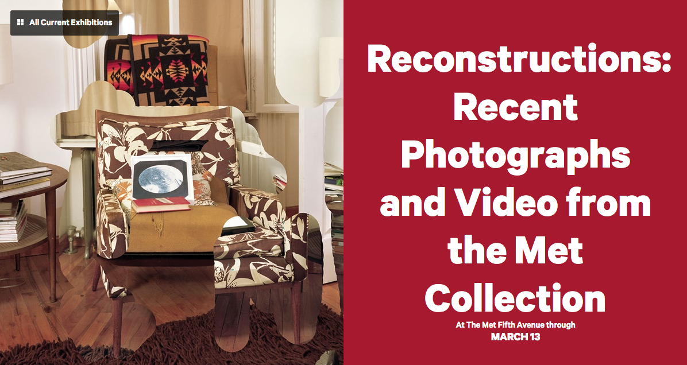
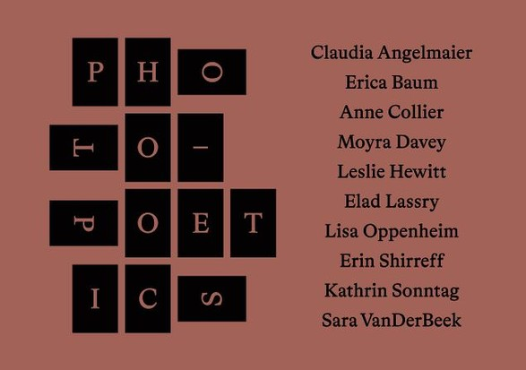
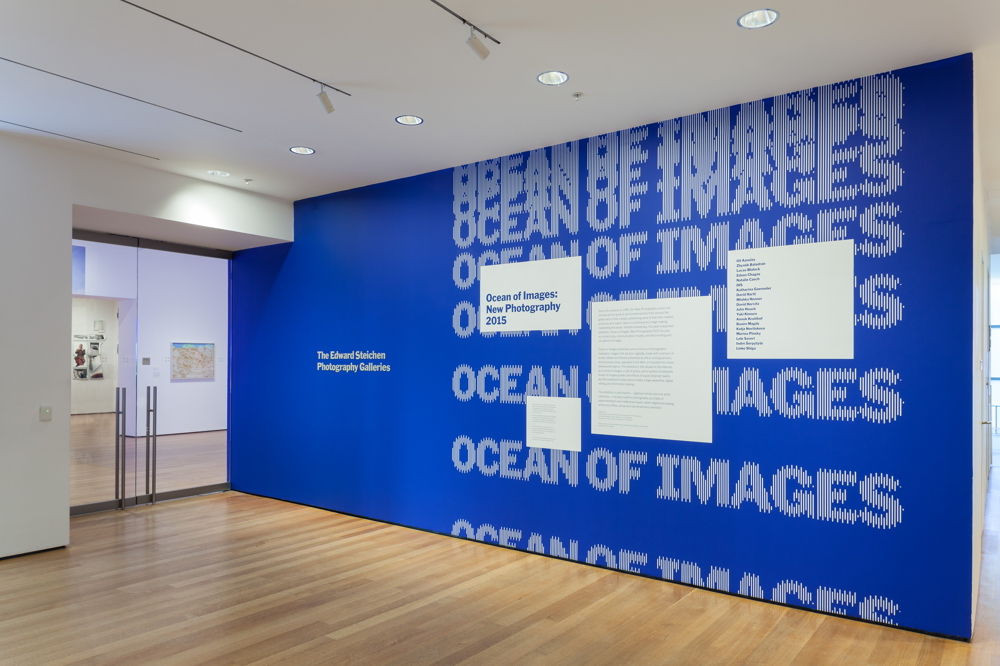

On a visit to New York last month, I was struck by the different ways in which three major museums—MoMA, the Guggenheim, and the Met—were addressing the relationship between physical and immaterial photographs, their modes of circulation, and artists’ responses to a contemporary experience of multiple modes of photographic imagery. Given the variety of work on view (and a few notable overlaps), the curatorial frameworks grappled with similar themes. Below, I’ve transcribed the exhibition titles and wall texts, as well as exhibiting artists, as a snapshot of the varied current artistic and institutional response to an “ocean of images” (MoMA), the “sea of photographic images” (the Met) or “photography at a moment when the medium seems poised to evaporate into digital oblivion” (the Guggenheim).

Artists and curators alike are grappling with the relentless movement of photographic images in and through these multiple forms—whether that is conceived as “complex negotiations between the old order and the new networks that silently and invisibly shape individual and collective experience” (the Met); an argument that "'real-time looking' is closer to reading than the cursory scanning fostered by the clicking and swiping functionalities of smartphones and social media” (the Guggenheim); or that photography is “a field of experimentation and intellectual inquiry, where digital and analog, online and offline, virtual and real dimensions intersect” (MoMA).

It’s difficult not to sense a degree of temptation to draw allegiances. But I remain most compelled by work—curatorial or artistic—that manages to set the seemingly contradictory modes of the photographic image into productive dialogue with one another, rather than disavowing one for the other. That said, it’s worth noting that the one object in all three shows that stopped me in my tracks and left me slack-jawed with visual appreciation was one that has almost nothing to do with this set of themes—and would be pointless to try to reproduce in print or on a screen: Miles Coolidge’s *Coal Seam, Bergwerk Prosper-Haniel #1*, a 2013 ink-jet print. [(And it's smart work, to boot.)](http://artillerymag.com/miles-coolidge/)

##Reconstructions: Recent Photographs and Video from the Met Collection##
[On view at the Metropolitan Museum of Art through March 13, 2016](http://www.metmuseum.org/exhibitions/listings/2015/reconstructions)

<figure class="figure">
	
	<figcaption>

	</figcaption>
</figure>

*This installation, the thirteenth since the Joyce and Robert Menschel Hall for Modern Photography opened in 2007, is a snapshot—not comprehensive, but representative—of the collecting interests of the Department of Photographs through recently acquired works made by artists during the last seven years. The concept of reconstruction chimes with many of the works that may be seen, at least in part, as indirect responses to how perception and cognition are being remapped to accommodate our newly bifurcated existences—online and "in real life.”*

*The notion that we swim in a sea of photographic images that shapes how we see ourselves and the world felt new in 1989 and prescient in 1968, but with the rise of the Internet and social media, this condition is so obvious as to be useless. With one foot in cyberspace and the other on an unstable terrain of accelerated change, our daily lives and our deepest subjective recesses—our relationship to ourselves, to one other, and to things—are constantly being reconstructed along digital lines, with cameras serving as almost bodily appendages to interface between these two realities. In this context, the seamless digital "restoration" of dazzle camouflage to a World War II battleship, the viral spread of Photoshop mishaps in an interior view, or the simple folding back of a book page can be seen as complex negotiations between the old order and the new networks that silently and invisibly shape individual and collective experience.*

**Exhibiting artists**

- Thomas Bangsted
- Erica Baum
- Shannon Bool 
- Lucas Blalock
- Sarah Charlesworth
- Michael Clegg and Margin Guttmann
- Miles Coolidge
- Moyra Davey
- Roe Ethridge
- Adrià Julià
- Matt Keegan
- Owen Kydd
- Luis Úrculo

*Organized by Doug Eklund*

##Photo-Poetics: An Anthology##
[On view at the Guggenheim Museum through March 27, 2016](http://www.guggenheim.org/new-york/exhibitions/on-view/photo-poetics-an-anthology)

<figure class="figure">
	
	<figcaption>

	</figcaption>
</figure>

*This exhibition features the work of ten contemporary artists who explore the medium of photography. The photographs, slide shows, videos, and film on view—poetic in form, concept, and tone—collectively document a development in art of the past decade.*

*These artists are fascinated by the material manifestations of photography and pursue practices that center on the creation of images as objects. Each artist contemplates the nature, traditions, and magic of photography at a moment when the medium seems poised to evaporate into digital oblivion. They rematerialize the photographic image through meticulous printing, using film and other disappearing technologies, and by creating photo-sculptures, installations, and artist’s books. While these artists are invested in exploring the processes, supports, and techniques of photography, they are also deeply interested in how photographic images circulate. Theirs is a sort of “photo poetics,” an art that self-consciously investigates the laws of photography and the nature of photographic representation, reproduction, and the photographic object.*

*Drawing on the legacies of conceptual as well as vernacular photography, these artists document still-life arrangements created in their studios. They play with the genres of commercial and amateur photography, and often include representations of image-bearing printed matter, such as books, magazines, postcards, record covers, and snapshots. Their motivations for appropriating these items are complex, ranging from the cultural and historical significance of the photographs to the personal associations they evoke.* 

*Photographs animate the present through their unique, visceral connection to the past. They are memory machines, inherently elegiac, and some of these artists harness this quality to reflect on the passage of time, and to find the sublime in the mundane aspects of daily life. Others use found text to create concrete poems, or are inspired by a specific author’s words. Ultimately, when artists juxtapose archival images in new configurations, the resulting photographs provide a syntax or meter to be parsed. The works in this exhibition, rich with detail, reward close and prolonged regard; they ask for a mode of looking, in real time, that is closer to reading than the cursory scanning fostered by the clicking and swiping functionalities of smartphones and social media.*

**Exhibiting artists**

- Claudia Angelmaier
- Erica Baum
- Anne Collier 
- Moyra Davey
- Leslie Hewitt
- Elad Lassry
- Lisa Oppenheim
- Erin Shirreff
- Kathrin Sonntag
- Sara VanDerBeek.
 (and kudos to the curators for not pointing out the gender balance as a part of the exhibition’s organizational logic)

*Organized by Jennifer Blessing and Susan Thompson*

##Ocean of Images: New Photography 2015##

[On view at the Museum of Modern Art through March 20, 2016](http://www.moma.org/calendar/exhibitions/1539?locale=en)

<figure class="figure">
	
	<figcaption>

	</figcaption>
</figure>

*Since its inception in 1985, the New Photography series has introduced the work of one hundred artists from around the globe early in their careers, presenting some of the most creative practices and urgent ideas in contemporary image making. Celebrating the series’ thirtieth anniversary, this year’s expanded exhibition, Ocean of Images: New 
Photography 2015, focuses on connectivity, communication models, and the branding and circulation of images.*

*Ocean of Images examines various forms of photographic mediation: images that are born digitally, made with scanners or lenses, edited and filtered, presented as still or moving pictures, distributed as zines, uploaded to the Web, or morphed into three-dimensional objects. The exhibition’s title alludes to the Internet, as a vortex of images, a site of piracy, and a system of networks. Ocean of Images probes the effects of a post-
Internet reality and the questions it raises about virality, image ownership, digital editing, and information sharing.*

*The exhibition’s participants—eighteen artists and one artist collective—critically redefine photography as a field of experimentation and intellectual inquiry, where digital and analog, online and offline, virtual and real dimensions intersect.*

**Exhibiting artists**

- Ilit Azoulay 
- Zbyněk Baladrán 
- Lucas Blalock 
- Edson Chagas 
- Natalie Czech 
- DIS Collective
- Katharina Gaenssler 
- David Hartt 
- Mishka Henner 
- David Horvitz 
- John Houck 
- Yuki Kimura 
- Anouk Kruithof 
- Basim Magdy 
- Katja Novitskova 
- Marina Pinsky 
- Lele Saveri 
- Indrė Šerpytytė 
- Lieko Shiga 

*Organized by Quentin Bajac, Roxana Marcoci, and Lucy Gallun*

####Relevant reviews####
[Martha Schwenderer in the *New York Times*](http://www.nytimes.com/2016/01/01/arts/design/review-metropolitan-museum-looks-at-photos-that-may-last.html)

[Loring Knoblauch in *Collector Daily*](https://collectordaily.com/ocean-of-images-new-photography-2015-moma/)

[Kathleen Caulderwood in *American Photo*](http://www.americanphotomag.com/photo-poetics-an-anthology-examines-role-photographic-object)

[Holland Cotter in the *New York Times*](http://www.nytimes.com/2015/12/04/arts/design/roots-of-conceptual-art-caught-by-a-cameras-eye.html)

[ Stanley Wolukau-Wanambwa on the *Aperture* blog](http://aperture.org/blog/review-photo-poetics-anthology/)

