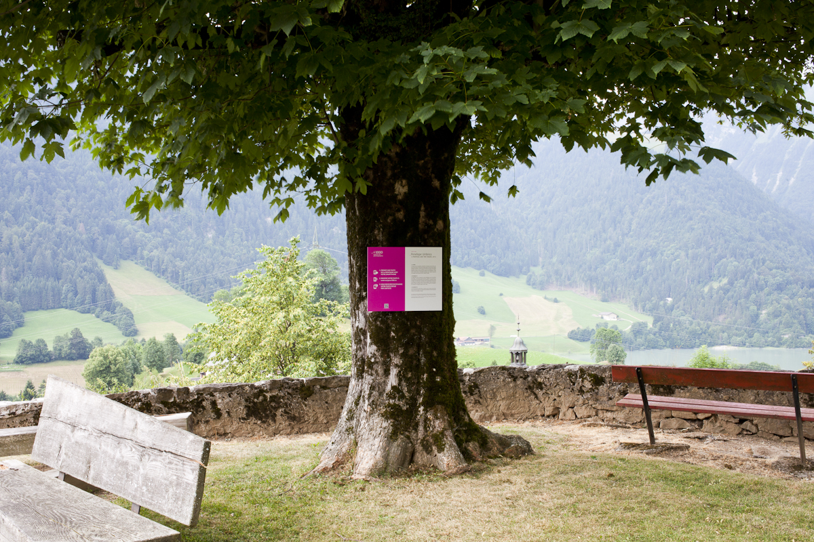
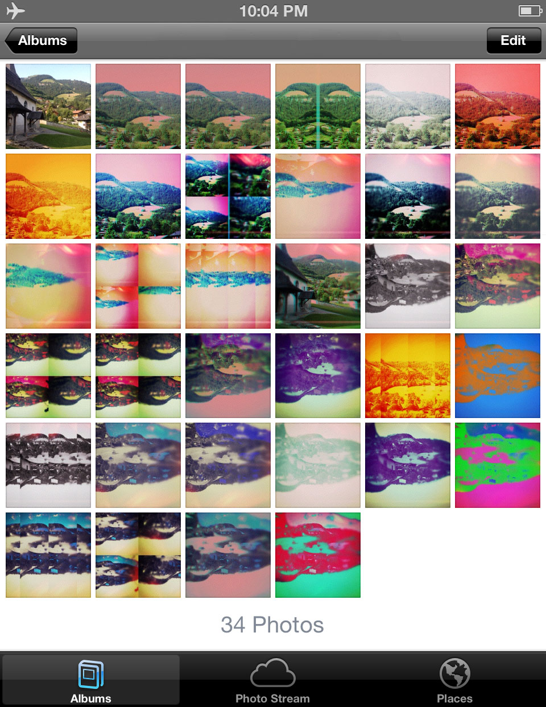
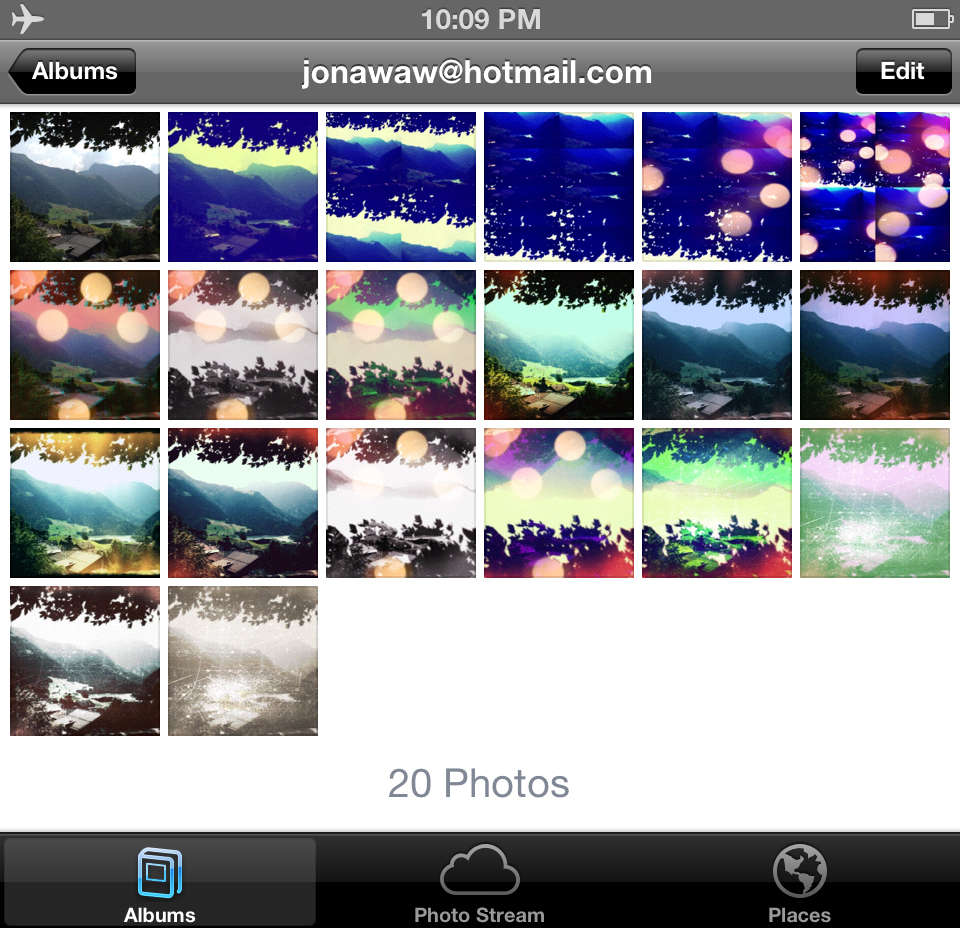
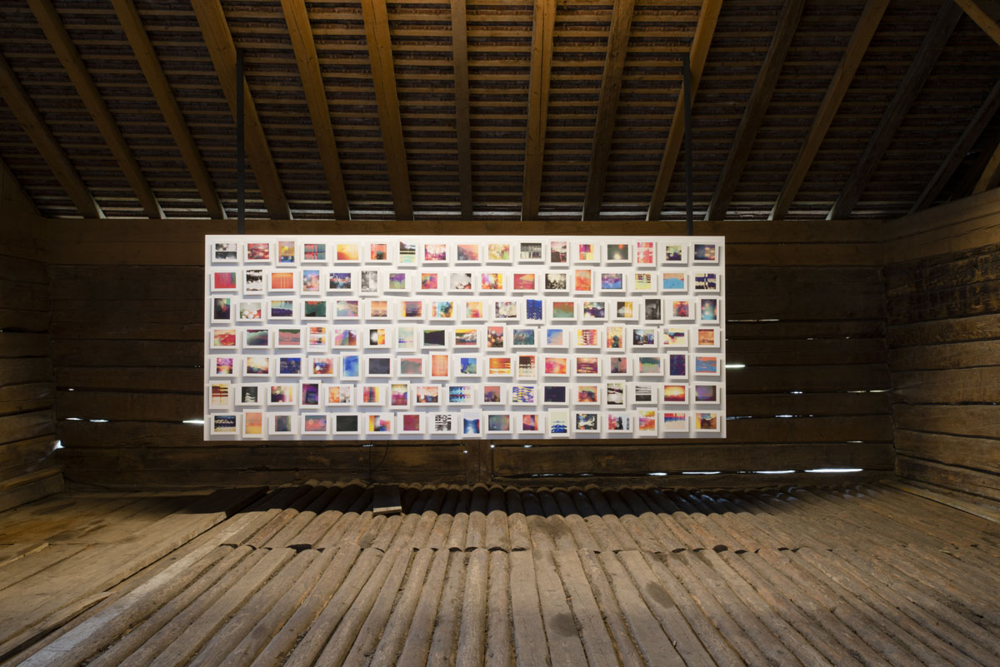

Earlier this year, the New York-based artist [Penelope Umbrico](http://www.penelopeumbrico.net) started an Instagram feed devoted to her project, “A Proposal and Two Trades,” which was initially conceived two years ago for the 2013 Alt+ 1000 Festival de Photographie, a biennial event in the Swiss Alps village of Rossinière. The continuous stream of images struck me as a natural home for this ongoing project: a perfect example of an artist taking seriously both the possibilities and parameters of a currently popular platform, and, in a particularly mobile manner, extending the project’s commitment to moving images through material and immaterial spaces, touching a range of strangers and audiences along the way.  

<figure class="figure-lg">
	
	<figcaption>
		Penelope Umbrico, images from “A Proposal and Two Trades”, 2013–present
	</figcaption>
</figure>

##### Part 1: Material becomes immaterial

The project began with Umbrico posting her proposal at the festival, outdoors, on a tree overlooking the Alps. 

<figure class="figure">
	
	<figcaption>
		Penelope Umbrico, “A Proposal and Two Trades” proposal, Rossinière, Switzerland, 2013
	</figcaption>
</figure>

She addresses a visitor directly:

> I propose that we look at the mountain in front of us together. Not as individual authors making unique pictures (that may or may not be printed), but as a collective group looking together, acknowledging that we use the same common smart-phone image technologies, and are acquainted with the same iconic images—some of which, probably, are of this very mountain. Images taken with smart-phone cameras, live between devices, between material, between people—forever migrating from one place to another, they are no place. 

It is worth noting that by looking at the mountain “together”, as Umbrico defines it in subsequent parameters of the proposal, she means what many people would consider “apart”. There is, currently, a cultural uncertainty about what constitutes “together” and “not together,” a seeming contradiction evoked by Sherry Turkle’s book title, *Alone Together* (2011), which suggests a sad condition of our culture’s state: imagine the recent (but already tired) photographic trope of a family all sitting together, each member focused on his or her individual screen (laptop, tablet, phone, etc). But Umbrico’s formulation thankfully rejects this knee-jerk critique and counters that easy visual reduction with a more nuanced version of what happens on those screens, formulating instead the state of being distant and the state of being together as one and the same when joined by a communal process of shared looking.  

Later in her proposal, Umbrico invited visitors to email the artist their photographs of the mountains, specifying that the image go straight from their phone to hers. She continued, that upon receipt, “I will direct it through my smart-phone camera apps with their host of digitally simulated analogue photo filters”. 

I was lucky to see the project in its early, unformed stage, upon Umbrico’s return to her studio in Brooklyn after the initial rollout in the summer festival. With characteristic enthusiasm, Umbrico pulled out her phone and began scrolling through a “roll” of visitors’ images that she had begun putting through a multitude of filters  (noting the anachronistic language that is habitually infused through digital image making). It was gorgeous: warm reds, oranges and yellows mixed in with the green and blue of mountains and sky, brilliant simulated light leaks and sun spots adding to the saturated warmth, as images that were inverted, broken into geometric sections, and repeated scrolled past. The whole and seemingly endless scroll was illuminated with the particular glow of today’s omnipresent iPhone, the backlit glass screen enhancing the sunny glow of the images. I was smitten. Seeing them there on the small screen seemed to me the perfect venue for a project about mobility, exchange, and the visual, emotional, and psychological effects of our intimately handheld devices on viewing images today. Of course, Umbrico is smarter than I am about how her images should be viewed, and watching the series unfold (itself part of her larger and ongoing project, [*Range*](http://www.penelopeumbrico.net/mountainsmoving/Altplus1000.html), 2012–present ) over the past two years has shown the on-the-phone-feed to be just one iteration of a many-faceted series that appears in multiple venues and multiple material and “immaterial” forms.[^1]

In “A Proposal and Two Trades”, Umbrico defines the first “trade” as one “between the original photograph of a mountain and a new construct of that mountain produced through digital ideas about analogue photography.” The production, in other words, of this first trade was not the collaboration between the festival visitor and the artist, but a trade conceptualized as one taking place between the initial digital photograph the viewer made and the filters in Umbrico’s apps. It was a “trade”, then, in which the technology of the smartphone camera, the makers of the filters, and even the growing photographic culture of “digital ideas about analogue photography” that produced the filter were the most active participants.

<figure class="figure">
	
	<figcaption>
		Screenshot of an image as it moves through 33 filters on Umbrico's phone
	</figcaption>
</figure>

In a remarkable display of modesty (or, more likely, a provocative abdication of authorial control) Umbrico writes: “The camera app will give me back its digitally infused mountain”. With this line, Umbrico references an entire history of debate about the relationship in photography between, on the one hand, mechanized and automatic production and, on the other, an artist’s authorial control. The very questions that animated the confused beginning of the photographic medium are summoned here, but rather than pointing to a nineteenth century rift between the painter’s labor vs. a photographer’s lack thereof, the viewer must consider the authorial contributions of not just artist and unknown human collaborator, but the app makers, filter designers, and automated algorithmic patterns necessary for the subsequent image production. 

<figure class="figure">
	
	<figcaption>
		Screenshot of an image as it moves through 19 filters on Umbrico's phone
	</figcaption>
</figure>

And, finally: “I will send you this new mountain.” In its new iteration, “this new mountain” has been produced through digital ideas about analogue photography (that have become visible through filters) and made mobile (again). And, yet, such an act is not a straightforward gesture when it comes from an artist to a viewer. Indeed, it brings up a multitude of questions about the status of the digital versus the printed image, and the market for an image now authored (or at least co-authored) by a respected contemporary artist. 

##### Part II: Immaterial becomes material, again

Umbrico received, altered, and emailed back 659 images of the mountain in Switzerland. Upon completion of the first trade (after the “new mountain” has been emailed back to the festival viewer), Umbrico invites her viewer/collaborator, wherever she or he may be, to print out two copies of the new file, in any material form they choose, and mail one back to the artist along with a self-addressed and stamped envelope in which to receive a certificate of authenticity for this new print edition of 2. 

<figure class="figure-lg">
	
	<figcaption>
		The first six prints Umbrico received from her collaborators
	</figcaption>
</figure>

This set of transactions, currently in process, transforms the initially immaterial exchange into a new iteration of unpredictable material form—a form that can then be exhibited by either party or bought and sold according to the conventions of the art market. It is notable, but perhaps not surprising, that the collaborative print edition is limited and accompanied by a certificate of authenticity while the digital iteration has no such stated parameters.

 While the material return of this second trade is underway, Umbrico is currently exhibiting a uniform suite of 119 new images (their print formats determined, in this case, solely by the artist) at the 2015 Alt+1000 Festival, returning their new material forms to the place and space of their initial starting points. Though the image may move freely through digital space, materiality, in a way, slows it down; the mountain is restabilized, at least momentarily, before drifting into its new, and divergent, futures.

<figure class="figure">
	
	<figcaption>
		Umbrico's intial iterations of the images, installed at the Alt+1000 festival, July 12–September 21, 2015
	</figcaption>
</figure>

“A Proposal and Two Trades” is as elegantly simple as its title suggests yet the project reveals the complexity of how we read, make, exchange, consume, and circulate photographic images today, both as everyday practice and into artworld circles. It is a complexity that largely goes unnoticed as our habits slowly shift to accommodate the vast changes in casual image making over the last decade. But by breaking it down into collaborative components that appear over time in a variety of viewing venues, “A Proposal and Two Trades” neatly embodies the particular nuances of our contemporary image-scape. Its various iterations evoke the movement of images today through physical and digital spaces, the newly possible connections among strangers that our culture’s technologies allow and suggest, and the uncomfortable edges of the art world market and the less-commodifiable exchanges these deeply corporate devices and platforms enable.

Like the [“Suns (from Sunsets) on Flickr” series](http://www.penelopeumbrico.net/Suns/Suns_Index.html) (2006-present), for which Umbrico is justifiably known, “A Proposal and Two Trades” is a project that is endlessly mutable in a way that enhances, rather than detracts from, the overall impact of the work. Extracting a bit here, inserting it there, printing more or less, adding as the supply grows and grows—it is an artistic process that mirrors the way photographic images move through material and immaterial space today: multiplying, retracting, becoming aligned, unaligned, or realigned with old and new contexts, occasionally drifting off into digital space and sometimes becoming harnessed again, while other times becoming forgotten, slumped into the massive caches of photographs seen-and-forgotten. While many may find this new image ecology terrifying, distressing, or simply illegal, “A Proposal and Two Trades” underscores a certain kind of beauty to its movements, a humanity within the collective identification and shared desire that is facilitated by algorithms and digital networks.

### **Notes**

[^1]: The larger project *Range* itself exists in multiple forms, including: as filtered photographic print reinterpretation of Aperture’s *Masters of Photography* series, exhibited in 2012 in [*Aperture Remix*](http://www.aperture.org/blog/aperture-remix-opening-at-aperture-gallery/) at Aperture Foundation in New York; as billboards in Rossinière, Switzerland, site of the 2013 Alt+1000 festival; as an artist’s book, including a special limited print edition (Aperture, 2014); as a [series of prints and as 3-D printed from Google Earth data](http://www.markmooregallery.com/exhibitions/2014-10-02_penelope-umbrico/) (2015); and as a list of filters, in print on paper and as exhibition installation at the California Museum of Photography in Riverside (both 2015). 

