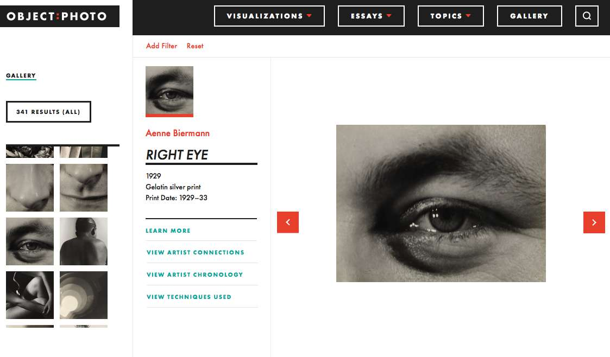
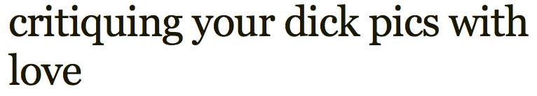

 There are really a lot of year-end top-ten photobook lists. One reason for the relatively recent surge in popularity of photobooks and their attendant year-end lists is certainly their accessibility: they bring photography into the hands of viewers, with fewer geographic and temporal constraints than an exhibition. But another way for photography to come into your hands—to find you where you are and offer a unique viewing experience—is to arrive on a nearby screen, like the ones in your pockets and on your desks. These closely held, frequently-accessed, and arguably highly personal viewing spaces are often overlooked as viable creative realms. This list is a shout out to a few of those moments of meaningful content and engagement that found their way straight to me in 2015.

##### 1. Library of the Printed Web, #3
<figure class="figure">
	
	<figcaption> 
		<em>Library of the Printed Web</em> Tumblr archive screenshot
	</figcaption>
</figure>

2015 saw edition #3 of Paul Soulellis’s [*Library of the Printed Web*](http://soulellis.com/projects/library/), a material archive and Tumblr devoted to, as Soulellis puts it, [“web culture articulated as printed artifact”](http://txtleiden.org/2014/search-compile-publish). *Library of the Printed Web* is not entirely about photography, but more fully embraces the fluid movement between material and digital realms that characterizes our age than just about anything else. #3 was available in a [crazy number of formats](https://newhive.com/soulellis/pw3), including:

- 8 ½” x 11” full-color, print-on-demand or downloadable pdf zines featuring curated selections of artists’ work
- a 388-page collection of texts and index of open call contributions, also available as unlimited print-on-demand paperback or downloadable pdf
- a 538-page hardcover, foil-stamped limited edition of 10 with hand-stitched cover and neoprene skin, with contents featuring every filed received in the edition’s open call
- a limited edition of neoprene fabric printed with pdf pages (24” x 31”)
- a digital archive in the form of a downloadable 1.5GB zip
- a 147-frame GIF in an “endless edition”

Though the range of formats could be read as an extreme form of indecision, their multiplicity instead conjured for me the very sense of overwhelming possibility merged with discrete selection—available both endlessly and hardly at all—that characterizes the heart of the *Library of the Printed Web*.

<!-- > “time relentlessly agitates language and images on the web; entire archives tend to appear and disappear in an instant. Single images explode into infinite versions.” 

>—Paul Soulellis [(read the full interview with Hrag Vartanian here)](http://hyperallergic.com/238041/turning-pixels-into-print-an-interview-about-the-printed-web/) -->

##### 2. Object: Photo
<figure class="figure">
	
	<figcaption> 
		Object:Photo website entry for Aenne Biermann, <em>Right Eye</em>, 1929
	</figcaption>
</figure>

The product of a four-year Mellon-funded grant project, the Museum of Modern Art’s *Object: Photo* appeared at the tail end of 2014 as an exhibition, [book](https://www.moma.org/interactives/objectphoto/the_book.html), [website](https://www.moma.org/interactives/objectphoto/#home), and [symposium](http://www.moma.org/calendar/events/700?locale=en) that uniquely championed and modeled intersections of object-based study and new possibilities for online scholarship and engagement. With contributions by dozens of scholars of the inter-war period and the expertise of photographic conservators, the strength of the multiple iterations underscored the flexibility institutions have (but rarely leverage) in producing and disseminating knowledge about the medium. This type of endeavor requires time, organization, funding, and the collaborative expertise of many, and it is heartening to see substantial institutional support for the advancement of this type of scholarship.

##### 3. “What’s Yours is Mine”: Appropriation redux

<figure class="figure-sm">
	
	<figcaption> 
		Richard Prince, <em>New Portraits</em> on view at Gagosian Gallery, New York
	</figcaption>
</figure>

What a great online to-do about Richard Prince’s Instagram Portraits, which were seen in person at Gagosian galleries around the world (starting in 2014) and—arguably also “in person”—on small screens everywhere. In a way, it was all of Prince’s old questions, updated for our social media age, and it pressed all the buttons the old work did, too. (see Prince’s [lovely writing on the series](http://www.gagosian.com/exhibitions/richard-prince--june-12-2015), recounting its meandering origins, and while you’re at it, read his words [on the Cowboys and Spiritual America](http://www.richardprince.com/contact/), too. The whole internet frenzy was good to get everyone talking about the legacy of photographic appropriation. I’m glad, also, [to know more about the Suicide Girls](http://www.theguardian.com/artanddesign/2015/may/27/suicide-girls-richard-prince-copying-instagram) and to have had opportunity to think not just about appropriation in the digital age, but new ways that pushback and subversion transpire. 

##### 4. “An Impossible Distance”, a photo exhibit at your local CVS

<figure class="figure-sm">
	
	<figcaption> 
		Prints from "An Impossible Distance" curated by David Horvitz
	</figcaption>
</figure>

I learned about this photo show on Twitter: a few years ago the artist [David Horvitz](http://www.davidhorvitz.com/) had curated a selection of images by two-dozen artists, and it was [re-issued in July](http://davidhorvitz.com/wordpress/?p=765). Like many of Horvitz’s endeavors, it puts physical distance and online distance into experiential proximity, and the project moves through digital and material space. To see it, the viewer (from wherever she is) emails her address, and the artist (from wherever he is) locates the closest drugstore that prints 4” x 6” photographs, and sends them the file of images—all of which relate to distance—to be picked up by the viewer. The price of the exhibition is the price of the printing: in my case, $8.22 at a Los Angeles CVS, and I viewed it on my kitchen table.

*Honorable mention in this category*: 
Everything else David Horvitz did, including my new favorite (non-photographic) app, *The Space Between Us*, available for download on the iPhone app store.

##### 5. Fotomuseum Winterthur *Situations* 

<figure class="figure">
	
	<figcaption> 
		Fotomuseum Winterthur <em>Situations</em> website
	</figcaption>
</figure>

Museums, almost by definition, have a hard time figuring out how to handle the new developments in photography, which often insist on immaterial forms as key components of process, circulation, and meaning. Hats off to [Fotomuseum Winterthur](http://situations.fotomuseum.ch/) for creating an institutional space—that exists both online and in physical space—for thinking through how museums can collect, exhibit, and support new modes of photographic thought and production (and you can read the curator and director Duncan Forbes's bracing critique of what he's up against [here](../assets/pdfs/Forbes_Fotomuseum_2050_2015.pdf)). I hope more institutions begin to support these types of endeavors, so crucial to the forward movement of photography as a creative field of practice.

**5b.** 

While you’re on Fotomuseum Winterthur’s website, take a look at the always-compelling multi-authored blog of ideas about photography, [*Still Searching*](http://blog.fotomuseum.ch/) and, in particular from 2015, Melanie Bühler’s [series of posts](http://blog.fotomuseum.ch/2015/03/2-what-i-talk-about-when-i-talk-about-photography/) which include her observation, 

> When we look at a photograph, we look at an amalgam of light that has become data, data that has been layered with code, code that has been transformed by software, an image that has been visualized and formatted on (touch) screens and that may or may not be printed on any number of physical materials.

##### 6. Tanja Hollander and Jeff Sharlet 

<figure class="figure-sm">
	
	<figcaption> 
		Screenshot from Jeff Sharlet's Instagram posts
	</figcaption>
</figure>

For the most part, the photographic response to the Paris attacks underscored the difficulties both photojournalism and social media have in grappling with how to visually respond to or represent the complexities of terror. I’ve been interested in the collaboration developing between [Jeff Sharlet and Tanja Hollander](http://sharletandhollander.com/), he a journalist and writer based in New Hampshire and she a fine art photographer from Maine. By chance, they were in Paris working together at the time of the attacks, and close by. They posted together on Instagram for the next several days, jointly grappling with honesty and insight about the situation they had found themselves in; the collection of posts was [subsequently published here](http://www.esquire.com/news-politics/a39802/jeff-sharlet-instagram-paris-attacks/). 

##### 7. Artists Try Snapchat

I’ve been on Snapchat for a few years now, and think its temporal constraints offer untapped creative potential. This year, a few artists gave the app a whirl.

<figure class="figure-md">
	
	<figcaption> 
		Alec Soth's <em>Disappear With Me</em>, a Walker Intangible
	</figcaption>
</figure>

• In March, the artist Alec Soth collaborated with the Walker Art Center gift shop on their [Intangibles](http://shop.walkerart.org/collections/intangibles) line with the seductively-titled *Disappear With Me*, experimenting with how to create value in an ephemeral exchange. The edition of three sold out, but Soth posts publicly as littlebrownmush (more on that [here](http://circulationexchange.org/articles/ephemeral.html)). I recommend following him; you never know when a little bit of Snapchat magic will appear in the palm of your hand.

<figure class="figure-sm">
	
	<figcaption> 
		Screenshot from David Brandon Geeting's posts on <em>This Is It / Now</em>
	</figcaption>
</figure>

<!-- <figure class="figure-sm">
	
	<figcaption> 
		<em>This Is It / Now</em> Snapchat exhibition announcement
	</figcaption>
</figure> -->

• In August and September, curatorial collaborators Max J. Marshall and Paul Paper [staged a Snapchat exhibition](http://thisisitnow.info/) under the handle thisisitnowshow, showcasing the work of six artists over a period of six weeks. Once the posts had had their 24 hours, they were gone. I only caught the tail end of this show as it featured work by [David Brandon Geeting](http://davidbrandongeeting.com/), but hope to see more projects like this, seeking, as the organizers wrote, “to extend boundaries of exhibiting spaces and reflect on the changing definitions of physicality and mutability”.

• In November, the photographer Steve Giovinco put on a month-long solo Snapchat show of his images of his father, experimenting with the app’s themes of impermanence and loss, and its capacity for contemplative looking. The show is over but you can follow him at stevegiovinco.

##### 8. Critique My Dick Pic

<figure class="figure-md">
	
	<figcaption> 
		
	</figcaption>
</figure>

This is not new in 2015, but a dear colleague turned me on to the many charms of [the Critique My Dick Pick tumblr](http://critiquemydickpic.tumblr.com/) earlier this year. The site has changed my understanding of this widespread photographic genre, and issues a thoughtful appeal to raise the common visual denominator. Madeline Hobson, a London-based writer, knows her way around a concise and effective visual critique: the prose is funny and smart, and her tone shows great warmth toward the fragile and sometimes clueless male psyche. Hobson frankly wants to see better dick pics, and she is open-hearted and welcoming of all body types, a combination that results in exchanges of surprising humanity and tenderness. 

##### 9. iPhone Selfie Album update

<figure class="figure-sm">
	
	<figcaption> 
		Auto-generated Selfie album on my iPhone
	</figcaption>
</figure>

I don’t consider myself particularly interested in the conversation around selfies, and yet, it was hard not to pay attention in 2015 (and I did write [this](http://circulationexchange.org/articles/largeformatselfiestick.html) on selfie sticks). In the latest iPhone update, Apple canonized the selfie category and made it unavoidable by automatically sorting out an album on your phone titled Selfies. I’m not quite sure how this works, but my guess is that it uses facial recognition technology in combination with knowing a photo was made using the back-facing camera. I found this by surprise one day recently when I was aimlessly looking through old photos, and was wowed by how happy it made me to see all the people I’d made selfies with. Despite all the talk about selfies primarily fulfilling a narcissistic impulse to be publicly shared, I was surprised to realize I hadn’t shared very many at all (just one from this screenshot). Score one for the algorithms. 

##### 10. The Ephemerides (@the_ephemerides)

<figure class="figure-sm">
	
	<figcaption> 
		Algorithm-generated text+image tweet from @the_ephemerides
	</figcaption>
</figure>

As may be evident from #9, I’m fascinated with how algorithms are programmed (by people) to produce our individually felt photographic experience. I also like Twitter bots. [The Ephemerides](https://twitter.com/the_ephemerides) is a photographic Twitterbot, created by the bot wunderkind Allison Parrish (@aparrish). It’s designed to pair images from NASA’s OPUS database of outer planet probes with computer-generated text in verse form. It’s almost never good poetry, but every now and then a gem comes through and, paired with black and white space imagery, makes me think about the magnificent odds against just about anything, and the subsequent wonder of everything.

