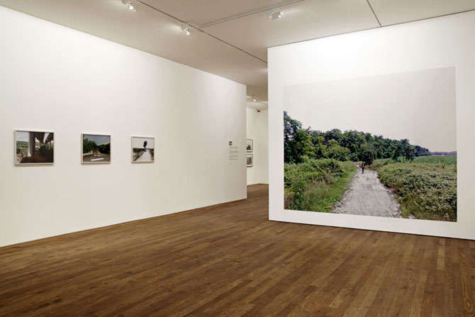

Recently, I Googled a friend’s name, and the first search result was the public record of her salary. This was not information I wanted to know: I felt awkward, and like I had crossed a line in our relationship by asking an inappropriate question—no matter how inadvertently it had happened. I tried to forget, I remembered when a student had told me she didn’t want to become a professor because she’d looked up *my* salary, I read some other stuff about her to distract the issue.

What do other people know about us today, and how do they learn it? What does Google know? What friend knows more than I realize? What do they get right, and what do they get wrong … whether “they” is the NSA, a close friend, or a prospective student? Mostly, the incessant collection of metadata about each of us, every day, is blissfully abstract, coming into focus only in brief and forgettable moments as we go about our online business.

But sometimes it appears in sharp relief: I viscerally recall the moment on a family road trip that my then-7-year-old had my phone and, from the backseat, somehow found and started reading aloud my search history. Though there was nothing damning in his announcement, it was nevertheless startling to hear, out loud, the record of my recent train of thought, now archived for family consumption. Today it sometimes seems that it’s our browsers and search histories that know the most—no matter the private conversations and public presentations, there is always another story in the cache, one that reveals the paths of a wandering mind, unselfconsciously following a rabbit hole of links and searches.

The abstraction, and the sometimes strangeness of squaring private knowledge with lived, public behavior, is hard to represent. In some ways, photography is at a real disadvantage in this arena: how do you make a photograph of something that can’t quite be seen? Of thoughts and exchanges that may leave few traces and are ultimately happening in some non-physical, immaterial space that can only be gestured at through physical traces and forms?

One recent trend in contemporary photography has been to represent the material, physical stuff of the internet: the fiber optic cables, the satellites, the data servers. These photographs are nearly always soulless, and necessarily so: they have to be in order to deliver a sense of the deeply dehumanized hardware that we, collectively, have passively entrusted with an extraordinary breadth of transactions, from the mundanities of scheduling appointments to the most private email or text exchanges. Alternatively, one can picture people with their devices, individuals (usually teenagers) illuminated by a cool glow or moving through life unaware of their surroundings (and immediate surroundings are always meant to read as obviously much better). Both types of image leave me cold: in the former, who really wants to look at rows of data servers? And in the latter, the implicit scolding judgment underscores a distressingly pervasive tone in our culture. Ultimately, neither visual strategy represents any kind of human complexity or a curiosity about how our internal experiences are shaped by those visible pieces of hardware, whether small and nearly attached to our bodies, or the massive actualizations of “the cloud”. How are those non-physical abstractions represented?

<figure class="figure-lg">
	
	<figcaption>Mishka Henner, "SP227d, Cisliano Milan, Italy," from <em>No Man's Land</em>. Courtesy the artist.

	</figcaption>
</figure>

##### “No Man’s Land”

Mishka Henner’s series *No Man’s Land* (first published in 2012, and ongoing) has some basics in common with other artists making Google Street View-inspired art ([greg.org](http://greg.org/archive/2011/07/04/on_bremser_on_google_street_view.html) is a good place to start, and [Pete Brook](http://www.wired.com/2011/08/google-street-view/) has nice updates). The massive online archive of semi-automated imagery, constantly refreshing, and relentlessly recording the publicly accessible visual world (streets, alleys, trails, museums, shopping centers, etc), is an irresistible and seemingly endless source of raw photographic material. I’m interested in all of these projects, generally, as they dovetail with a history of mapping, knowledge production, and human navigation and wayfaring, and they collectively seem to me the natural and obvious extension of the great tradition of road trip photography. But each of the projects has its own aesthetic and conceptual valence, and Henner’s uniquely addresses the uncomfortable collision of public and private space and experience that now characterizes much of our collective lived experience, and wades, too, into the grim realities of the commerce and commodity of physical bodies in the 21st century.

<figure class="figure">
	
	<figcaption>Mishka Henner, "Strada Provinciale Binasco Melegnano, Carpiano, Lombardy, Italy," from <em>No Man's Land</em>. Courtesy the artist.

	</figcaption>
</figure>

The series came about through the artist’s own dissatisfactions with the possibility of creating a visual story about the deeply complex, fraught, and contradictory experience of sex workers in Manchester (where the artist and his partner live), while also squaring the profound power imbalance between photographer and subject. Abandoning his frustration as a documentary magazine photographer and with the circulation of photographs on the image market, he made a decision “to work within the spectacle”.[^1]   

In its simplest description, *No Man’s Land* isolates and re-presents Google Street View (GSV) stills of women who may be sex workers, in areas of southern France, Spain, and Italy. But it quickly becomes more complex: Henner learns the locations of the women by virtually eavesdropping on men in online forums who share information about the locations of sex workers in their areas. The artist then cross checks with other sources such as NGO and UN reports, and “goes” to the locations via Google Street View’s camera. Henner saves the views made by the automated cameras, embracing a certain surrender of photographic control.

<figure class="figure">
	
	<figcaption>Mishka Henner, "Via Rigosa, Bologna, Emilia-Romagna, Italy," from <em>No Man's Land</em>. Courtesy the artist.

	</figcaption>
</figure>

Though *No Man’s Land* may best be known as it initially appeared, in its book form (or, let’s be honest, [more likely just through viewing fragments online](https://vimeo.com/113027269)), the project also came to include a video animation, an audio track of bird calls and other sounds recorded by local amateurs, and large prints that magnify the photographs back to 1:1 scale. Henner does not travel to the locations to photograph his subjects personally, as conventional documentary practice would dictate, because his subject is arguably neither primarily the women nor the places themselves but the relatively more abstract scaffolding through with they are discussed, located, seen and encountered.

<!-- <figure class="figure-sm">
	
	<figcaption>

	</figcaption>
</figure> -->

<figure class="figure">
	
	<figcaption><em>No Man's Land</em> installation, The Photographers' Gallery, London, 2013. Photo: Kate Elliott. Courtesy the artist.

	</figcaption>
</figure>

<figure class="figure">
	
	<figcaption><em>No Man's Land</em> installation, The Photographers' Gallery, London, 2013. Photo: Kate Elliott. Courtesy the artist.

	</figcaption>
</figure>

##### Visibility and the Unseen

Modes of personal exchange—direct and mediated—are referred to in multiple ways in *No Man’s Land*, but physical human bodies are only seen once: per the conventions of western art traditions, it is the surveilled female subject who is offered up to viewers. Each image in the series shows a woman, typically on the side of the road, maybe with a cheap plastic chair or sun umbrella, amid the “almost idyllic" landscape—as the artist puts it—of generally rural areas of Spain and Italy (in the first published volume).

<!-- <figure class="figure-lg">
	
	<figcaption>

	</figcaption>
</figure> -->

Without a human eye to filter out the literal debris, the automated GSV cameras offer a view of the natural landscape that gestures towards the beauty typically associated with those countries, especially photographically, but invariably precludes a romanticized view. The potential of endless volumes of the series (Brazil and Eastern Europe are forthcoming) “mirrors the insatiable appetite of the drone for creating imagery and of the insatiable cultural appetite for sex and exploitation,” Henner says, and speaks to his impulse to give over outright personal poetics to the ambiguities of scale and volume, both in terms of the numbers of images he had access to, and in terms of the magnitude of the social issue. As he points out, “The images had already been taken, but they hadn’t necessarily been seen; there are too many.”

But aside from the conceptual apparatus and implicit critique of conventional documentary practice, and aside from the women we see and the landscapes they occupy,  what really got me about *No Man’s Land* was thinking about the other human bodies gestured to in the series. First, the men in the online forums, on whom Henner (another body) was eavesdropping, and later, just as affectively, the citizen-scientist bird call recorders, earnestly uploading their homemade audio tracks to a publicly accessible and geolocated database. And, together, the various mediated modes of accessin
g each group of individually distinct yet always physically separated and isolated people (chatroom eavesdropping, Google Street View screen capture, amateur birders) and subsequently bringing them together in the space between the artist’s work and his viewer, strikes me as an apt method of getting at the strangeness of navigating some of the ways we can know things, or think we know things, about other people today.

Regarding the unseen men, I both wanted and didn’t want to peer over their shoulders and watch them in the chat rooms. I imagined them collectively alone, in a dark room, in front of those illuminated screens, individually filled with anticipatory imagination about what (who) their future selves would encounter in the locations they were sharing among strangers. Or was it less filled with longing, and more calculated: with logistical considerations about distance, time and money. Or was the nature of the calculation worse: predatory rather than logistical. Perhaps, realistically, it is some shifting combination of all of it. Henner himself characterizes the online forum conversation as bluntly akin to the ratings and reviews left on Airbnb, but for women rather than places to stay. Either way, those missing figures spoke volumes, and their absence offered an uncomfortable, yet open, space in which to reimagine them.

A hallmark of recent art projects that investigate the terrain between material and physical realms is their manifestation in multiple forms. It is as if the process of physically setting the still images into a range of material forms more efficiently and effectively orients viewers toward the movements of those images: as we see them play out in multiple venues, the shifting contexts becomes a key piece of the content. It might seem curious, for a project that is largely about the condition of *not* being there, that Henner so clearly wanted his viewers to feel as if *they* might be there: [particularly through the video](http://mishkahenner.com/filter/works/No-Man-s-Land), which sets a viewer into the position of a car driving by the women to the audio track provided to make a place more real. Stills are sequenced together to create an effect of leering at the women as the driver passes by, and then dispassionately moving on to the next body offered on display, who is again passed by. The repetition underscores the already dehumanizing effect of the GSV cameras while simultaneously asking viewers to inhabit, and, in a way, even empathize with, the automated camera’s point of view: the discomfort ante is raised. The experience is accompanied by audio files made by strangers who have geolocated sounds from the same or nearby locations and uploaded them to a sound-sharing website. The cues, then, locate a viewer within a range of mediated representation that began in similar locations, were recorded for different reasons and different audiences, then distributed onto the open space of the internet, and brought back together by the artist for a viewer in yet another physically distinct location.  

##### Distance and Connection

*No Man’s Land*, like some of the other Google Street View work, has had a remarkable degree of success, but it’s not without its detractors. (See a brief summary and Henner's [robust rebuttal](http://prisonphotography.org/2012/04/23/a-conversation-with-mishka-henner/).) To generalize, the primary complaints about it have been 1) the very notion of a photographer “just” sitting at his or her computer all day rather than physically going to the places shown, and 2) that the women are depicted in an objectifying and dehumanized fashion, and assumed without proof to be sex workers. These reactions are linked in an interesting way: a solution to both would be for Henner to have traveled to the sites, spent time with the women, heard their personal stories, and translated this lived experience in a visually compelling way to his viewers so that we, too, could feel we better understood the life experiences—perhaps the personal challenges, small triumphs, economic realities, and surprising insights revealed through casual anecdote—of the subjects. In other words, it could have operated within the accepted rubric of a documentary photography project. But its departure makes plain both that there is something of a formula to the way documentary photography is supposed to work, and the effect it’s supposed to have on its viewers.

<!-- <figure class="figure-sm">
	
	<figcaption>

	</figcaption>
</figure> -->

As points of comparison in the history of photographic representations of sex workers, I think first of Susan Meiselas’s [*Carnival Strippers*](http://www.susanmeiselas.com/early-years/carnival-strippers/#id=girl-show) (published in 1976) or the later Philip-Lorca diCorcia’s *Hustlers* (1990-1992, [exhibited first as *Strangers*](http://www.nytimes.com/2013/08/25/arts/design/philip-lorca-dicorcias-hustlers-return-to-new-york.html?_r=0), as both particularly effective and even groundbreaking proposals of an affective documentary practice that seeks to bring a distant audience closer to the interior worlds of men and women negotiating money and sex; beyond their extraordinary aesthetic pull, their power stems from the commitment of the artists to spend time, to care, to go there, and from the subjects’ willingness, or apparent willingness, to participate, to share, to open up—even just a little—about the emotional, economic, and physical complexities and contradictions of their lived realities.

<figure class="figure">
	
	<figcaption>

	</figcaption>
</figure>

<figure class="figure">
	
	<figcaption>Page spreads from Susan Meiselas, <em>Carnival Strippers</em>, Farrar, Straus & Giroux, 1976

	</figcaption>
</figure>

<!-- <figure class="figure">
	
	<figcaption>

	</figcaption>
</figure> -->

<!-- <figure class="figure">
	
	<figcaption>

	</figcaption>
</figure> -->

I think, too, of Larry Sultan’s [*The Valley*](http://larrysultan.com/gallery/the-valley/) (published in 2004), which lets viewers in on the boredom and mundanity, the domesticity, of the pornographic film industry that occupies the edges of Los Angeles and reflects the development, in photography generally, of an interest in unraveling the distinctions between art, artifice, and reality that collectively consolidate around the film and sex industries.

<figure class="figure">
	
	<figcaption>

	</figcaption>
</figure>

<figure class="figure">
	
	<figcaption>Page spreads from Larry Sultan, <em>The Valley</em>, Scalo, 2004

	</figcaption>
</figure>

Henner offers a more historical, and perhaps more fitting, comparison: to E.J. Bellocq, the somewhat mysterious photographer who left a cache of glass negatives of women in New Orleans’s red light district—also now unknown by name, many with obscured faces, and having been exhibited and “made known” by a male photographer who knew nothing of the women’s stories: in their case not Bellocq but Lee Friedlander, who re-printed and exhibited Bellocq’s work at the Museum of Modern Art in 1970, within its own thick stew of authorial and institutional complexity.

In these other projects, the prevailing view of sex workers is one of a sympathy and openness (and, not coincidentally, in the last few decades, in parallel to the rise of the sex workers’ rights movement). And yet now, in an age awash in Chatroulette and apps like Tinder and Whisper, which might be characterized broadly as an age in which encounters with strangers, whether sexually charged or not, have never been easier, how do the relationships to and between these physical bodies fare now? *No Man’s Land* offers an update both on what sex workers “look like” today—in the broadest context of how the visual operates—and on the intertwined question of what documentary photography “looks like” today—also in the broadest context of how the visual operates. But, ultimately, its emotional core is the shifting space between the human bodies invested in the work’s components and production and, by extension, the ambiguous relationships enabled and facilitated by our many modes of connection today.

### **Notes**

[^1]: All quotations are from a conversation with the artist, November 10, 2015.
