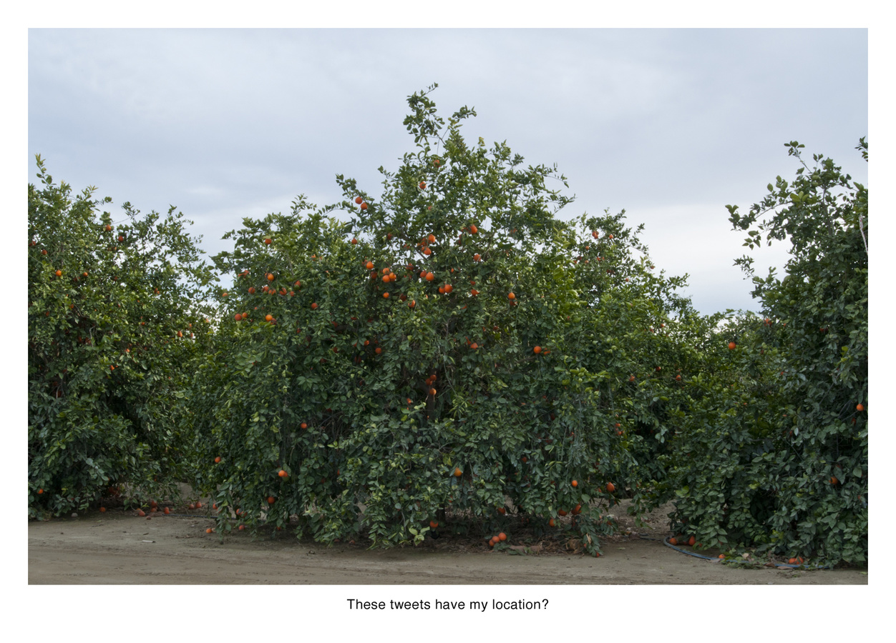
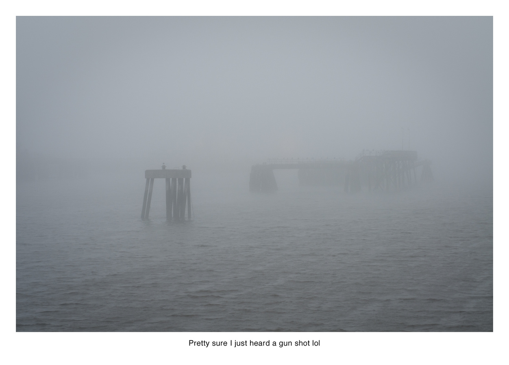
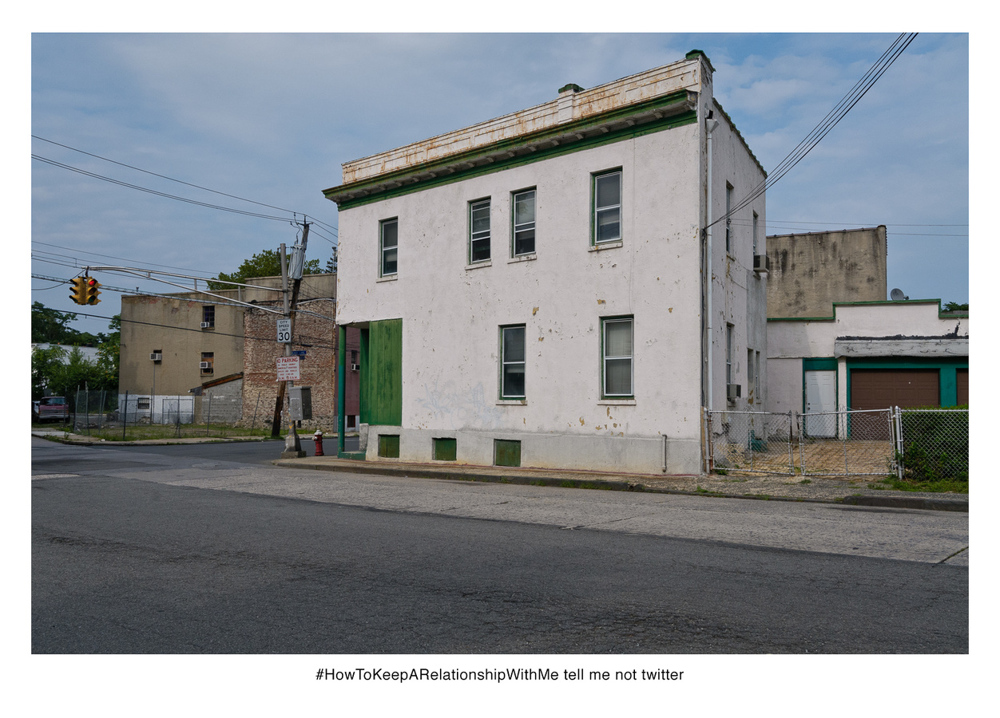
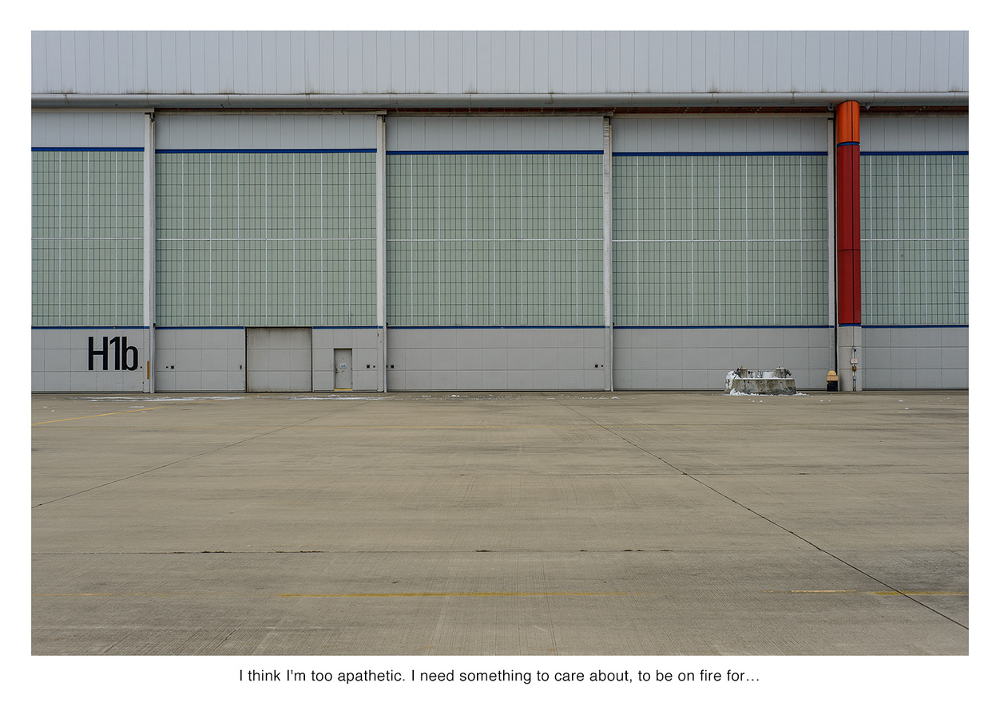
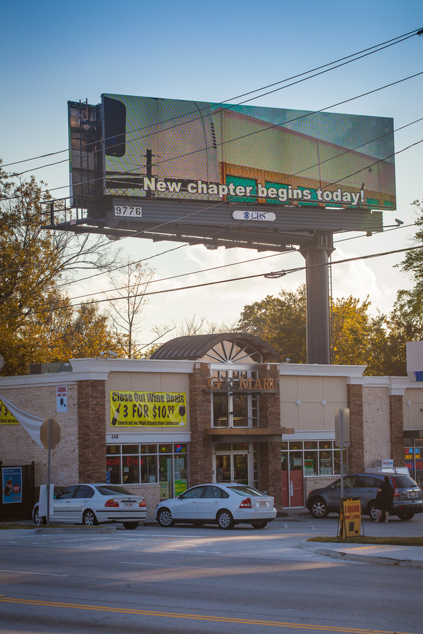
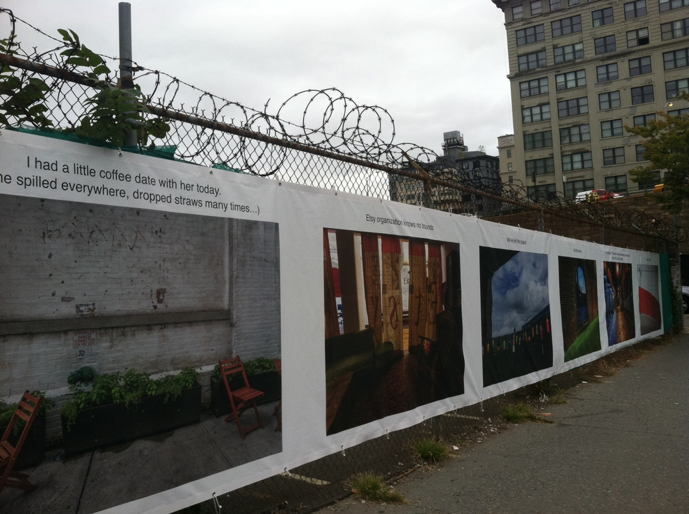
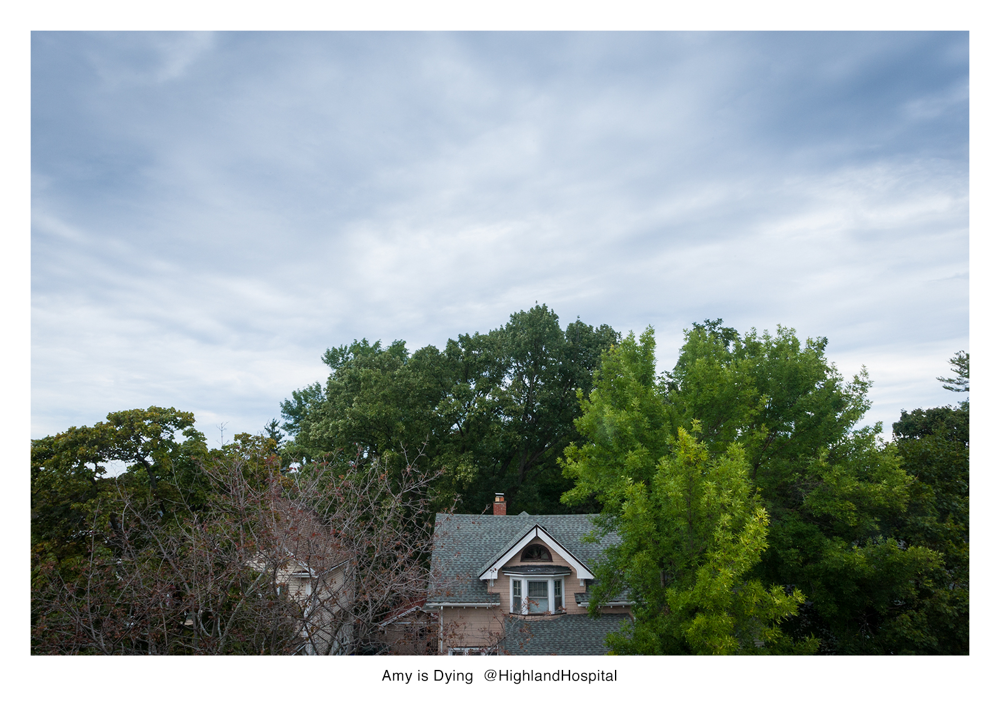
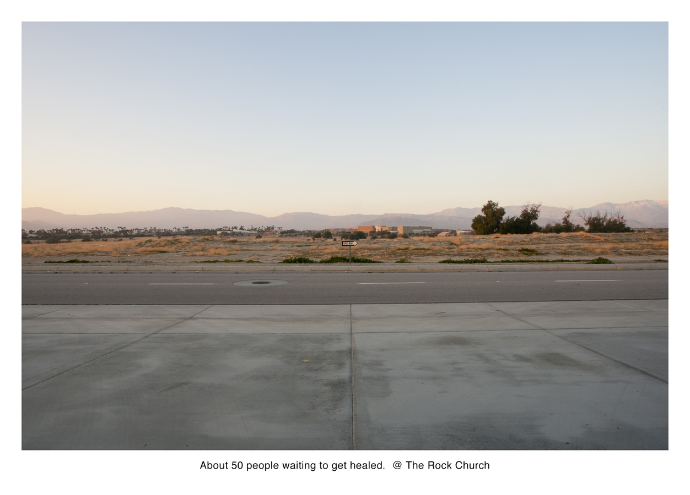
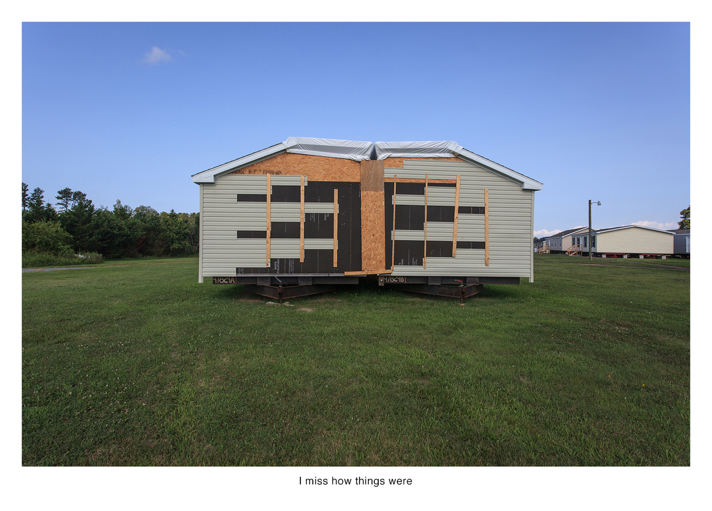
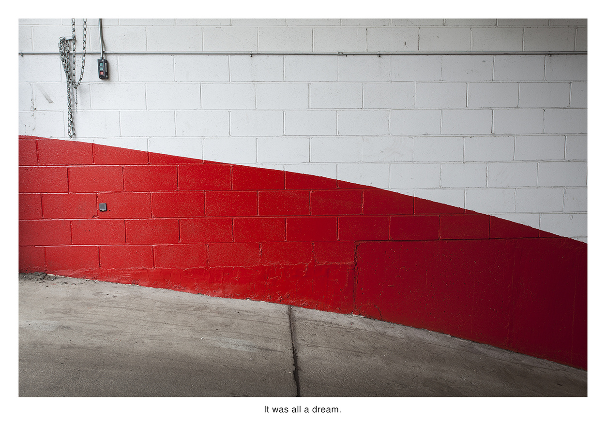

*Earlier this year, Nate Larson and Marni Shindelman published their collaborative project [Geolocation](http://www.flashpowderprojects.com/geolocation/) with Flash Powder Projects. As they describe the project, ongoing since 2009: "We use publicly available embedded GPS information in Twitter updates to track the locations of user posts and make photographs to mark the location in the real world."*

*Along with [the short essay I contributed to their book](geolocation_essay.html), we had a conversation about the series.*

<figure class="figure-lg">
	
	<figcaption>

	</figcaption>
</figure>

**KPA**
You both know that I’m interested in how photographic images move through both digital and material spaces, and another ongoing question for me is how artists mediate the daily experience of regular social media use into the aesthetic realm of the art world. *Geolocation* has been such a great project to watch unfold as it’s moved such ephemeral and otherwise inconsequential sentiments—thoughts expressed as tweets—into all kinds of visual and material forms. I thought it might be interesting to start by asking you about that very terminology—whether that idea of either the sentiments or the medium as inconsequential or ephemeral are fair or accurate, as you see it.

**MS**
Twitter is absolutely ephemeral, and yet there is an archive, somewhere, if you can capture it before it disappears. The Library of Congress has said they are archiving it, and yet thinking about how this might be possible is mind-boggling. It’s a new kind of watching’ reading, one we and others call social media listening.  

**NL**
I also think a lot about the consequence of these Twitter interactions and many of them mean less to me as just text than when I’m on site making a photograph, imagining the headspace of the original poster. An example that comes to mind is “Pretty sure I just heard a gun shot lol.” It popped up when we were photographing in Saint John, New Brunswick, and I believe that Marni originally flagged it. I thought it was kind of dumb, until I arrived at the site, which was a deserted waterfront area that was a former port. The fog rolled in and the tweet took on a much deeper resonance as a result—the inconsequential became the consequential in that moment.

<figure class="figure-lg">
	
	<figcaption>

	</figcaption>
</figure>

**KPA**
I suppose that while individual tweets are searchable—by users, words, hashtags, etc—what vanishes is the form it initially arrived in, that larger feed of aggregated posts. Which is itself distinct to any one user. Is that how you got interested in trending hashtags, the idea that there could be a collective experience of Twitter as opposed to an insistently individual one?

**NL**
Yes, I think that’s exactly right, that the hashtag gives a comparison point to be able to talk about collective experience. So far we’ve done #HowToKeepARelationshipWithMe in the greater New York City metro area and #5WordMoneyProblems in the capital region, NYC, and Atlanta.

It’s also interesting to think about hashtags as an organizing point for social justice – how #HandsUpDontShoot united individuals after the tragic events in Ferguson. We’re interested in exploring that idea of cultural organizing and have some pieces in development along those lines.

<figure class="figure-lg">
	
	<figcaption>

	</figcaption>
</figure>

**MS**
I think of it as ephemeral in a sense that Hasan Elahi talks about obscuring information through complete transparency.  Sure you can search for the entire Twitter timeline of public tweets, but how do you know what to look for? The timeline is what is important to us. . .  the specific moment we are “listening” to Twitter.  Twitter makes the search available, but you have to know what you are searching for, and we are interested in the timeline of Twitter, in the entirety of a conversation.  You cannot search conversations, only terms, @s, #s, words, phrases, users. . . I want to see the interaction between users in a specific space during a specific time. [There is one person on Reddit who has put this data together.](http://www.slate.com/articles/technology/technology/2014/10/mapmaking_using_reddit_okcupid_twitter_and_other_social_media_websites.html)  So, it’s not so much about the ability to access information, it’s the ability to read it, and search it in with different terms and outcomes.

**KPA**
One of the challenges it points to is how to make human meaning from this unbelievable amount of data we now have access to. I appreciate the impulse to map emotional reaction or what topics people are intensely passionate about on Reddit, but I wonder how to make those results compelling on the level of a single human being. It gets back to your point about knowing what to listen for, or how to search for particular outcomes. I’d rather read the tweets you found, and imagine those individual people. So it’s this question of the individual experience within the collective trend.

**MS**
Yeah, it’s the old microcosm vs. macrocosm debate of sociology and anthropology.  

**NL**
I think that’s very much in keeping with our thinking, which is that each of these photographs is an environmental portrait of this individual Twitter user. The individual is key.

<figure class="figure-lg">
	
	<figcaption>

	</figcaption>
</figure>

**KPA**
You’ve worked in an array of different forms, including photographs, murals, billboards, and now a book. With your work in particular, these seem to me like a series of possible translation points in a continuum of person to data to media to material thing in the world to viewer.

**MS**
We often talk about the data we drop as digital breadcrumbs. I’ve never thought about the way we’ve been returning it to the world as being in a similar fashion. Since the book just came out, I’m thinking most about that now, and the thing that has struck me most is the photographs on Facebook of our friends holding the book. They can now sit with the work in a manner I do all the time. Nate and I always have access to the work physically, and could curl up with some Geolocations, but now our friends can. The billboards have been so fleeting, as they were digital billboards, and a bit mysterious. There was no feedback on those, so we have no clue what people saw, or thought of, but we know there were hundreds of thousands who saw them.  But what they did with the images is disconnected. It’s funny, the most popular images are the most disconnected.  

<figure class="figure-pair">
	
  
	<figcaption>
		Left: Geolocation billboard in Atlanta, GA, June 2012.
		Right: Geolocation fence installed at the intersection of Prospect and Washington, Brooklyn, NY, September 2013 - September 2014.
	</figcaption>
</figure>

**NL**
When we did the billboards in Atlanta and fence in Brooklyn, I was very much thinking about it as a translation point, translating this meta-layer of information from the surrounding area for the people that inhabit the neighborhood. This is what your neighbor thinks about, this is how this location is used differently by your neighbor, that kind of thing. And secretly hoping that people could use the public artwork as a connection point. But as Marni mentioned with Atlanta, we put this thing out there and the billboard company tells us that it was seen 600,000 times a week, but we didn’t end up hearing anything one way or the other from members of the public.

With the fence in Brooklyn, there was also something interesting about the physical object at ground level. When I first saw it installed, one of the first interactions was seeing a dog lift their leg and pee on it. There were also various things written on it after it had been installed – someone took it upon themselves to add a commentary to our artist statement. That to me seemed an especially poignant translation point, online chatter to physical object to anonymous chatter written on a physical object. I rather enjoyed dropping in on the piece on different trips to NY, and just observing people stopping to look (or not) as they went about their daily routines.

<!-- <figure class="figure">
	
	<figcaption>

	</figcaption>
</figure>

<figure class="figure">
	
	<figcaption>

	</figcaption>
</figure> -->

**KPA**
That’s a pretty interesting connection between tweets and what sounds more like graffiti.
Marni, I like this idea of art you can curl up with. That’s a good category. I know you mean in the sense of curling up with a book, but I think we also curl up with our phones. I would be happy to see more art on my phone that I could curl up with—it would be way more satisfying than scrolling through Twitter. To me this gets at a question of thinking about the spaces we have to view art, or to encounter meaningful visual content—so it’s useful, for me, to think about your work in terms of how public and/or collective that viewing space is, in relation to how private and/or individual the originally expressed thought may have been. I suppose that thinking about any tweet as “private” is a little absurd, and yet there’s a real sense, as a viewer and, presumably as artists, of an invasion of privacy in this work.

<figure class="figure-lg">
	
	<figcaption>

	</figcaption>
</figure>

**MS**
It is strange how this work brings up such privacy issues, when it is completely public timeline and information.  I think it just eloquently exposes data and its tie to the actual world. I rarely think about what I put out on FB, and how it affects others or how it situates in my daily life. I am careful about some things, and those are the moments when I stop and remember this is archived, public information.  Our project just compiles them in a way you can’t look away.

**NL**
For me, the question of privacy is central to our work. I frequently think about the shifting norms – these days the norm is to share rather than not share. Dave Eggers’ novel *The Circle* proposes a new Orwellian precept that  “privacy is theft” and to not share is to “steal” your experiences away from the community. When I was a kid and we went out of town, we had to put the lights on timers and no one would know from the outside that we were not home. Now we all post about it publicly on social media without a second thought and it’s almost like it didn’t happen if you don’t post. It becomes a part of the cultural record only when you share.

**KPA**
I really liked that book, and I’m glad you brought it up. At one point the company in the book develops a program that, through facial recognition, can search a vast archive of online photographs—from historic sources like newspapers and county records—to create an album of family photographs, including from generations back, that you never knew existed. We’re probably not too far from that reality. That idea of producing an unedited visual family history is fascinating, in a terrifying way.

I’ve also seen you mention Clive Thompson’s essay ["I'm So Totally, Digitally Close to You"](http://www.nytimes.com/2008/09/07/magazine/07awareness-t.html) many times. I have to say, it’s funny to re-read that 2008 essay now, since some of it seems so quaint, just eight years later. But the idea that seems to have really stuck with you is about ambient awareness, or ambient intimacy, where, over time, these tiny snippets of information—about either friends or strangers—coalesce into a picture or a story about that person. This is an immaterial, time-based, internal experience that happens in the mind of the viewer (or, the person following the tweets/posts/etc). So I’m interested in that idea of knowledge (or awareness, or intimacy) built up over a period of time, and how it relates to what you do in *Geolocation*, which is much more about these emotional or political core samples, extracted from Twitter like a kind of public consciousness.

**MS**
Ok. . . what’s stuck with me from Clive’s article is that we haven’t even noticed how things have changed. I hear so many people say “Oh, Facebook is ruining friendships and relationships” (imagine this said by my mother) and yes, in ways it has, but we have to recognize the good it is bringing.  We talk so much about how our heads our stuck in phones, how we’re disconnected, alone together (thank you Sherry Turkle) but for me, the sheer noise we’ve never heard is how many of us are lonely and just want to be heard. The Internet is the loudest place for this. It was with iVillage, with blogs, and now FB and Twitter. That is what has built up over time, and over reading hundreds of thousands of tweets. We’re flip about the tweets, and the poignantly sad ones don’t come around as often as I think about them, but the sheer noise to me is sad. Just seeing my neighbor tweet about wishing a girl would listen to him is heartbreaking, or how much he hates his job at Jimmy Johns.  

One of the most influential experiences I had in grad school was housesitting/dogsitting for my parents in their beautiful Atlanta suburban house. I hadn’t lived in Atlanta since I was a child and didn’t know a soul. I remember spending my days luxuriously reading in their pool. And yet it was tragically sad. I would go to the grocery, to movies, to book stores, and lived three weeks in a bubble where I rarely talked to anyone. I grew up in the suburbs my whole life, so I was very comfortable in the surroundings. But I began watching my parents’ neighbors those few weeks. And really thinking about how we live very separate lives in such proximity. This was in 2002, so way before the Internet. But I began thinking about how this life would be so lonely. Working, not working, staying home, having a family in a tiny capsule. But I think about this too now when I got to NYC each year for a month. How we are just tiny pods stacked upon each other. There really is a lack of listening in today’s culture, and the Internet is exposing that need, that craving for connectedness that has been waning for years.  

<figure class="figure-lg">
	
	<figcaption>

	</figcaption>
</figure>

**KPA**
And yet I know from Instagram that you’ve just built a house in what looks like a pretty isolated area, and you seem to really love it. That seems kind of nice to me, that I can know that.

I’m curious, do you know that neighbor who works at Jimmy Johns? I’ve been reading the Missed Connections in Craigslist recently, and it’s a similar thing—I’ve felt like I’ve become privy to all of these desperately poignant attempts at connection that are veiled in a sense of foregone futility—because who reads Missed Connections? How would you ever actually connect with someone that way? But one of them—it was really long—was written by a guy to his neighbor, and chronicled his longing for her, and his fantasies about her, concluding with him wondering if he was just projecting all of this onto her. Of course he was. But I like how you’ve phrased this “the noise we’ve never heard”—and on some level I wonder if it’s not so much sad, as just the human condition.

**MS**
It absolutely is the human condition.  I was just talking to a class and the kids asked “Since so much of your work is based on Twitter, what’s going to happen now that it’s dying?” And I said, “There will be something else”.  We talked about how we all have our heads in our phones and I said it isn’t new; it is just a new symptom of the human condition. It’s one we can see more readily, and easily. Because it has been so fast. We’ve only had iPhones for 9 years!!  9 years!  So we’re seeing a generation jump a little faster.  

Regarding the neighbor, it was more hypothetical. . . I watch my neighbor leave for his job, and wonder what he’s tweeting about, but never really see his Tweets/ Facebook posts. But I like to imagine what they say. It goes back again to harsh time in the suburbs - and again Sherry Turkle’s awesome title *Alone Together: Why We Expect More from Technology and Less from Each Other* — sadly the book did not move me as much as her title does. I used to read Missed Connections. Small town ones are the best, because sometimes you can figure out who they are talking about. It’s been a while though. I am embattled in my own online life, keeping up with FB, online dating sometimes, ugg.

One thing to add here is my interest in boredom and its relation to trauma theory.  Boredom/ repetition has the exact same symptoms as trauma in some sense, outside of language, you lose track of time, forgetting.  I think about the task I do everyday, taking one pill that I sometimes cannot remember if I did.  And it operates on a similar theoretical plane to me as traumatic events.  I could go way more into this, but I’ve always been interested in boredom, and I think mobile devices are functioning in this manner. Games are moving more towards what they call “in line, waiting ones”. Things you can do in five minutes while in line at the grocery.  TV, Facebook all that is now geared towards those times. I can’t even watch a commercial anymore; I just go to my phone.  

**KPA**
Tell me about your new project *Safe Trade*.

**NL**
We started photographing for the project in the fall, after the University of Georgia set up a parking lot with surveillance cameras for people to conduct Craigslist transactions. I sell a lot of odds and ends on Craigslist, so I could appreciate this—I usually meet people at fast food restaurants because I’m not comfortable having strangers in my home. We kept thinking about these sites as a very peculiar way that the Internet intersects real life—that moment when you sell a ten-year old vacuum filled with lint from your home to a stranger in a Dunkin’ Donuts parking lot. For ten dollars. Thinking about the strangeness of this led us to start this new series. [A small selection of them are on our website](http://www.larson-shindelman.com/safe-trade) as a “soft lauch” but the project is still developing and leading us to some interesting sites and interactions.

<figure class="figure-lg">
	
	<figcaption>

	</figcaption>
</figure>

<figure class="figure-lg">
	
	<figcaption>

	</figcaption>
</figure>

[*Read my short essay for the book **Geolocation** here.*](geolocation_essay.html)

This conversation took place over email from January through March 2016. Unless otherwise noted, all images are by Larson and Shindelman, from their series [*Geolocation*](http://www.larson-shindelman.com/geolocation) (2009-present).
