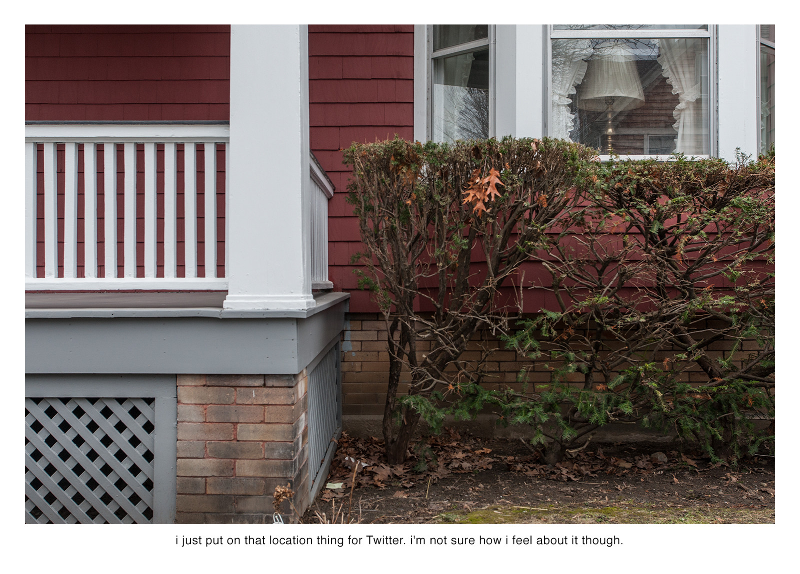
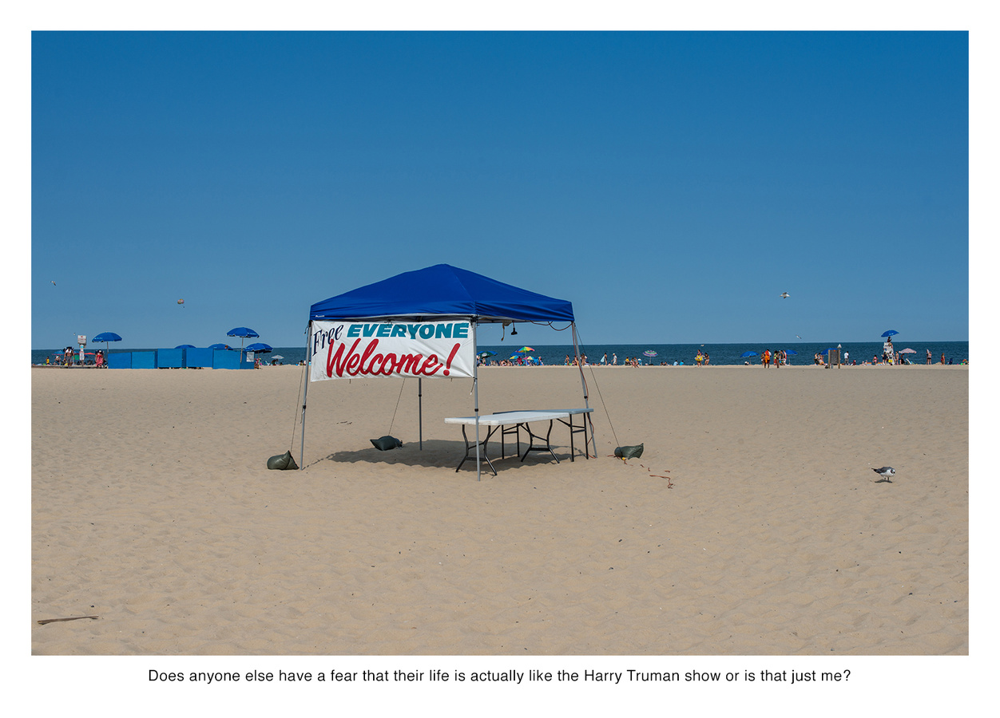
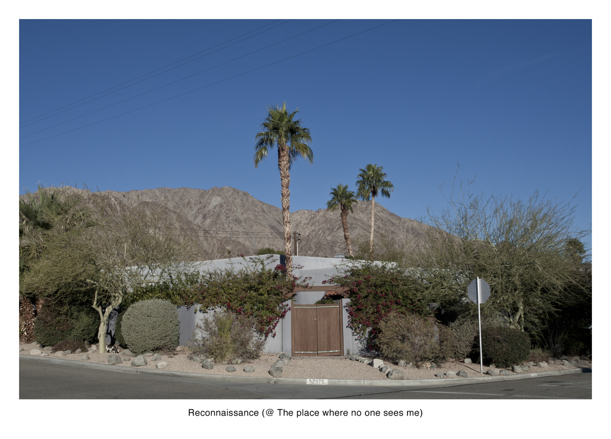
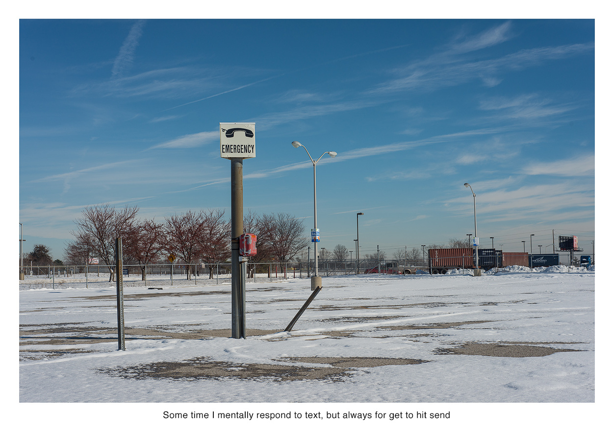
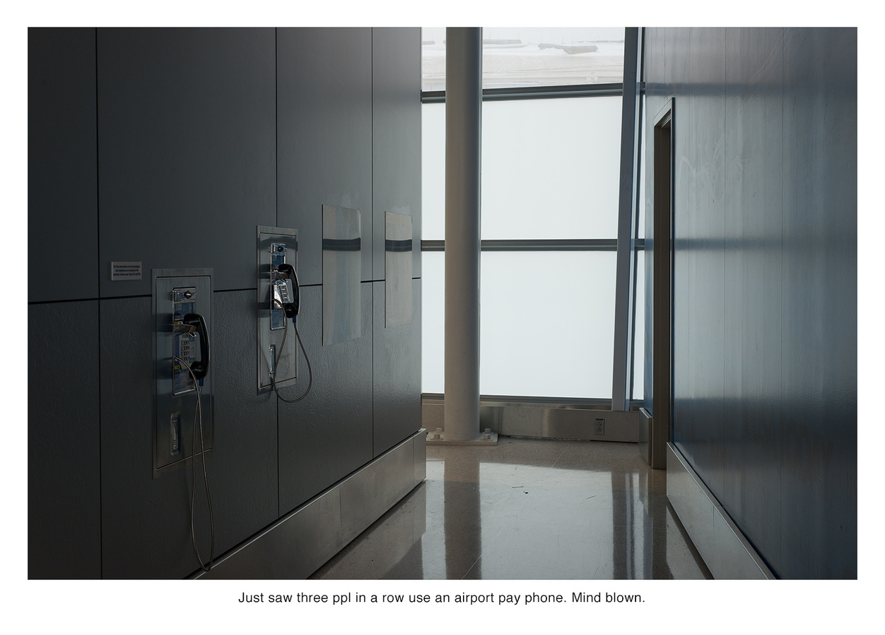
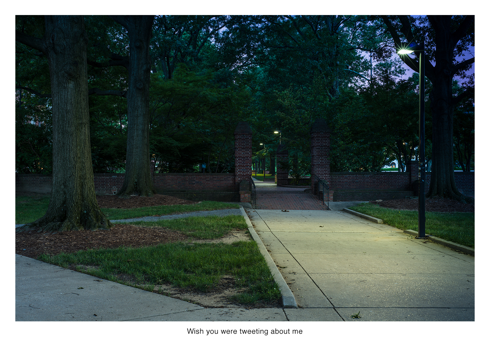

*Earlier this year, Nate Larson and Marni Shindelman published their collaborative project [Geolocation](http://www.flashpowderprojects.com/geolocation/) with Flash Powder Projects. As they describe the project, ongoing since 2009: "We use publicly available embedded GPS information in Twitter updates to track the locations of user posts and make photographs to mark the location in the real world."*

*Along with [a conversation we had about the series](geolocation_conversation.html), I contributed this short essay to their book. I'm happy to share it here, along with a selection of the images I was asked to write about.*

<figure class="figure-lg">
	
	<figcaption>

	</figcaption>
</figure>

<figure class="figure-lg">
	
	<figcaption>

	</figcaption>
</figure>

<figure class="figure-lg">
	
	<figcaption>

	</figcaption>
</figure>

Uncertainty, hesitation, confusion, fear, vanity, lack of control, yearning… desire to connect, ambivalence about connecting, desire to disappear. All of these emotions and states of being appear in Nate Larson and Marni Shindelman’s series *Geolocation*, forming, in this sequence, an experiential core of the still-nascent reconfiguration of our human relationships in an age of Twitter and, more broadly, geolocated social media. “Where are you?” we ask, when we call someone on a mobile phone. But more and more often, our phones already know, and broadcast—or at least record—our location, our perpetually updated place of existence.

The constant state of being found, or findable, is extremely useful: we can receive the local weather, route directions, choose a nearby movie or café or gas station; we can install apps to find nearby people with shared interests, eavesdrop on the chit chat of nearby strangers, and map nearby sex offenders, real estate opportunities, or our morning run. Yet how we use the new tools at our disposal to communicate with other human beings—whether friends, acquaintances, or strangers—is new territory.

*I’m not sure how I feel about it though*

Photographs, while not inherently tied to place, tend to be connected in some significant way to the visible site of their production. But are our word-based thoughts similarly connected to place? Does it matter where someone is when they think something, have an idea, or write something? On the other end of the equation, does it matter where the viewer or reader is when she looks at an image of another place, or reads a thought written elsewhere? This sequence of images dwells on the strangeness of how we communicate, the collision of old and new technology, and the meta-state of self-consciousness embedded in these tweets about tweeting and geotagging, land lines and missed messages, and the unsettling sensation of navigating a newly merged digital and physical space.  

*or is that just me?*

I imagine Larson and Shindelman combing through geolocated tweets by the hundreds, mining the data stream for the string of a stranger’s words that sparks some kind of curiosity. Then traveling to that location, always well after their original muse has left, and finding themselves in a very particular place, the most notable feature of which may be that, at some earlier point, a stranger tweeted something interesting. Then the challenge of photographing that place where a fleeting moment, perhaps unseen in the first place, has long since vanished.

*(@ The place where no one sees me)*

We, the viewers, are brought to an empty walkway, lit in the twilight hour by a solitary streetlamp; to a bleak field of snow-covered asphalt, punctuated by a lone Emergency phone; to an empty welcome table in a broad expanse of unpeopled sand; to the shrubbery and red siding of a suburban home; to a walled-off desert oasis, from which, the artists have suggested, someone believes himself to be hidden and yet can’t resist publicly declaring his location.

Was that stranger imagining he couldn’t be seen? Did he know his tweet was geolocated? (Though the artists don’t track gender, the tweet strikes me as distinctly male.) Would he ever see the photograph Larson and Shindelman would make? Would they have shown us, the viewers, a place that initially resonated with the person who had since vanished? Or is it only in the photograph that the connection occurs?

*Haha I have lost followers today*

In a series of otherwise unremarkable places, day after day, at all hours, we wonder, we muse, we judge, we exclaim, we ask, we confess and we reveal…  out loud and in a strange combination of publicly and anonymously. It’s easy to get lost in a sea of numbers, in the patterns and statistics that emerge from the data stream that Larson and Shindelman evoke as worthy of tribute in their series subtitle. Metaphors of floods and rivers of information—much of it in the form of images—occlude the very thing the artists point to: the individual humanity that persists in that overwhelming data stream.

*wish you were tweeting about me*

<!-- <figure class="figure-lg">
	
	<figcaption>

	</figcaption>
</figure>

<figure class="figure-lg">
	
	<figcaption>

	</figcaption>
</figure> -->

<figure class="figure-lg">
	
	<figcaption>

	</figcaption>
</figure>

[*Read our conversation here.*](geolocation_conversation.html)

All images are by Larson and Shindelman, from their series [*Geolocation*](http://www.larson-shindelman.com/geolocation) (2009-present)
