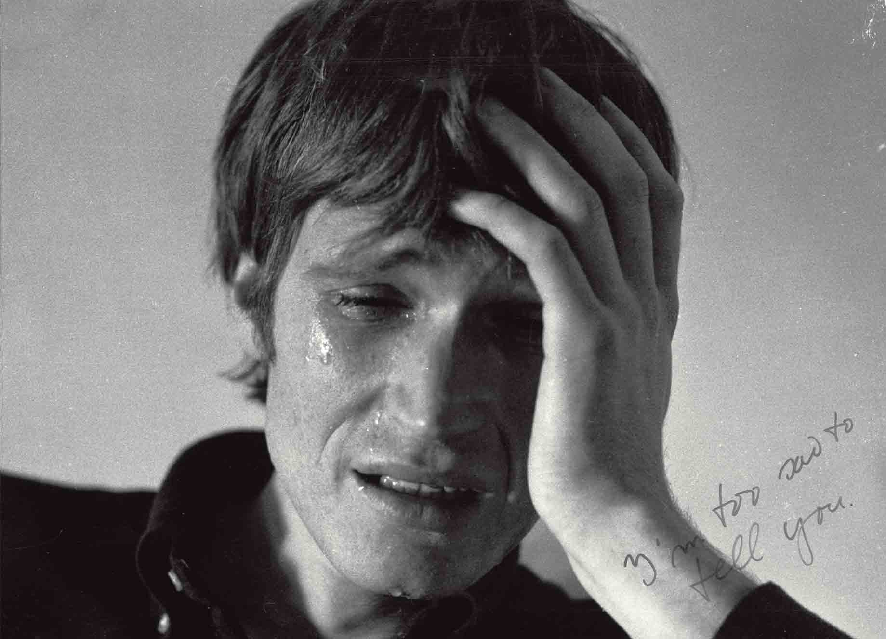
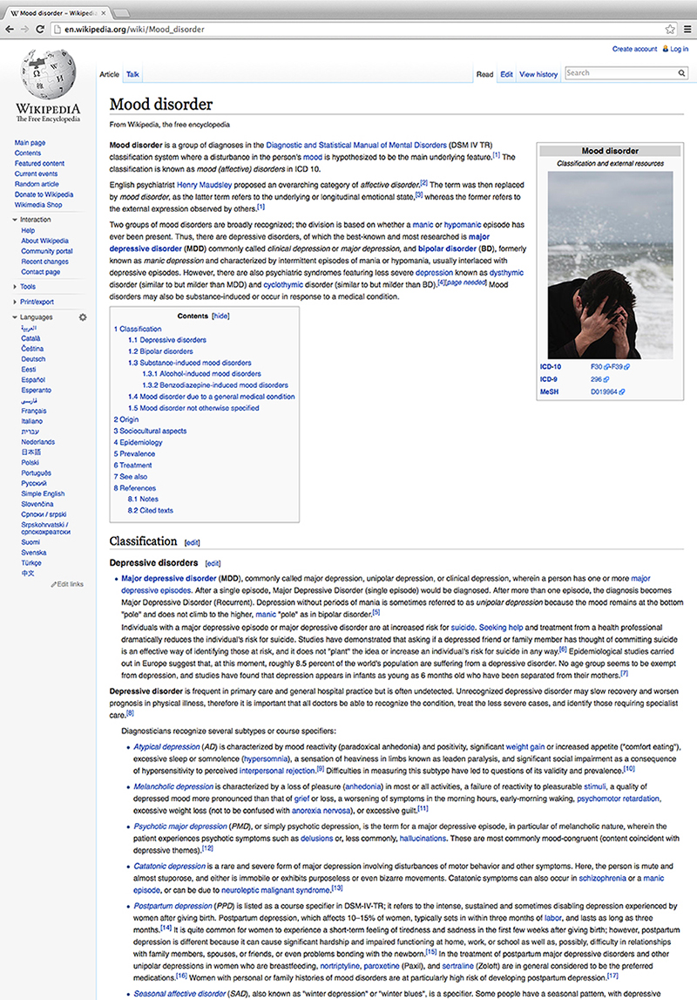
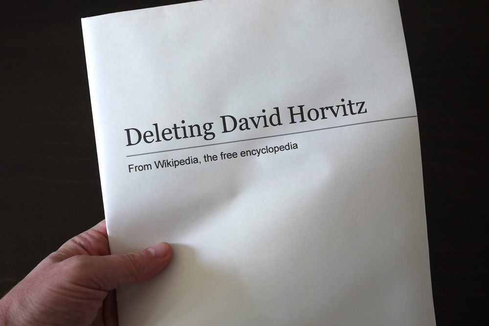
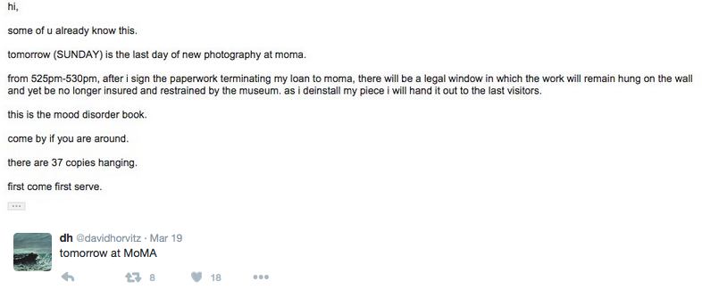

**sur·ro·gate** 
/ˈsərəɡət,ˈsərəˌɡāt/ 
*noun* 
noun: surrogate; plural noun: surrogates 
1. a substitute, especially a person deputizing for another in a specific role or office

##### 1.

A year or so ago, a colleague of mine—let's call her Jane—told me how much she disliked the first photograph that appeared with a Google image search of her name. I didn’t know what photograph she was objecting to so strongly, but I knew the feeling she meant. With images both of oneself and one’s professional activities and interests collected through a variety of means—including direct tags, shared appearances on websites, and public archives of social media posts—it can be unnerving to confront the algorithmically constructed photo album of our online existence. Without the editorial control we may be used to in other forms of both private and public image management, Google image search results dispassionately proclaim, “This is what you look like in public, online.”

Because Jane has professional interests in privacy and consciously cultivates a very light online footprint, rather than live with the slight unease caused by coming eye to eye with the accumulated presence of her online image, she gave herself a project. Her goal was to get the offending image removed from the search results. Though motivated by a substantial desire for online privacy, the pursuit—she readily admits—existed somewhere at the intersection of professional curiosity and personal vanity. Because the original image had multiplied online and appeared in at least three locations, their removal entailed contacting an international array of webmasters at multiple companies, and ultimately filing an image copyright claim with Google, which asserted the photographer’s right over the image (not, ironically, her own). Perhaps her greatest challenge was in seeing that her photograph had also been transferred to another person’s identity, a woman in eastern Europe who, for unknown reasons, was using it as her own profile image.

##### 2.

I found myself equally interested a number of questions raised by Jane’s reaction and responses, including 1) any individual’s desire or ability to manage self-image in an online public space—as opposed to a traditional public space, 2) the easy multiplication and spread of images, from one context to the next, and the corresponding difficulty of stopping that spread or removing the image entirely 3) the relationship between algorithms and people selecting a group of images, and 4) public access to the private self.

The easy and fluid movement of images online, from one immaterial context to another, can be seen, depending on one’s perspective, as either a utopian space offering infinite contextual flexibility, or a landmine-strewn field of copyright threats and complications. It is more common to see artists’ concern about the (perhaps alarmingly) freewheeling movement of authored images through this often undifferentiated series of spaces than it is to see artwork that engages seriously with the new realities and creative possibilities of that movement. And yet, how we, as a culture, come to understand these new types of image relationships within such emerging arenas of visual consumption and forms of visual display relates closely to the broad challenge of navigating ourselves through the shifting—and perhaps unfamiliar—terrain of online public space.  

##### 3.

<figure class="figure-sm">
	
	<figcaption>David Horvitz, "Mood Disorder," 2014

	</figcaption>
</figure>

In 2014, the artist David Horvitz made a photograph of himself portraying a visual stereotype of internal despair. The resulting image is simultaneously evocative of both a legacy of conceptual art and the banalities of stock photography. In the former category, Horvitz summons his conceptual forebearer Bas Jan Ader’s most well-known piece, [*I’m Too Sad To Tell You*](http://www.basjanader.com/works/toosad.php) (1970-1971), a video of the artist weeping, conveying the incommensurable space between sorrow and speech.

<figure class="figure-sm">
	
	<figcaption>Bas Jan Ader, "I'm Too Sad to Tell You," 1971

	</figcaption>
</figure>

But unlike Ader’s direct confessional, which strikes a heartfelt tone, Horvitz obscured his own face, making his self anonymous, and built in the visual clichés of depression: a lone male figure, dressed in black, lowered head-in-hands, a tumultuous sea behind him. Having created an image suitable for the generic needs of those wishing to visually signal “inner turmoil”, Horvitz uploaded the image to Wikimedia Commons—a growing database of, at present, 31,595,596 freely usable media files to which anyone can contribute—and then linked that image to the Wikipedia page for Mood Disorder, an overarching psychological diagnosis classification, the most common of which is clinically diagnosed depression. (A more accurate image for this page would no doubt be a person of perfectly average appearance, but that’s a separate matter.)

<figure class="figure">
	
	<figcaption>Wikipedia page for Mood Disorder, c. 2014

	</figcaption>
</figure>

Safely categorized as fair use and with no fees to anyone who wished to take it, Horvitz’s uploaded image followed the laws of online nature and, over time, circulated—or, "propogated," to use Horvitz's term—away from the Wikipedia page and became absorbed into new contexts. As Horvitz had observed in a previous project, “My photographs depict my own presence in a place and are intended to move, to circulate, to be sourced and re-sourced. Like the postcard, the digital photograph is meant to embark on its own travel. Instead of a singular object moving through time and space, its movement is defined by multiplication through copying, re-posting, forwarding, etc.”[^1]

Horvitz’s challenge then became tracking the image—a surprisingly elusive task given the ubiquity of images online. Whether archives of material objects or networks of jpegs circulating online, large image collection sites challenge easy access for all but the most iconic of images. Though the image depicts Horvitz, it was not identified with his name. This disassociation meant that the easiest textual search term, “David Horvitz” was ineffective in tracking the image’s movement.

It was a situation curiously opposite the one experienced by my colleague who didn’t like her Google search results: where she objected to the image (of herself) that the search algorithm produced as a match for her name in text form, and wanted the terms disassociated, Horvitz, by contrast, sought to create a condition whereby his own image (made anonymous) would travel freely through online space. Yet, now disassociated from the search term of his name, tracking the proliferation of the image had to be determined through a reverse image search, a still-rudimentary process of algorithmic vision that attempts both to replicate a human’s ability to differentiate among like visual forms and recognize individual forms or places within those broader categories. The results of this search became Horvitz's book, [*Mood Disorder*](http://dismagazine.com/blog/76800/mood-disorder-david-horvitz/).

##### 4.

My first introduction to Horvitz was through an online search, in 2012, when a friend of a friend suggested I might be interested in his work. I looked him up, and while I must have found his website, all I remember from that first search is his Wikipedia page, where I was curious to find a number of obvious irregularities for a typical artist’s biography. I was interested enough in that fact alone to check back on the page, and found that every time I looked, it had changed in some puzzling way—never quite what I remembered, but also never quite seeming like a usual, or accurate, artist’s profile. So it seemed not entirely surprising to learn, in July 2014, that Horvitz had been banned from Wikipedia, after [extensive, and now archived](https://en.wikipedia.org/wiki/Wikipedia:Administrators'_noticeboard/IncidentArchive846#David_Horvitz), discussion among Wikipedia editors largely stemming from unusual activity on the artist’s Wikipedia profile and his performance/intervention *Public Access*, and coalescing around the “Mood Disorder” image, which was deemed, in short, inappropriate self-promotion at odds with the goals of Wikipedia.

Consequently, Horvitz’s man-and-the-sea (self-)image was removed from the “Mood Disorder” page, and Horvitz himself was indefinitely banned from Wikipedia, which is actually to say that the name “David Horvitz” along with its associated username and IP address, was prohibited from editing Wikipedia entries. In the material world, an act of “banning” conjures legal action such as a restraining order, whereby the person’s physical body is barred from entry into the designated parameters of a particular physical space, or must keep a particular physical distance from another person, both acts that would generally be prevented or surveilled through traditional visual means: the eyes of cameras, guards, or other interested parties. Yet to “ban” someone digitally is necessarily premised on establishing personhood through other categories. Horvitz was not banned from physically walking into Wikipedia headquarters in San Francisco. However, the digital extension of him, his online and immaterial surrogate, as expressed through a configuration of words, place and source code, is not welcome in that online space.

##### 5.

And yet, despite his ostensible absence, Horvitz manages to perpetuate a degree of uncertainty. In the course of trying to determine which, if any, of the other Wikipedia editors who had become involved in images and edits was associated with Horvitz (one of them, for instance, shares his name, but is not thought to be him), one of his most vocal dissenters wrote in apparent frustration, in July 2014, “I'm simply doubting that if it's even the right person. There's no telling with this guy.”—Ryūlóng (琉竜) 13:44, 13 July 2014 (UTC)

I could relate. In my own online sleuthing trying to understand for myself the circulatory patterns of the “Mood Disorder” image, I came to feel a lot like I imagined the befuddled yet persistent Wikipedia editors who were discussing his case to be. By way of example, I came across two other photographs that struck me as potentially “authored” by Horvitz, on some level, if only as existing, by virtue of his connection, within the same image sphere. The first was another photograph of a crashing ocean, in a book by yet another (?) David Horvitz, that appeared on his Instagram feed, and the second is the current (as of this writing) image on the Wikipedia page for Mood Disorder: an 1869 illustration of a man standing by himself in the rain that already, 150 years ago, oozed self-awareness about its own status as visual cliché, a tongue-in-cheek “stock image” of its day.

<figure class="figure">
	
	<figcaption>The current illustration for "Mood Disorder" on Wikipedia, originally published in the satirical magazine "Punch" in 1869

	</figcaption>
</figure>

Drawing on essentially the same visual stereotypes as Horvitz, instead of the [lowered-head-in-hands gesture](https://www.google.com/search?biw=1440&bih=721&tbm=isch&sa=1&btnG=Search&q=depression#tbm=isch&q=depressed) it features a visage obscured by a rain hat and umbrella and swaps out the trope of crashing waves for the [pathetic fallacy](https://en.wikipedia.org/wiki/Pathetic_fallacy) of a heavy downpour to indicate human emotion. The illustration, published in 1869 in the satirical magazine *Punch*, was captioned to indicate its own absurdity as a serious image.

Whether or not Horvitz uploaded this image as well hardly matters: the more interesting point is that I wondered if he had, if the man standing in the pouring rain could be a surrogate image for the first, now removed, crashing wave image. The idea of a surrogate for an imposter stock image is funny, or at least absurd (and so meta it hurts), but if the strategy of hiding in plain sight fails, it is a reasonable (if also funny and absurd) extension of the same impulse.

##### 6.

It is worth noting that the offending “Mood Disorder” photograph is [archived](https://en.wikipedia.org/wiki/Talk:David_Horvitz#This_artist_featured_in_mood_disorder_article) on the website’s editorial talk boards. So, too, for that matter, is Horvitz's expressed wish to delete his own Wikipedia page—a wish that has been commemorated in the form of a fixed material life by the designer [Sabrina Montimurro](http://newmedia.merz-akademie.de/~sabrina.montimurro/portfolio1/deleting-david-horvitz/), working with Paul Soulellis.[^2]

<figure class="figure">
	
	<figcaption>Sabrina Montimurro, "Deleting David Horvitz," 2015

	</figcaption>
</figure>

Horvitz more closely shares the goal of erasure with my colleague who worked to get her “bad” photograph removed from public online space. The difficulty of the two projects, and the differences between them, however, illuminate the complexity of online privacy rights for individuals and for individuals who also exist as public figures. In Horvitz’s case, as an individual, he can aesthetically disrupt the typical circuitry of public knowledge production on a site like Wikipedia, in a manner that directs his audience to consider the parameters and possibilities of such an interface, but as a figure about whom a Wikipedia page exists, a page that is written by other people on the basis of previously published information, Horvitz can do relatively little to control the narrative.

In the face of the durability of online data, then, the existence of a public surrogate or, better yet, a band of surrogates all slightly different from one another, to act as a collective form of decoy, becomes an appealing possibility. It is a strategy not unrelated to that practiced by the artist Hasan Elahi, who, since 2003, has been making the aesthetic and political point that a torrential deluge of information—photographs, coordinates, records—is not unlike no information at all. This mirrors the proposals of some online privacy advocates: in the absence of the possibility of the total erasure of an online identity, adding data, and particularly misinformation, rather than subtracting it is a viable alternative.

Of course, Horvitz and Elahi are artists, so ultimately, if known, their gestures of anonymity bolster their own aesthetic authorship, refracting back though the multiplicity of online space to coalesce around their professional identities. In Horvitz’s case, for example, the image that was set free through its Wikimedia Commons status, was reconstituted in all of its new permutations [at the Museum of Modern Art](http://www.moma.org/calendar/exhibitions/1539?locale=en) in New York, an institution nearly synonymous with aesthetic authorship. Fittingly, at the close of the exhibition, Horvitz gave away the exhibited copies of *Mood Disorder* to friends and strangers, setting them back into unknown paths of circulation.

<figure class="figure">
	
	<figcaption>Text of an email from Horvitz, tweeted

	</figcaption>
</figure>

##### Notes
[^1]: David Horvitz with Ed Steck, *Public Access* (2012). The self-published book emerged from a commission by San Francisco Camerawork for their exhibition *As Yet Untitled: Artists and Writers in Collaboration* (2011) and is available in modified form as a [freely downloadable PDF](https://rhizome.org/editorial/2011/feb/18/something-fishy-pelican-state-beach/).
[^2]: Horvitz, too, produced a zine with Franklin Street Works that documented, among other things, the archived debate about deleting the page.
