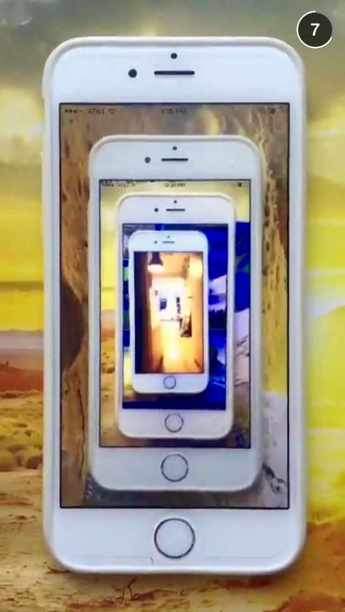

<figure class="figure-pair">
	
  
	<figcaption>Screenshot of Snapchat posts by Lonneke van der Palen (L) and David Brandon Geeting (R) for This Is It/Now exhibition, 2015. Courtesy This Is It/Now.
	</figcaption>
</figure>

##### I
In 2010—not so long ago, but it feels like light years in online time—I had a conversation with a photography curator about a recent acquisition she’d made for her museum. Upon purchase, the photograph she had discussed with an artist arrived at the museum, somewhat unexpectedly, as a digital image file. The museum, of course, was well equipped to receive photographic prints, but the receipt of a digital file as a work of art presented this museum’s venerable photography department with some interesting questions. 

For starters, assuming the image would be exhibited in material form, how big should the print be? What kind of paper should it be on? And who should decide? In the absence of an artist’s choice or an obvious default solution, what was the museum’s role in these aesthetic decisions? Furthermore, once the photograph was printed, what, then, should happen to the digital file? Was that the original form? Could new prints be produced from it, perhaps in different sizes, should the need arise in future exhibitions? 

It should be clear that the default assumption, at the time, was to make a print: an object to accession and then exhibit and preserve in the known ways, albeit with some modifications. After all, variations of these questions are well known among collections that include negatives and slides. But this set of questions, which tracks the movement from the lived and dynamic realities of photographic images into the traditionally more restful state of museum objects has only grown more complicated in recent years. 

##### II	Experiential Value
There is somewhat of a tendency, in certain circles at least, to think of the proliferation of immaterial images primarily in terms of loss, most notably a loss of the object, its treasured material nuances, and the particular modes of labor and skill required to make those material wonders, that exist in an expansive range of physical forms. Yet photography has always been a medium of enormous experiential complexity. We can think of the intimacy of a hand-held and mirrored daguerreotype, kept inside a velvet-lined case and revealed for each viewing; the emergence of mass media press images, viewed by millions, nearly simultaneously, on disposable pages; the collective family vacation slide show in the living room; or the elegant and aesthetically validated walls of museums. One of the beauties of the medium—a beauty that is as visible now as it ever has been—is the ability of its images to exist in a flux of shifting and adaptable forms that, in turn, carry similarly shifting experiential possibilities. And just as a range of printed forms have offered a corresponding range of experience, emerging modes of immaterial viewing—online or elsewhere—are similarly complex and specific to particular screens, platforms, and social or personal custom. 

The root of the issue the curator was navigating as she grappled with how to integrate the digital file into the museum’s existing rubric of value was the result of emerging forms of image production and distribution that are decidedly at odds with the systems and values of the by now fairly well established photo museum world. With very few exceptions, photography departments in museums and institutions dedicated to photography emerged in concert with or in response to the development and evolution of the medium as a form of fine art. This began happening in earnest in the 1970s as photography simultaneously became legitimized by the broader art world and began to develop roots as a viable market. Though it’s a bit of a generalization, it’s fair to say that photography’s viability as a legitimate creative medium was directly tied to the production of objects and the establishment of both institutions and a market that granted seals of approval that, in turn, further facilitated a desire for those objects to be collected, stored, exhibited, and preserved. Yet the value granted to individual prints and objects (itself not wrongly placed) may overshadow other worthwhile facets of the medium. There is room for more attention to the experiential nuances of photographic images, and a fuller range of value. 

##### III	Modes of Viewing
If one mode of exhibiting attention to new forms of photographic image creation and circulation might be characterized by impulses to modify new modes of photographic production to known ways of viewing (more on this in future posts), another approach is to infuse the experience of the exhibition with the experience of immaterial viewing characterized by networked space.[^1] This latter mode seeks to disrupt habitual modes of collective viewing—whether those habits have been formed in traditional gallery spaces, or through new habits (no less engrained, for many) in online spaces that call for scrolling, reposting, commenting, and sharing. Arguably, both types of space have become so common, so internalized, as to have become invisible. 

I’ve been interested in the creative possibilities of disappearing photos for a few years now, particularly in relation to how we assign value. Disappearing photographs force the issue: there’s no way to value them except as experiential. So last summer I was happy to hear about an exhibition that took place entirely on the app built around a default mode of image disappearance, Snapchat. Aptly titled [*This Is It/Now*](http://thisisitnow.info/), the exhibition ran for 6 weeks, featured one artist per week, and was organized by the collaborative duo Max Marshall and Paul Paper. Per the restrictions of the app, the artists posted images (accumulations of still images or videos) that were viewable by followers of the *This Is It/Now* account for 24 hours. 

In my own imaginary version of a Snapchat show, I had mentally featured artists attuned to what I think of as the usefully limiting parameters of the app, which creates a condition that favors immediate, direct engagement, and relationships to temporality and disappearance in a venue that offers very specific limits on time, text options, and almost a total lack of social feedback cues that are otherwise typical of social media. So in a recent conversation with Paper, I was interested to learn that their selection of artists took a different tack: while the company’s general perception and self-marketing strategies suggest that the images’ ephemerality allows a more unfiltered, more spontaneous, and thus more “authentic” social media experience, Paper and Marshall’s selection criteria favored artists whose photographic work engages with “manipulation and mutability of the digital file,” as a strategy to slow down the viewing process and thus delay the arrival of meaning. 

Paper writes, “the curatorial decision was to explore a clash between the seemingly unmediated format and an apparently manipulated content. As Snapchat offered very few basic filters back then, the artists worked within - and sometimes around - the confines of the app, which presented a somewhat different experience to their normal and regular working conditions.” 

<figure class="figure-pair">
	
  
	<figcaption>
		Screenshot of Snapchat posts by Nico Krijno (L) and Roxana Azar (R) for This Is It/Now exhibition, 2015. Courtesy This Is It/Now.
	</figcaption>
</figure>

Prior to *This is It/Now*, Marshall and Paper had collaboratively organized the exhibition *Blog/Reblog*, designed “to mimic the processes of online re-blogging” and presented via digital slide projection. Outside of these experimental curatorial endeavors, Paper has also spoken publicly about the need for museums to adapt to new forms of networked images, and the emergence of a “glaring gap” between how we experience photography in our daily lives and how the medium is generally presented in exhibition: “While the experience of viewing photographs online, in front of our bigger or smaller, but increasingly mobile screens, imbues it with senses of fleetingness and temporality, and a background of rich surrounding activities, the gallery space is just the opposite: the prints are solid, the noise is kept to a minimum and the time is presented as still.” He continues, “network culture has radically changed not only how the medium operates, but also how art photography reaches us.”

<figure class="figure-md">
	
	<figcaption>Screenshot of a Snapchat post  by Ruth van Beek for This Is It/Now exhibition, 2015. Courtesy This Is It/Now.

	</figcaption> 
</figure>

I appreciate Marshall and Paper’s efforts (among those of many others, which will featured in forthcoming posts) particularly in this last regard: to consciously evoke an awareness of new modes of viewing and replicate those modes as exhibition strategy, whether designed to mimic the ubiquitous activity of reblogging, or impose the fleetingness of the most disruptive viewing experience currently available as a parameter of viewing an exhibition. Perhaps counter-intuitively, in some ways, the idea of an ephemeral online exhibit is not entirely unlike any other physically realized exhibition: both exist for a discrete and self-selecting set of viewers who must opt in to the particular time and place of the show; at the conclusion of the exhibit’s run, it can no longer be viewed as a discrete experience and must be understood through the necessarily incomplete nature of its inevitably partial documentation. (While it might have been more radical a gesture for Paper and Marshall to let the exhibition play out as, in fact, entirely ephemeral, it’s nevertheless nice that they archived aspects of the exhibition through screenshots – which Paper characterizes as “glimpses and remainders”.)

##### IV	Digital materiality
While all photographic devices have internal rules, culturally, over the last 50+ years, we’ve largely internalized the basic specifications of the hand-held camera, and can thus ignore the deliberate choices of manufacturers to design cameras to behave in particular ways. But the rise of apps and algorithmic photography, in particular, offers a nice reminder that—as always—any particular device or platform offers a set of human-designed possibilities. (It could be that one perceived shortcoming of snapchat among artists—beyond the obvious attachment to producing an object that will (or may) become an immortalized thought or vision—is the discomfort of coming so squarely against the app’s imposed default limitations.) It’s not unlike the ways that museums and photo institutions, not to mention my own field of photo historians, have internalized ways to handle, process, and write about photographic objects. 

But there is, currently, an opportunity—and I would argue a need, actually—to develop a fuller and more expansive default mode that includes what we might think of as a more nuanced collective sense of immaterial image connoisseurship. Art historians and museum professionals excel at object connoisseurship: a highly practiced skill developed through career-long attentiveness to what might otherwise be easily overlooked facets of the material production and lives of photographic objects. But there is a type of unsung close attention to the immaterial photographic image, that is largely swept aside in favor of a kind of flattening of the online image experience, as if all forms of immaterial images are experientially—or even actually—the same. And while bringing a willing attentiveness to the particular textures, contours, contexts and cues of particular modes of immaterial viewing is an unfamiliar area, the skills and attentiveness are similar. 

Immaterial objects may be in constant flux, as are material objects. Beyond their rapidly shifting contexts, they degrade and age, and though they may be multiplied, they are also at risk for loss. As with the hidden backsides of prints or paintings, or the care with which an expert can assess the age of paper, or a particular studio stamp or date of a signature, immaterial images contain elusive information, albeit sometimes in the decidedly less romantic realm of metadata. But it takes a similarly attentive mode of viewing, and care about the relationship between what is being seen, how it was produced, the effects of circulation, and the experiential value to the viewer (or maker) to tease out the full spectrum of information offered by those cues. 

These are details that can trace and track histories of use and channels of circulation; they can underscore shifting balances of surveillance and privacy; they can provoke questions of authorship and originality; they can illuminate the shapes and patterns of global economies and transactions; they can reveal cracks and ruptures in social politics and political power; they can mediate relationships of individuals to communities and corporations; and they can enable human communication and relationships from the most personal to the broadest demographic levels. But it is worth keeping in view that none of these are new issues in photography: the “old” ways of making and viewing photographs produced questions that were (and remain) just as complex as these new iterations. It is the experience of it—and how we access, understand, and value the meanings of that experience—that has changed.

##### Notes
[^1]: This is not to suggest that there is no material involved; certainly, the romantic and marketable notion of “the cloud” is premised on an entirely man-made and decidedly physical system of servers, wires, cables, and “off-site” storage, not to mention the copious amount of hardware involved in its distribution and reception and the breadth of human labor that produces the disposable (though toxic) stuff. I thank Katrina Sluis for pushing me to clarify this point. And, yet, despite all that stuff – which is perhaps more comparable to the chemicals and labs of the analog era than it is to the (typically) paper-based object of traditional photography, there is, still, a very distinct difference in the viewing experience when there is no comparable discrete object to hold onto, admire, collect, and become aesthetically expert about. 

