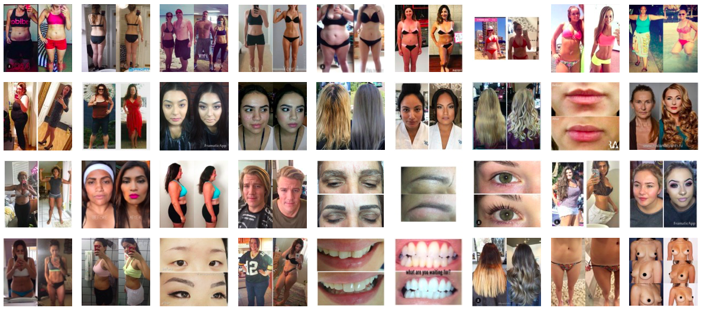

<figure class="figure-lg">
	
	<figcaption>
	Excerpts from #beforeandafter on Instagram
	</figcaption>
</figure>

Until this past Friday morning at the Tucson airport, when I sat down next to a discarded copy of the *New York Times* that was left open to [Jennifer Weiner’s op-ed on the subject](http://www.nytimes.com/2016/08/26/opinion/the-women-who-wont-wear-swimsuits.html?_r=0), I had been unaware of the hashtag #weartheswimsuit, which has become somewhat of a social media summertime rallying cry to encourage those (women, mostly) who have elected to remain covered up, even uncomfortably so, at the beach or the pool. I’m in the right demographic – female, 40+, carried, pushed out, and nursed two babies – to have some natural empathy for the swimsuit anxiety Weiner describes, but I don’t give the issue much active thought. I’m glad she does, though, and I’m even more glad that she connected #weartheswimsuit to the realm of before-and-after photography, a topic to which I have, by contrast, devoted considerable thought. 

Weiner writes:

 > As summers go, this wasn’t a totally terrible one for body positivity. The Playboy Playmate Dani Mathers, who snapped a photo of a woman at her gym with the giggly, grossed-out caption, “If I can’t unsee this then you can’t, either!” was roundly shamed on social media.
>
> Then, during the Olympics, in between commentators’ cracks about how a female swimmer’s husband was actually the one responsible for her gold medal, or how our gymnasts looked as if they should have been hanging out at a mall, you could actually see larger bodies being celebrated for their achievements; bodies that were winning medals as opposed to being “befores” on those weight-loss reality shows.

The before-and-after mindset has been produced and circulated via photographic means, to serve various ends, nearly since the invention of the medium, in areas from medical treatment to climate change to drug awareness to disaster documentation. In the book I have co-edited with my colleague Jordan Bear, [*Before-and-After Photography: Histories and Contexts*](http://www.bloomsbury.com/us/before-and-after-photography-9781474253116/), a real absence among the contributions we solicited is serious attention to some of the most banal, pervasive, and commonly seen before-and-after photographs in our contemporary culture: those from beauty magazines, celebrity gossip rags, and advertisements for all manner of body improvement strategies ranging from teeth whiteners to bleach creams to cosmetic surgeries, each promising an easy fix for the bodies they touch. 

To acknowledge this oversight, I wrote in the introduction: 

> The hashtag #beforeandafter on the photo-sharing app Instagram yields, as of this writing, over 3 million posts, most commonly depicting weight loss, hair styling, and make-up application. Beyond typical portrait views of predominantly female bodies and heads, particular body parts are often highlighted: Eyebrows, lips, bare bellies, and bikini-clad bottoms join the relentless parade of physical display and underscore the powerful effect of the beauty industry on the self-perceptions, aspirations, and publicly shared personal documentations of millions. The visual narrative of personal transformation is unquestionably one of progress and improvement; it goes without saying that the end result is believed to be preferable to the starting point. Whatever process or length of time it took the subject to attain more voluminous tresses; red-carpet worthy make-up; or a tighter, leaner body is collapsed into the side-by-side pair of magical transformation: the ugly duckling is transformed into a swan and viewers are spared the dirty process of becoming. In these cases, the before-and-after trope works to hide the intervening series of events: the less the viewer thinks about the visually absent period of time, confirmed by its absence as a private matter, the better. The images have to exist as a pair: the “before” can only be tolerated as a public post in the presence of the triumphant “after,” which both confirms and eradicates the personal shame of the “before”.

So it was particularly gratifying to read Weiner’s counter to this deeply ingrained trend – particularly set, as it was, within an immediate context of cultural attention to and celebration of Olympians’ extraordinary range of strength in body types. As shotputter Michelle Carter (aka the Shot Diva) summed it up, “You have to understand, everyone’s body was built to do something.” 

Weiner concludes:

> These are the images I want to take with me from this summer: [Olympic weightlifter and bronze-medalist] Sarah Robles’s smile; Michelle Carter’s confidence, and what my Facebook friend Jaime Rydman wrote beneath a shot of herself in a black one-piece with waves frothing around her ankles and wrote, “I’d always say ‘this will make a good ‘before’ picture. I need to stop ... it makes a good NOW picture!"

I have a couple of people in my life – both male and female – who can’t seem to look at a photograph of themselves without commenting on how terrible they look. It always seems a little futile to point out that *I* think they look good, and that I’m pretty sure I’m right. While I’m fascinated by the pervasiveness of before-and-after photographs, the NOW picture seems like a much better model towards which to aspire. 

