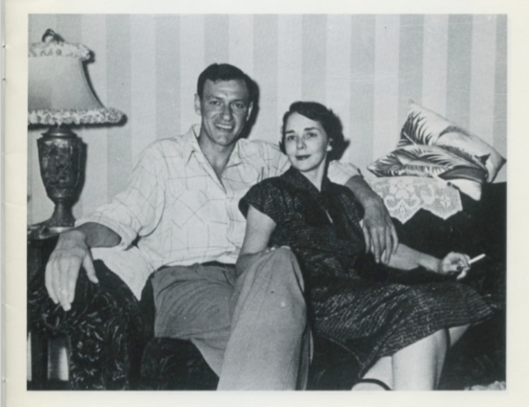

Dear Al,

Have you thought about the future of your digital self? I know you want your body to be cremated, but in the end that’s just your bones. There will still be so much of you left behind – so many traces. Does this question seem strange? I went to a presentation yesterday afternoon at the Hereafter Institute. It was for new clients – well, for anyone who needs some help thinking about their digital afterlife. It was just chance, really, that I stumbled into it. I was on the 5pm tour. Strangely, I bumped into your old colleague there, Anne – she was with her husband and their dog. They’d just come from a basketball tournament in San Diego – they’d rushed up to make the tour. She said to say hi, and to tell you she’s happier in her new job. 

Anyway, I was glad not to be alone on the tour. Our guide was so brisk and efficient – like someone you’d imagine in a movie giving a tour of a cryogenics facility. White lab coat, tidy clipboard, a little bit intimidating in her demeanor – and it was uncanny how her blue blouse perfectly matched her eyes. She led us into a Japanese style pavilion – I think you would have liked the room’s earthy elegance. 

She had us raise our hands to give her a sense of where we had our data stored….
Facebook, Instagram, Twitter, LinkedIn, MySpace…
Gmail, Yahoo email, work email, school email…
OKCupid, eHarmony, Match, Tinder, Grindr…
Tumblr, Wordpress, Pinterest…
And what about Amazon! I really do feel like Amazon knows me – how many times have their suggestions, generated from my purchasing history, been so right on? 
There were more but honestly I don’t remember them all. Her point was, our personal data – our words, our photographs, our videos, our preferences and tastes, our financial information – it’s everywhere, dispersed over networks, entrusted to corporations, backed up in “the cloud” but, at the same time, totally out of our hands, completely vulnerable. (I thought about making a joke about how they handle Snapchat accounts – it seemed the wrong mood, though.)

So this is where it got interesting. She proposed three options for our digital remains (that’s right, our “digital remains”…. what a term, huh? She had our attention.) They were: continuation, deletion, or memorialization.

The easiest, as she described it, is deletion. I guess it’s a little like cremation, or burial. Sort of a traditional aftermath of dying. You hand over all your accounts, entrust them with all the passwords, and the analogy she used was like cleaning out a house. They just wipe everything clean. Actually it made me think this could be a nice option for the material world, too. Instead of the burden of the kids dealing with all the stuff – think of all the furniture, the cars, the papers and files, and, my god, the books. Imagine if it could just all – poof! – be gone. So that’s an option. At least for the Twitter you, or the Facebook me. But I don’t know – I have to say I kind of like some of your tweets. I might be sorry to see them go. (I wonder, would they save your draft tweets, too? The ones you wrote but never posted? Some of the best stuff is in there, if you ask me.) 

The second option was actually my favorite, and definitely the coolest, but also the weirdest. Continuation. If we sign on with the Hereafter Institute, and choose this option, they’ll create bots for us that – get this – will be algorithmically programmed to maintain the illusion of presence on social media. So, I’d be dead, but the bot would have analyzed my social media habits – the kinds of photos I post, my tone in captions, my habits, like how often I post in various places, what time of day – and it would just keep it all up, like it were me. No one would have to live without my pretty sky pictures, or art reports, or miss a second of the kids’ cuteness. (Do you think the bot could even auto-generate good license plates to post? They’d have to be funny ones. I don’t like the obnoxious ones. Could a bot tell the difference?) On the other hand, now that I’m writing it out, this sounds like a more valuable service for the living – maybe I could pay them double to create a bot to just start posting as me now? I should have asked if it would also comment on my friends’ posts for me, wouldn’t that be great? But what if the bot learned to become a better version of me? What if, after a while, I could never live up?
Ugh.

Okay. Well, the last option was memorialization. They were really selling this one. I guess [the guy who founded the Hereafter Institute](http://www.gabebc.com/) is most excited about these options. In fact, he came in to the presentation at this point, and told us about all his ideas himself. Charming guy, really persuasive – brimming with ideas and enthusiasm. It was infectious. (No mean feat, given the subject matter.) A sleek, black memorial plinth that plays – and displays – all my tweets, ever, (or yours) from a custom LP. A virtual reality experience in which my 3D body scan combines with recordings of my voice and an illusion is built around me in my favorite place – so, for example, they could take photos of Echo Lake and generate its virtual version, and you could visit me talking about my favorite artists or the book I last read. There was also a wearable necklace – bulky, but pretty good looking all in all -- that played uploaded videos on shuffle. This would be great for you, it could be all your Vines and gifs and little videos on Instagram, but also videos from our phones. It’s like an old nineteenth century Victorian locket, updated. 

Anyway, dear, it gave me a lot to think about. You should think about it, too. I’d suggest we make an appointment for a consultation, when you’re back in town, but it was just a two-day opportunity. But [here’s their website](http://www.hereafterinstitute.com/). Take a look. As the guide said at the very end of the presentation, “We won’t live forever. But our data will.”

Love, Violet

<figure class="figure">
	
	<figcaption>
	William deLappa, from The Portraits of Violet and Al, c. 1973, 
	as published in Creative Camera, October 1977
	</figcaption>
</figure>

**************
The Hereafter Institute [debuted at the Los Angeles County Museum of Art](http://www.lacma.org/about-hereafter-institute), August 27-28, 2016, affiliated with the museum's exceptional [Art + Technology](http://www.lacma.org/lab) program. Read more about the Hereafter Institute [here](http://laist.com/2016/08/23/hereafter_lacma.php) and [here](http://thecreatorsproject.vice.com/blog/hereafter-institute-digital-remains-death-online-art-project).

