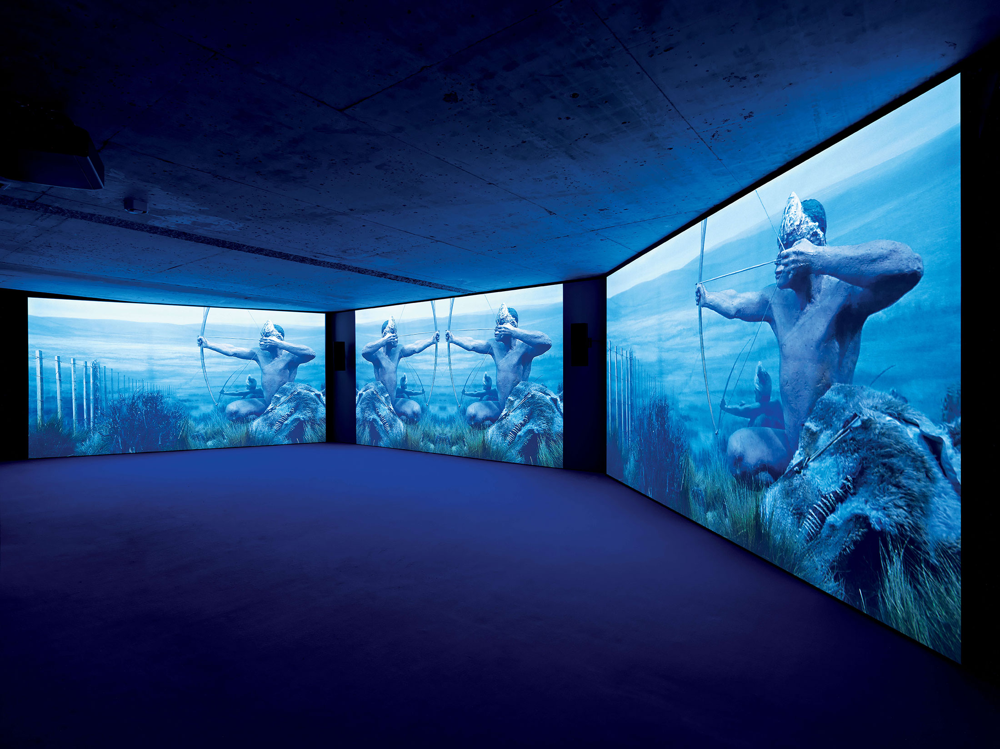

<figure class="figure-lg">
	
	<figcaption>
	Oskar Schmidt, Portrait (No. 2), 2015, C-Prints, © Oskar Schmidt
	</figcaption>
</figure>

*Duncan Forbes is Director and Curator of [Fotomuseum Winterthur](http://www.fotomuseum.ch/en/), Switzerland. He was previously Senior Curator of Photography at the National Galleries of Scotland. Recent collaborative curatorial and publishing projects include [Provoke: Between Protest and Performance – Japanese Photography 1960–1975](http://www.fotomuseum.ch/en/explore/exhibitions/21814_provoke_between_protest_and_performance_photography_in_japan_1960_1975) (Steidl, 2016), [Beastly/Tierisch](http://www.fotomuseum.ch/en/explore/exhibitions/21646_beastly_tierisch) (Spector Books, 2015), [Manifeste! Eine andere Geschichte der Fotografie](http://www.fotomuseum.ch/en/explore/exhibitions/21668_manifesto_an_alternative_history_of_photography) (Steidl, 2014) and [Edith Tudor-Hart: In the Shadow of Tyranny](https://www.nationalgalleries.org/whatson/exhibitions/edith-tudor-hart) (Hatje Cantz, 2013). Our conversation revolved around Fotomuseum’s engagement at many different levels with the question of post-photography.*

**Kate Palmer Albers:** Fotomuseum Winterthur has launched the [Post-Photography Prototyping Prize](http://www.fotomuseum.ch/en/explore/p3). You’re well underway in the nomination and selection process, with the first awardee to be announced in November.[^1] One of the aspirations of the award is to seek ‘photographic work that engages directly with the creative and conceptual opportunities opened up by computational technologies’. In what ways has this played out in terms of thinking through what post-photography might mean, and in bringing together the worlds of photography and computational technology?

**Duncan Forbes:** Since I arrived at Fotomuseum in 2013 we’ve wanted to engage very directly with the problematic of post-photography and have made significant changes to the way the museum operates – in terms of program, personnel, visual identity, digital and physical infrastructure etc. – in order to do so. I can’t here go into too much detail, but perhaps it’s worth beginning by thinking a little more abstractly about what post-photography might be.

I think it’s important not to think of post-photography as a straightforward temporal relation, something simply following after 150 years of ‘photography’. It might be possible to read its emergence chronologically, but as a primary explanatory framework this is very misleading and immediately forecloses on innovative thinking. Neither is post-photography a movement (this is clear), or in any sense a stylistic or artistic development related to transformations in ‘the medium’ simply understood. Rather, post-photography represents a significant shift in the ontologies of photographic media, driven by the vast power of computational technologies, but in a way that needs to be understood against the historical experience of those media. We need to begin to describe the ontologies of post-photography against the complex institutional and disciplinary discourses that constitute its present, but also in relation to its ‘photographic’ past, which might not be entirely foreign. To my mind that description will be profoundly transmedia and transdisciplinary and will also revise the way we think of the history of photography, or rather what I would prefer now to call the history of photographic media. This is a rather simplistic schema and of course it conceals considerable intricacy. But the creative potential for photography curators is huge and I think a few now are beginning to grasp this.

Second, I think we need to begin to talk more about what Joan Fontcuberta has recently termed the [‘post-photographic condition’](http://moisdelaphoto.com/en/publications/post-photographic-condition-2015/). This is the context of our post-photographic moment which is marked by a deep technical, aesthetic and social transformation, distributed now on a global scale – what might be termed the ‘worlding’ of the post-photographic is another very interesting question. The institutional discourses in which the post-photographic is embedded are vast and are having a profound impact on the way we lead our lives – think of the changes wrought over the last ten years or so by surveillance culture; the power of the attention economy; the changing boundaries of public and private; and the virtualization of the image archive, to name just four obvious examples. And we are very much in the infancy of these developments. This is now the context from which the internal transformations in the media of post-photography are taking place. Again, I think we are all struggling to come to terms with this, but more institutions are following advanced artistic practice in this arena and developing programs that speak to this situation.

<figure class="figure">
	
	<figcaption>
	Maryam Jafri, Getty vs. Ghana, 2012, 8 inkjet prints, 4 framed text panels, installation view (detail), © Maryam Jafri
	</figcaption>
</figure>

**KPA:** I want to pick up on several things you just said, but let’s start with the counter-intuitive resistance to thinking of post-photography as a temporal relationship. Because, I agree, efforts to define photography ‘now’ very often rest on advancing a false sense of unity about what photography ‘was’ – say, by creating a sense that there was a coherent thing like the analogue era – so that more recent developments can be situated as a departure from ‘the way things were’. So your interest in articulating a history of today’s algorithmic photographic trends that is located in earlier discourses around histories of computational science seems to me a usefully specific way to identify both current work and realities, and to outline a historical thread for photography that may not have been visible to previous generations of scholars and curators. But amid the conditions you articulate – of how surveillance actually functions, of ways of accessing large quantities of images, of the relationship between individuals and large entities such as states or corporations, of the commodification of attention – the role of the algorithm is crucial. As you say, all of those facets of photography today are pervasive in everyday life. And one thing I’m really interested in understanding is how museums and curators – those kinds of institutions with their own particular histories – resolve collecting and exhibiting a history of vernacular photography with the scope of vernacular photography today. So, to wrap that around into a question: how do you think that re-writing a historical ontology for photography, one that takes into account a much earlier appearance of computational thinking or systems, might affect the way photographs can be understood within the context of the art museum? Are there areas of collecting, exhibition, or programming that might present openings or invitations to this other way of thinking about the medium? I ask this knowing (or believing) that the institutional pressures within museums around not thinking this way are quite strong.

**DF:** These are huge questions, so let’s begin to unpack them a little. This urge to prescribe a unity to ‘the medium’ of photography is now constantly reasserted by institutions in our era of digital convergence. It suggests a certain anxiety. I’m struck in particular by the recent wave of exhibitions asking ‘What is the photograph?’ or some such – I’ve worked hard to prevent this line of questioning at Fotomuseum. Of course, the best of these shows have concluded that photography is many things and not really one medium in any meaningful sense of the term. To exhibit a program of photography nowadays is to accept disjuncture, difference and even incoherence. But there are still the nostalgics – concerned to carve out an essentially demarcated museum positioning for photography – who want to ascribe clear material, aesthetic or technical characteristics to ‘the medium’ in the face of the endless malleability of the algorithmic image. It is a position which is at once defensive, boring and increasingly untenable.

<figure class="figure">
	
	<figcaption>
	Experimental Jetset, Lost Formats Preservation Society, 2000/2015, mixed media, installation view, © Experimental Jetset
	</figcaption>
</figure>

If there is a unity to the identity of photography, it is, as Peter Osborne has recently argued, ‘distributive’ and spread historically across a wide variety of still and moving photographic media. And this has now become even more abundantly clear when, for example, the signaletic temporality of the photograph on the screen further erodes any substantive technical difference between still and moving images. Neither is there any simple binary opposition between digital and analogue – the digital is often embedded in the analogue and the analogue in the digital. The specificities of work and process are everything. I think this has radical implications for the way that photography institutions position themselves bureaucratically, so to speak. More than ever, museum labour in photography needs to find its way to more abstract knowledge. In order even to survive, the empirical scrutiny of the curator needs to find its way to theory.

**KPA:** I think it’s important to ask big questions, but even more important to try to answer them, which you are doing here, so, thank you. And it’s interesting that you bring up medium specificity, because I find myself stubbornly attached to the idea of photography’s specificity but have a hard time articulating why that is, in a way that seems defensible. But it’s certainly along the lines of Osborne’s argument, which I wasn’t aware of, so that's quite useful, as you summarize it. But what do you mean by the ‘signaletic temporality of the photograph on the screen’?

**DF:** I mean only that on a screen a still image is a loop in a digital video signal actualized at 25 times a second. Actually, this relation is a more interesting question than it initially seems and is both historically resonant and complicated by both the variety and interactivity of screens – a question rarely discussed by photography curators. Suffice it to say that the technical capacity to combine still and moving images is far greater than ever before – earlier this year I watched my nine-year old nephew, bored on the beach, film and edit a short film on his Dad’s iPhone combining still and moving images in around two hours. This kind of facility was unimaginable even six years ago. As to your longing for the specificity of the photograph – founded perhaps on its indexicality, its tactile character, its relation to truth etc. – I think this is an understandable impulse. Whatever the changes happening to our networked image-spaces a twentieth-century conception of the photographic is still dominant – Osborne refers to this as a kind of double articulation in the digital image. I prefer not to think that I’m carrying computer-generated images of my friends on my phone, even though they are increasingly ‘operative’, that is defined algorithmically.

<figure class="figure">
	
	<figcaption>
	Nicholas Maigret, The Pirate Cinema, 2013, installation view, interactive 3 channel video installation, © Nicolas Maigret
	</figcaption>
</figure>

**KPA:** No, no – I should clarify. My thoughts about photography’s specificity aren’t a longing for truth or tactility. I’m very happy to have both object and screen-based photographs in my life, similarly happy with the various kinds of tactile experiences each form offers, and also comfortable with the indexical complications that move through both (all) kinds of photographic images. I like all of it, and I want all of it. I want layering of complexity, not proscriptive or reductive declarations of narrow specificities. The specificity I’m attached to emerges from that whole complex set of contradictions that has long been characteristic of both individual photographs and groups of images, and also related to the fact that everything we’re talking about – surveillance, massive accumulations, even algorithmic image production – are still, to me, distinctly photographic issues. The specificity is in this expansiveness. Also, I think the inseparability of the digital from the algorithmic is key – it’s not one or the other, and never has been, nor is there even a useful internal coherence among either term. I’m a little wary of the bureaucratic dimensions here, but do tend to think that there can be useful spots or fissures in which to find room for real material outcomes to what might seem to be the purview of abstract or theoretical thought. Let’s move on to your ideas about an algorithmic history of photography.

**DF:** Certainly it would be possible to construct one – and it would date back to the 1840s. I’m interested in thinking about the way the algorithmic is already present within analogue histories – I’ve just begun to work on a project that explores the potential of nineteenth-century photography as a proto-cybernetic form, a mode of visual production that in some sense anticipates our current post-photographic condition. There’s a wonderful phrase from Vilém Flusser in his *Towards a Philosophy of Photography* (1983) where he suggests that ‘the invention of photography will prove to be the point at which all cultural phenomena started to replace the linear structure of sliding with the staccato structure of programmed combinations’ – it’s so suggestive! His idea of the camera as a programmed apparatus (he means this in an institutional sense), which may or may not be subverted by its operator, is nothing if not relevant today. For me, this points to the excitement of early photography – a revolutionary transition deeply embedded in problems of human freedom.

<figure class="figure-lg">
	
	<figcaption>
	Ryoichi Kurokawa, Sirens, 2013, film still, HD-video, © Ryoichi Kurokawa/Novi_sad
	</figcaption>
</figure>

So I think we also need to consider what might be termed the long wave of the digital, which in turn will help us develop a more complex temporality for post-photography. I find this very helpful in rethinking the relations between past and present, not least in countering those arguments – often fuelled by a good dose of non-representational theory – that computational culture marks some kind of dramatic break in the priorities of vision, even a kind of invisibility of the image. I’d far rather conceive of the changes we are living through as an intensification of existing processes already embedded within capitalist modernity, an intensification of practices of quantification above all else. Indeed, Jonathan Beller has recently provocatively argued that capitalism was a digital culture from the start – there’s an idea that might help revolutionize the history of photography! To my mind all these questions are highly significant, including for the way that photography institutions position themselves today.

**KPA:** I appreciate your willingness to think in terms of the revolutionary capacity of ideas or histories. And I want to push us a little more back to: well, what does that look like in practice? When you do it? And that’s an interesting translation challenge, maybe the translation challenge for photography today. It’s certainly why I’m so interested in artists in whose work we see movement across material and screen-based forms, incorporating a kind of variability into their work in what seems to me like a logical extension or outcome of how images, and photographic images in particular, live today. This might be a good place to ask you to reflect on what seem, so far, to have become the challenges and successes of the [SITUATIONS](http://situations.fotomuseum.ch/) series. This is a project that, as I understand it, is quite unique among institutions for consciously and regularly programming both physical/material and screen-based/immaterial work that can exist in both realms simultaneously (and in an ongoing way online).

<figure class="figure">
	
	<figcaption>
	Roc Herms, &#60;YO&#62;&#60;YO&#62;&#60;YO&#62;, 2007–2015, installation view, © Roc Herms
	</figcaption>
</figure>

**DF:** At Fotomuseum we’ve seen a substantial shift in the work of (mainly) young artists towards the multi-platform presentation you suggest. Forms of production now are multiple, utilizing a wider variety of formats, materials and processes (both still and moving) within a context of dramatically transformed circulation and reception. This generates the expansive specificity you highlight. It’s a potent crucible of change marked by tremendous variety in the possibilities of photographic and filmic visualization. In a sense the image is less passive than it used to be, involving, too, a higher level of technical complexity. For example, I’ve been working recently with a photographer who is rewriting software that is intervening in the apparatus’s program.

For any museum interested in contemporary photography this poses considerable challenges. At Fotomuseum we moved very deliberately to deal with these changed circumstances, creating a new programme, SITUATIONS, which is a kind of laboratory of post-photography. Building on the success of our blog, [Still Searching…](http://www.fotomuseum.ch/en/explore/still-searching/) we wanted to create an exhibition format that had a strong virtual and physical presence and we offer content both on- and offline. SITUATIONS is curated collectively by our curatorial team according to a series of thematic clusters and we stage five or so a year alongside our more mainstream exhibition programme. It has a kind of investigative quality, often featuring younger artists, as well as playing the present off against the past. The laboratory context allows us to take more risks. It hasn’t been entirely plain sailing – our stakeholders are sometimes quizzical and there are still individuals in the museum who think post-photography means anything made on an inkjet printer. But we are staging innovative installations – a recent very successful cluster was devoted to in-game photography for example.

<figure class="figure">
	
	<figcaption>
	Kent Sheely, DoD, screenshot, 2012 © Kent Sheely
	</figcaption>
</figure>

**KPA:** What have been some of the most successful experiments, as you see it, and what were the characteristics of those projects? Does Fotomuseum collect and preserve some of the work that is presented through SITUATIONS? It seems that quite aside from the content, politics, or aesthetics of some of the new modes of photographic work today, there are enormous challenges for collecting institutions that were set up to accommodate prints, albums, discrete objects. My sense is that institutions with media or new media departments are more readily positioned, currently, to navigate some of these complexities of acquisition, storage, and preservation.

**DF:** The work is highly diverse and it’s hard to isolate specific characteristics – interested readers can run through the clusters online. We’ve made a strong commitment to the distributive identity of the photographic, building a state-of-the-art projection space and showing films by artists such as Ryan Trecartin, Ryoichi Kurokawa, Mario Pfeifer and Nicolas Maigret. Other artists such as Maryam Jafri and Oskar Schmidt engage with transformations in the photographic archive. There have been net-based projects – David Horvitz, Eva and Franco Mattes, Kasia Klimpel, Tabita Rezaire – as well as artists who offer historical interrogation such as Experimental Jetset. We’ve also attempted to engage post-photographically as curators, assembling, for example, SITUATIONS comprised of screen shots or curating material directly from the Internet. I guess if there is one key characteristic it is that much of this work is conceptually charged, offering a kind of mapping of our post-photographic condition. I don’t think this is just a curatorial fad. The complexity of the post-photographic demands qualities of abstraction in order to draw out meaning that is resonant in aesthetic and political terms – a major question for the training of young photographers today.

<figure class="figure-lg">
	
	<figcaption>
	Mario Pfeifer, Approximation in the Digital Age to a Humanity Condemned to Disappear, 2014-15, installation view, 4K Cinema transferred to HD video, © Mario Pfeifer
	</figcaption>
</figure>

As to collecting, well there are no real practical problems here, beyond having the spaces adequate to physical installation and a decent digital infrastructure. The bigger problems are conceptual and, indeed, bureaucratic (and I don’t mean this in a negative sense). My feeling is we are at a kind of tipping point for photography institutions – do they embrace the distributive identity of the post-photographic, or do they foster a more museal (that is primarily historical) conception of photography? I am still being told privately by some major institutional curators that their commitment is to the still photograph. The danger, of course, is that this positioning is increasingly nostalgic, even in terms of presenting an adequate history of photography. Our response to this is threefold: to look very closely and with an open mind at new practice; to think theoretically about photography’s identity; and to try and rethink the history of photographic media. Of course, this isn’t easy, particularly in a context in Europe where most small museums are struggling even to keep their doors open – the crisis in photography’s post-industrial institutional identity is a key related factor here. Whilst I’m very wedded to the creativity of small institutions, I also wouldn’t underestimate the bureaucratic difficulties faced by the larger institutional curators. To be a photography curator in a large institution was always to engage in a very complex war of position. And the battles are becoming ever more strategic.

**KPA:** I don’t doubt any of that, and it’s just that sense of a tipping point that makes me interested in these conversations right now. There is certainly no shortage of still photographs to attend to, so it does become a matter of potentially competing priorities — it always is. The hope, I suppose, is that all of these types of venues offer or innovate different types of support, different forms of public platform and programming, in ways that make sense for their particular collections, histories, and audiences. And while we’ve been focusing on exhibiting institutions, there are certainly related challenges in academic scholarship, research and writing. It’s potentially a daunting set of challenges, but hopefully an exciting one, too.

**DF:** Yes, the challenges are daunting and they also lie significantly beyond the realm of the image. For example, I recently heard a lecture by the geographer, David Harvey, in which he began by describing the extraordinary volume of concrete now being poured in China. Between 1900 and 1999 the US poured 4405 million tonnes of concrete, whilst between just 2011 and 2013 the Chinese poured 6651 million tonnes – an astonishing increase. I’ve been haunted by these figures ever since I heard them – they are the dialectical antipode of the intensification in algorithmic processing that we have been discussing. In a sense this pouring of concrete (a new, emerging form of urbanization) also has something to do with the ‘worlding’ of the post-photographic I mentioned earlier. I’m fascinated by the potential of bringing these antipodes together, of using one to illuminate the reality of the other. We need to try and grasp the very material relations between digitality and capital, in this case the vast surpluses of Chinese capital that are rapidly turning our world into one big car park.

<figure class="figure">
	
	<figcaption>
	James N. Kienitz Wilkins, B-ROLL with Andre, 2015, film still, HD-video, © James N. Kienitz Wilkins
	</figcaption>
</figure>

And of course there are artists doing this. We are about to stage James N. Kienitz Wilkins’ film *B-Roll with Andre* as part of our SITUATIONS programme, a digital film which in a similarly dialectical vein brings together the utopian possibilities of 4D camera technologies and the reality of the US’s prison-industrial complex. I’d far rather work like this – informed by what might be described as a digital realism – than the Photoshop formalism which is now beginning to forge a place for a version of post-photography in the marketplace. We are living through a period of very exciting production in this arena, much of it below the radar of institutions and the market. In our age of permanent structural underemployment the (networked) social base of post-photography is also taking new forms. This is another compelling topic – institutions should pay attention. But I’ve already said too much – perhaps it is something we can return to?

**KPA:** Yes, let’s. Thanks, Duncan.

**************

*Our conversation took place in Google Docs from August 22 – September 11, 2016. All images are courtesy Fotomuseum Winterthur.*

[^1]: Full disclosure: I was one of twenty-three nominators for this prize. 

