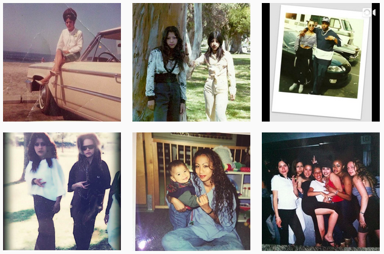
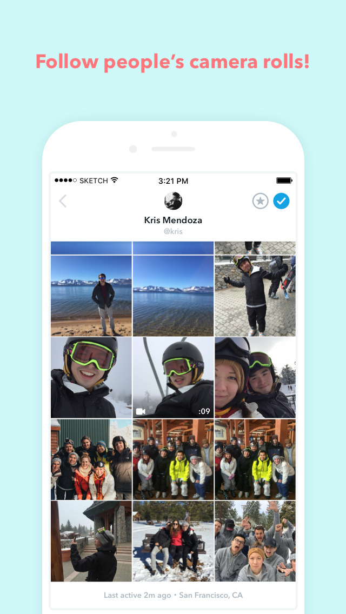
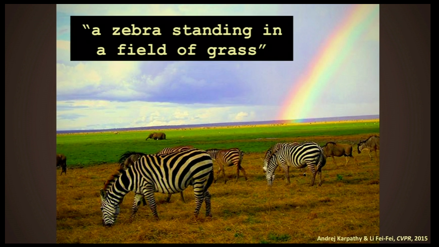
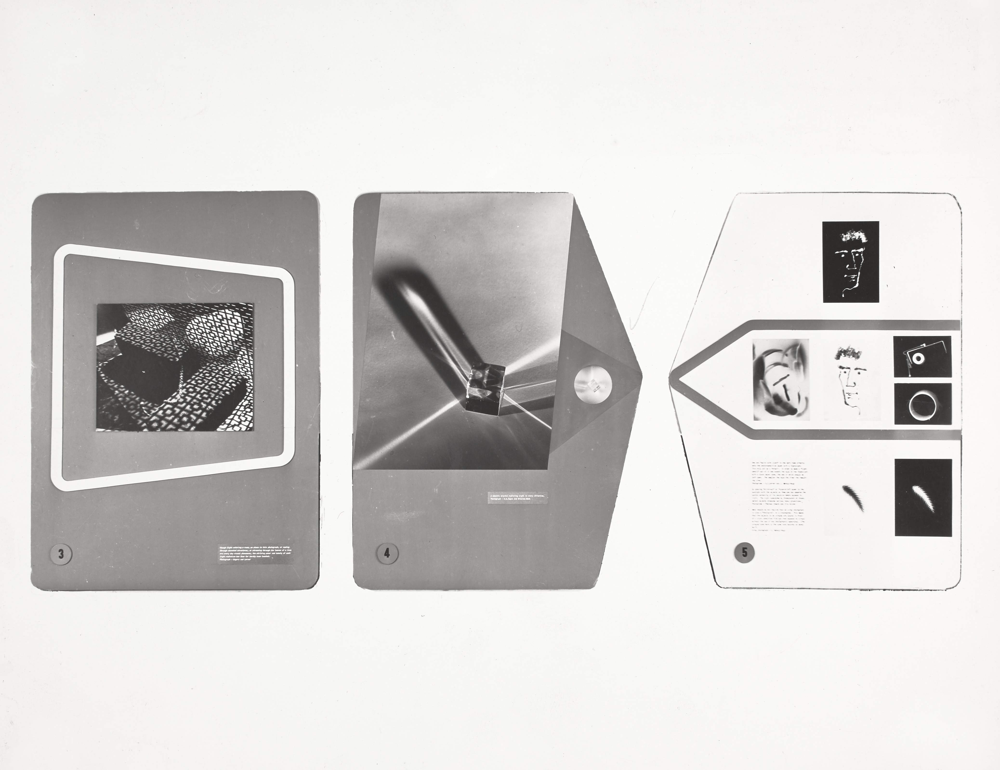
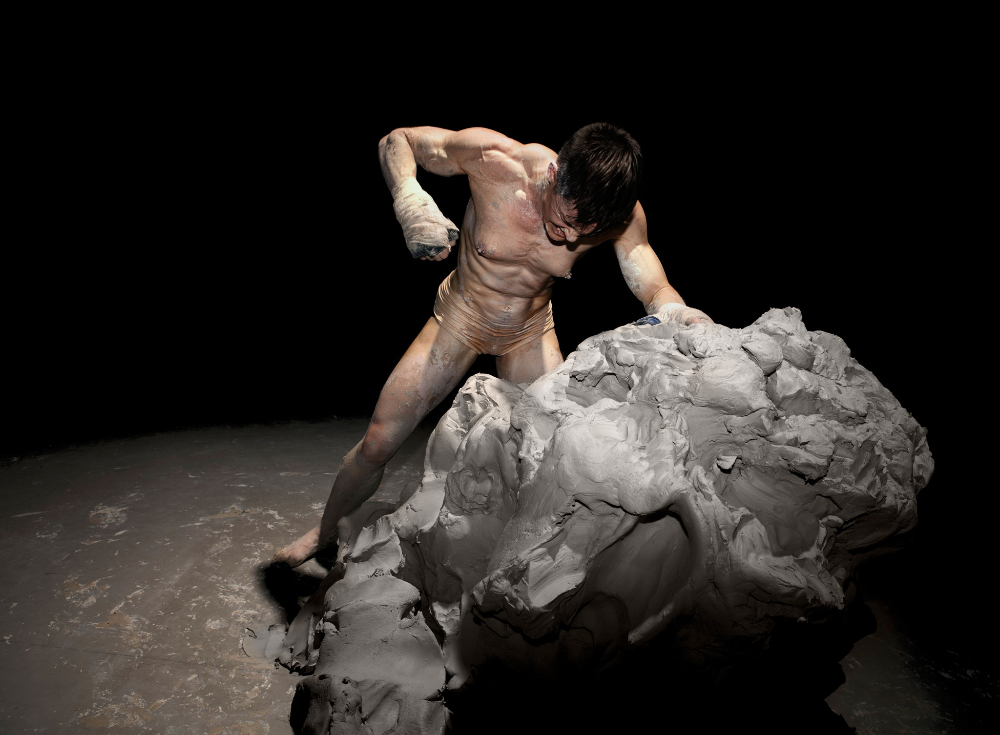
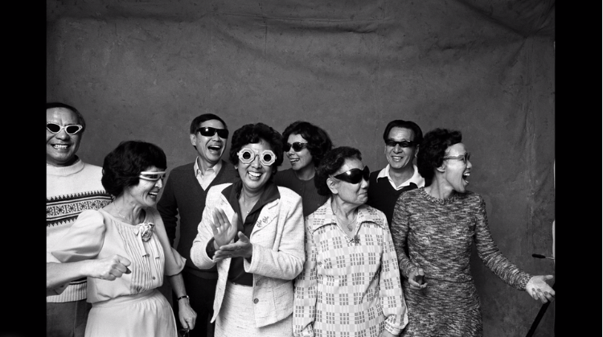
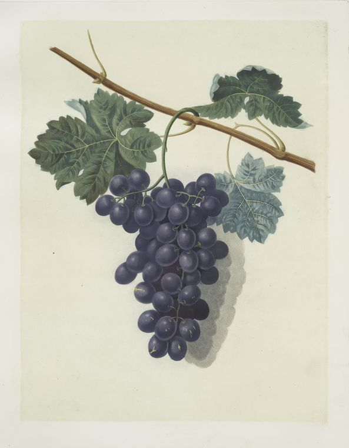
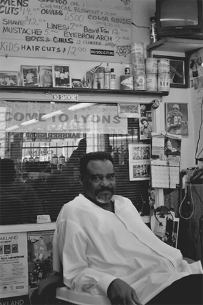
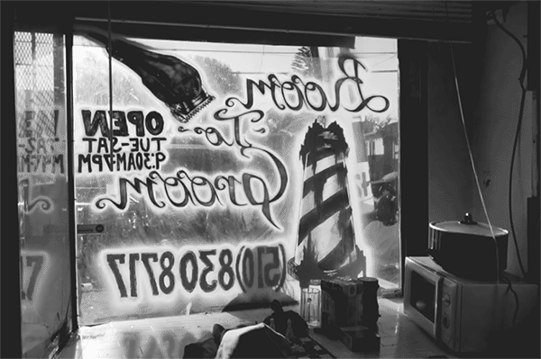

In 2015, I wrote [a year-end list](http://circulationexchange.org/articles/tenthings.html) of ten things I liked in photography—my only rule was that none of the items be photobooks or exhibitions, both categories that are clearly—even exceptionally—well-covered elsewhere. 
As I wrote then:  another way for photography to come into your hands or into your view—to find you where you are and offer a unique viewing experience—is to arrive on a nearby screen, like the ones in your pockets and on your desks. These closely held, frequently-accessed, and highly personal viewing spaces are often overlooked as viable creative—and, I would now add—scholarly realms. So, as my contribution to more expansive list-making in matters of photography, this list is a shout out to a few of those moments of meaningful content and engagement that found their way (mostly) straight to me in 2016.

##### 1 + 2. Veteranas and Rucas + Rhizome’s Webrecorder
<figure class="figure">
	
	<figcaption> 
		Samples from the Veteranas and Rucas archive
	</figcaption>
</figure>

**1.** I’m a fan of [Veteranas and Rucas](https://www.instagram.com/veteranas_and_rucas/), an Instagram account run by Guadalupe Rosales, for its vernacular chronicles of Chicana life in East Los Angeles, and beyond, in the 1980s and 90s. Nearly all the images and accompanying texts that Rosales posts are sent in by followers of the account who want to contribute their own images and memories to this collective archive-in-the-making. That dialogue and exchange is important to Rosales, who comments, ["The archive is not just photographs, it's archiving language and the way we relate to a photograph."](https://www.kcet.org/shows/artbound/photos-of-east-la-in-the-1990s?utm_source=facebook&utm_medium=social&utm_campaign=artbound)

**2.** It’s an effort that rests on the possibilities that social media offers and yet, at the same time, is subject to the parameters of Instagram’s format and corporate ownership. The arts organization Rhizome has become a leader in recognizing the challenges of creating a permanent record of this type of increasingly common digital and live cultural production. As they point out: "Current digital preservation solutions were built for that earlier time and cannot adequately cope with what the web has become." Veteranas and Rucas—fortunately—is a case study for Rhizome's newly launched, Mellon-funded responsive archiving tool [Webrecorder](http://rhizome.org/editorial/2016/jan/04/webrecorder-mellon/), a free service that allows any user to archive dynamic web content—and, hopefully, will ensure the ongoing digital preservation of these complex new resources.

##### 3. "Shorts" photo sharing
<figure class="figure-sm">
	
	<figcaption> 
		
	</figcaption>
</figure>

How many people would you let look through the entire camera roll on your smartphone? The core of the idea for Shorts, a photo-based social media platform that launched in March was, essentially: share what you don’t share. If other photo-sharing apps are clearly performative, and just too polished, Shorts proposed that, among your network of contacts, one option would simply be to share all the photos in your smartphone’s camera roll. As a writer for *Wired* [commented](https://www.wired.com/2016/03/shorts-photo-sharing-app/), “Giving someone (fairly) unfiltered access to your phone is like letting them fish around in your purse or backpack, freely digging through everything you’ve amassed or hidden in there—it’s a frightening level of intimacy to share with most people.” 
After its launch, this app lasted for about 5 minutes before the company called it quits, so it’s on this list for its provocation, not its success.

##### 4. Fei-Fei Li’s TED talk on computer vision

<figure class="figure">
	
	<figcaption> 
		A computer in Fei-Fei Li's lab describing zebras and grass in a photograph (but not recognizing a rainbow)
	</figcaption>
</figure>

I don't think I’m going out on a limb by suggesting that most photo people in the art world—whether artists, curators, critics or historians—don’t really understand how cameras work anymore, let alone consider it particularly relevant to consider the ways that cameras and computers now work together to arrange our pictures for us—on our phones, on social media apps, in dating profiles, in auto-generated vacation photo albums, and so forth. A good place to begin to shore up this knowledge gap is by watching computer scientist Fei-Fei Li’s TED talk on computer vision, [“How We’re Teaching Computers to Understand Pictures”](https://www.ted.com/talks/fei_fei_li_how_we_re_teaching_computers_to_understand_pictures). 

##### 4. The Museum of Modern Art's exhibition archive

<figure class="figure">
	
	<figcaption> 
		Installation view from MoMA's 1942 exhibition "How to Make a Photogram", courtesy the Museum of Modern Art Archives, New York. 
	</figcaption>
</figure>

In September, the Museum of Modern Art launched [an online archive of its exhibitions.](https://www.moma.org/calendar/exhibitions/history) Starting with the museum’s first shows in 1929, most pages include, at the least, the press release, object checklist, and installation views. It’s not only a great way to lose several hours, the visual chronology presents a little something for everyone, and a multitude of research possibilities. 
Beginners can familiarize themselves with MoMA’s [most](https://www.moma.org/calendar/exhibitions/2088?locale=en) [famous](https://www.moma.org/calendar/exhibitions/2968?locale=en) [photography](https://www.moma.org/calendar/exhibitions/2429?locale=en) [shows](https://www.moma.org/calendar/exhibitions/2347?locale=en); book lovers can delight in the full pdfs of numerous exhibition catalogs; snapshot photography fanatics can ponder MoMA’s [1944](https://www.moma.org/calendar/exhibitions/2316?locale=en) embrace of that form; collectors can salivate over the pricelists from exhibitions such as [American Photographs at $10 (1942)](https://www.moma.org/calendar/exhibitions/3021?locale=en) and [Christmas Photographs (1952)](https://www.moma.org/calendar/exhibitions/3281?locale=en), both of which demonstrate MoMA's early efforts to build a market for this new art form. It strikes me that a history of color photography exhibitions at MoMA (put on in [1943](https://www.moma.org/calendar/exhibitions/2306?locale=en), [1950](https://www.moma.org/calendar/exhibitions/2408?locale=en), [1966](https://www.moma.org/calendar/exhibitions/2574?locale=en), [1974](https://www.moma.org/calendar/exhibitions/2512?locale=en), and, most famously, in [1976](https://www.moma.org/calendar/exhibitions/2079?locale=en)) could be a useful essay. And there are [some](https://www.moma.org/calendar/exhibitions/3050?locale=en) [fantastic](https://www.moma.org/calendar/exhibitions/3463?locale=en) [installation](https://www.moma.org/calendar/exhibitions/2694?locale=en) [views](https://www.moma.org/calendar/exhibitions/2686?locale=en). My dearest hope, however, is that someone will explain how [this unexpected 1970 exhibition](https://www.moma.org/calendar/exhibitions/2684?locale=en) fits in with how we understand the evolution of the photography program at MoMA. 

**5b.** *Honorable mention in this category:*

Princeton University Art Museum's [Minor White Archive](http://artmuseum.princeton.edu/minor-white-archive), launched online in October. Admirably, both the MoMA and White archives were made public as "works in progress", meaning that the institutions have opened up a substantial degree of material but work is ongoing, and new material will continue to be added. 

##### 6. Photography as Live Event: Cassils’ *Becoming an Image*

<figure class="figure">
	
	<figcaption> 
		Cassils performing "Becoming an Image" 
	</figcaption>
</figure>

Lovers of photography may argue that all photographic viewing is a live event. But what I have in mind here are neither exhibitions nor publications nor artist talks, but rather events that merged photography with performance, insisting on the unique shared experience of a particular time and place, whether online or off. Mostly I missed these events, which is part of their point, and what makes them special for those who attend. 

[In November](http://www.epgn.com/arts-culture/arts/11380-gender-nonconformity-on-display-at-pafa), surrounded by an audience in a room of total darkness, the trans performance artist Cassils restaged “Becoming an Image” (originally 2013), an event in which Cassils—who is also a bodybuilder—pummeled a 2,000 pound block of clay to the point of the artist’s total physical exhaustion. During this this solitary feat of creation, aggression, endurance, and depletion, the audience heard the sounds of Cassils’ physical exertions, which only periodically are viewable by way of the strobe-like illumination of a photographer’s flash. 

Cassils has [spoken compellingly](https://thesportspectacle.com/2013/10/06/becoming-an-image-in-the-ring-with-cassils/) about the effect of this scenario, offering a reinvigorated conception of the possibilities of the photographic medium. The artist says of the photographer’s crucial role in the performance: “When the flash of his camera goes off, it will illuminate the image for maybe an eighth of a second, and the light is so bright that it will burn an image into your retina, creating, essentially, a live photograph.”

See images and watch the video trailer [here](http://heathercassils.com/portfolio/becoming-an-image-2/). 

##### 7. San Francisco Museum of Modern Art’s Art + Artists series

If I’d been writing this list in 2008, Doug Rickard’s [American Suburb X](http://www.americansuburbx.com/) would have been on it in a second, for its incredible accumulation of online resources—videos, TV clips, interviews—that collectively insist upon an alternative photographic history to the established textbook view of what’s important in American photography (and beyond). 

This kind of cumulative spirit of bringing together “behind-the-scenes” resources about artists and their work also animates the more recent—if also more institutionally-driven—series of artist interviews growing at a rapid pace as part of SFMoMA’s Art + Artists series. It’s a great selection of artists, and photography is very well represented—both familiar figures and those who are lesser-known. I recommend starting with [Michael Jang’s family snapshots](https://www.sfmoma.org/watch/michael-jangs-family-snapshots/). 

<figure class="figure">
	
	<figcaption> 
		from Michael Jang's 1970s series, The Jangs, featured on SFMoMA's Art + Artists series
	</figcaption>
</figure>

##### 8. Visualizing the Public Domain: NYPLEmoji + New York Public Library Labs 

I love a good Twitter bot, and this year the New York Public Library made a new favorite, [@NYPLEmoji](https://twitter.com/nyplemoji). When you send an emoji tweet to @NYPLEmoji, the bot will tweet back a corresponding image for the library's [outstanding digital collections](https://digitalcollections.nypl.org/). 

For instance, the grape emoji … &#x1f347; … becomes this 1812 beauty:

<figure class="figure-md">
	
	<figcaption> 
		George Bookshaw, "Raisin de Calmes (grapes)", 1812. Rare Book Division/The New York Public Library Digital Collections.
	</figcaption>
</figure>

The playful exchange of old and new imagery may make you reconsider the emoji form within a long visual history. What's more, this humble bot may also [call your attention to the fantastic work](http://publicdomain.nypl.org/pd-visualization/) the New York Public Library is doing to visualize, make accessible, and encourage research and creative work in their public domain collections.

##### 9. Brandon Tauszik’s *Tapered Throne* GIFs

<figure class="figure-sm">
	
	<figcaption> 
		
	</figcaption>
</figure>

Okay, #9 is a real cheat on my list of favorites, because not only did I learn about it on the last day of 2015, it was from [someone else’s](https://medium.com/vantage/the-best-use-of-gifs-in-2015-brandon-tauszik-e32fde36210#.q89pwa3rf) “Best of” list. But just as I’ve been a fan of artists who manage to use social media platforms in ways that both creatively build on the specific parameters at hand and also resist the common denominator offered by any particular platform’s profile, I’m similarly taken with Brandon Tauszik’s embrace of the quintessential meme format to offer something quite unexpected. 

The [*Tapered Throne*](http://taperedthrone.com/) GIF series updates a traditional documentary photography aesthetic and beautifully translates the quiet subtleties of life inside the many African-American owned barber shops in Tauszik’s hometown of Oakland, CA. The short loops, painstakingly crafted from sometimes hundreds of individual frames, manage to slow time and provide a poignant view of this community. Looking at them again nearly a year after I first saw them, I find I’m most compelled by the loops in which almost nothing happens. 

<figure class="figure-md">
	
	<figcaption> 
		
	</figcaption>
</figure>

