One of the things I enjoy about living in Los Angeles is the ample opportunity for observing art that at times appears to exist largely for the purpose of [generating photographs to post on social media](http://www.latimes.com/entertainment/arts/la-et-cm-museum-selfies-20150608-story.html). Local examples include Chris Burden’s *Urban Light* (2008) and Michael Heizer’s giant rock *Levitated Mass* (2012), both at the Los Angeles County Museum of Art, and the more recent Yayoi Kusama *Infinity Mirrored Room* (2013) at the newly opened Broad museum.

<figure class="figure-pair">
	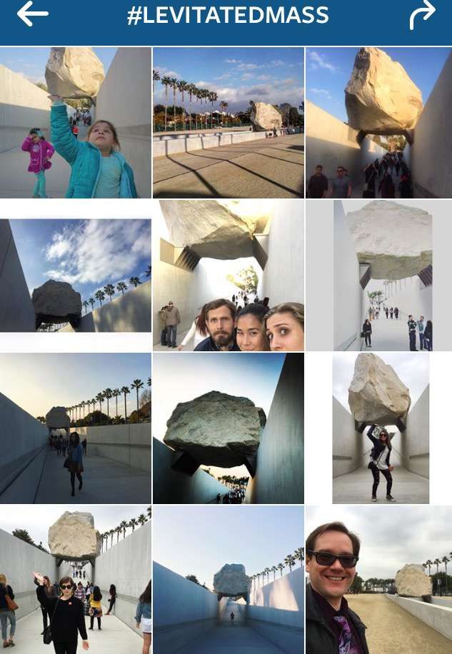
  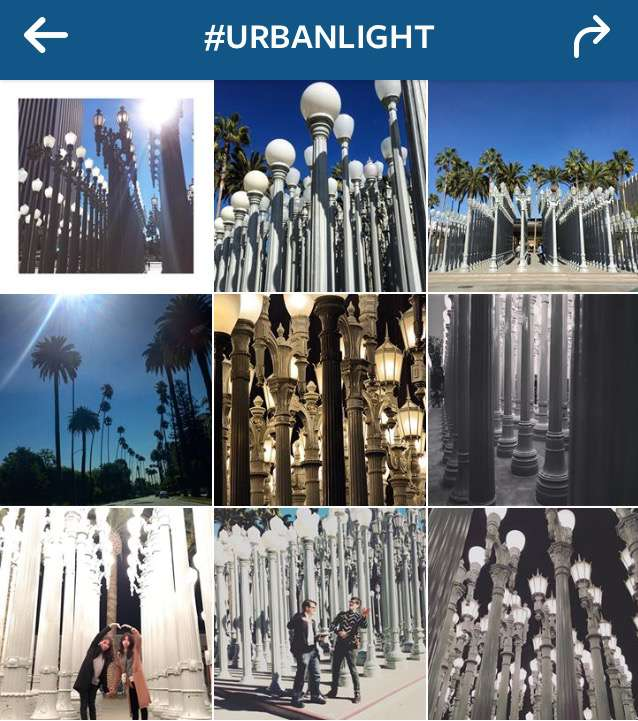
	<figcaption>
	Viewer-generated Instagram hashtag archives for Michael Heizer's <em>Levitated Mass</em> and Chris Burden's <em>Urban Light</em>, both permanently installed at the Los Angeles County Museum of Art.
	</figcaption>
</figure>

Farther flung instances of this type include Kara Walker’s brilliant and wildly popular *A Subtlety*, installed last fall at the defunct Domino Sugar Factory in Brooklyn; the initial installation of *Rain Room* at the Museum of Modern Art in New York in 2013; or Anish Kapoor’s *Cloud Gate* in Chicago since 2006 (and more commonly referred to as the Bean). Whether or not one sees these installations in person, they are nevertheless impossible to miss as their viewer-made representations have oozed across social media platforms, permeating the consciousness of virtual art world viewers.

<figure class="figure">
	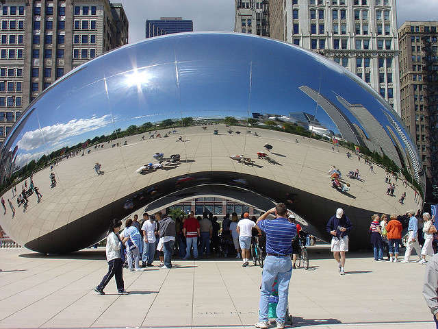
	<figcaption>Anish Kapoor's <em>Cloud Gate</em>, in Chicago's Millennium Park. By Flickr user dgphilli.

	</figcaption>
</figure>

Even if you like the art itself, it’s easy to become cynical about viewer response to these kinds of large-scale installations, when the primary shared characteristic is to produce a reflexive gesture among their viewers to 1) reach for a camera, 2) determine the best hashtag, and 3) add a unique view to the vast collective, and publically produced, archive. The impulse to make the photograph in the first place taps into a wealth of literature on vernacular travel photography—to declare one’s location in a particular place via the miniature souvenir of the iconic thing (see Susan Stewart’s [*On Longing*](https://www.dukeupress.edu/on-longing) for more on this), while the impulse to share it widely speaks to a more recent form of self-identity construction. And, as a result, we now have a mode of public art that, through its own physical form meeting the unstated yearnings of individual viewers, can now succeed in a manner of Darwinian adaptation to reproduce itself as endlessly as possible, seeping into public awareness well beyond the physical geographical limits of any individual viewer. If an artwork can be thought to survive based, to some degree, on the collective memory bank of those who have seen it—and think of it, and remember it—these artworks are evolutionary superstars, ensuring their own survival by adapting into the reproductive networks of today’s culture. These artworks want to be shared and, outsmarting us, seduce viewers—who are weakened by their own individual wants—to oblige in large numbers.

Ultimately what interests me in these examples, perhaps even more than the object on display or its image being shared, are the new configurations and possibilities of photographic scale, and the relationship between material objects and their image-based counterparts. By extension, I’m curious about the effects on how viewers—who are also implicated as producers—are learning how to look, how to see, based on these conceptualizations of materiality and scale. Though none of the projects named above are specifically photographic in the basic form of their physical manifestations, they are all deeply photographic as the response of a viewer is activated, and as they spread virally through immaterial (but entirely real) space.

<figure class="figure">
	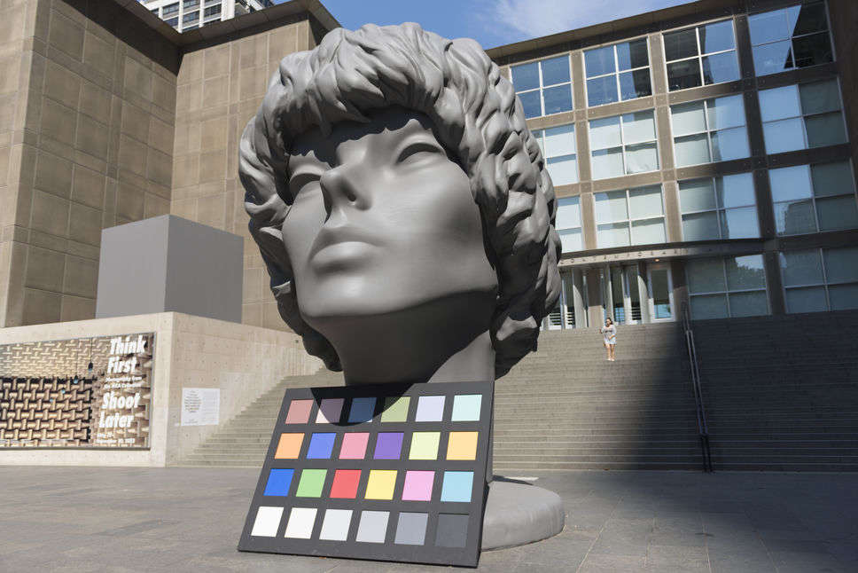
	<figcaption>Amanda Ross-Ho, <em>The Character and Shape of Illuminated Things</em>, Museum of Contemporary Art, Chicago, 2013-2014

	</figcaption>
</figure>

##### The Character and Shape of Illuminated Things

Los Angeles-based artist Amanda Ross-Ho’s 2013 piece *The Character and Shape of Illuminated Things* strikes me as an exemplary manifestation of the aesthetic possibilities presented by these new ecologies of scale and materiality. And its investment in the relationship between past and future models of learning to see speaks to the ongoing desires of the everyday/amateur photographer to speak a visual language.

*The Character and Shape of Illuminated Things* has had two distinct physical iterations, and these iterations share a common (and ongoing) immaterial life. Ross-Ho initially realized the piece in 2013 as a [public sculpture commission](https://mcachicago.org/Exhibitions/2013/Amanda-Ross-Ho) for the Museum of Contemporary Art, Chicago, in the artist’s hometown. In the large-scale sculpture, Ross-Ho materialized a photographic illustration from a 1980s how-to instructional manual that sought to teach its readers about photographic lighting. It was presented as three separate sculptures accompanied by an oversized color correction card on MCA’s front plaza, the tallest component measuring some 25 feet in height. In 2015, the trio of sculptures was re-materialized (the original was destroyed upon de-installation) at a smaller scale in New York’s City Hall Park, as part of a [Public Art Fund](https://www.publicartfund.org/view/exhibitions/6079_image_objects) commission for the exhibition *Image Objects*. The color card nod to an analog era was replaced in this version with a green neon element referencing the facial recognition software installed on many smartphone cameras.

<figure class="figure-lg">
	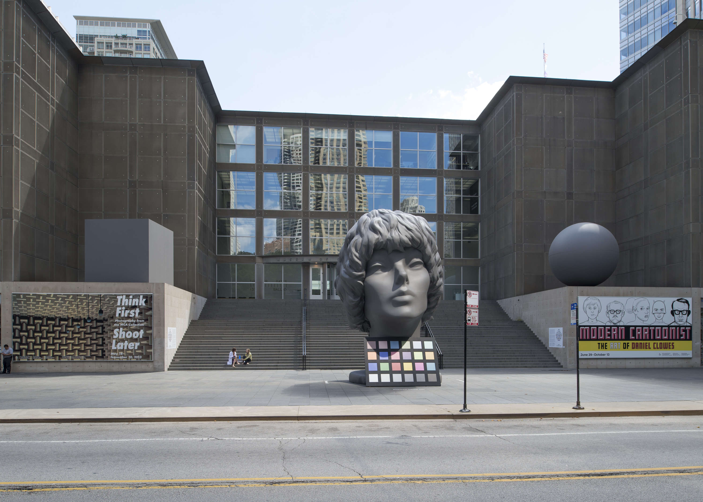
	<figcaption>Amanda Ross-Ho, <em>The Character and Shape of Illuminated Things</em>, Museum of Contemporary Art, Chicago, 2013-2014. Courtesy the artist.

	</figcaption>
</figure>

In both cases, the physical forms of the sculpture lived parallel lives online, largely via the shared hashtag #illuminatedthings, where an ongoing stream of individual viewers digitally enacted the premise and promise of the instructional photograph in the first place: as a blank slate of possibility for all the conditions of lighting and filters a photographer might encounter. Indeed, in both locations (Chicago and New York), the sculpture was subject not only to the naturally shifting outdoor lighting conditions of time of day and weather, but to the readily-at-hand filters and in-camera lighting and color effects available on all smart phone cameras. In other words, it was the viewing public that tested and produced the conditions set forth initially by the instructional manual, thereby moving a set of skills that once had to be explicitly learned by serious and aspiring photographers, into the vastly more ubiquitous province of any passer-by with an in-camera filter.

<figure class="figure">
	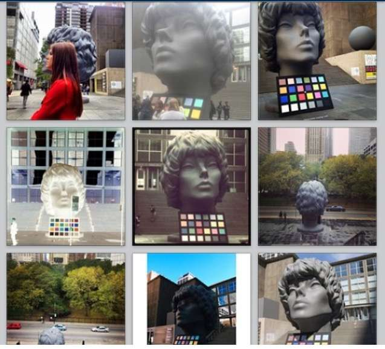
	<figcaption>Audience submitted views to #illuminatedthings, illustrating the effects of light and filters on Ross-Ho's sculpture

	</figcaption>
</figure>

Correspondingly, viewing *The Character and Shape of Illuminated Things* meant one thing on site (the opportunity to absorb its physical scale and contribute to the collective archive of its form) and another thing online (an appreciation of the degree to which the hashtag organized and served up the premise of the visual effects of light on form and color). Unlike other public sculptures whose reach extends photographically, in Ross-Ho’s hands, the socially-produced component was integral to the overall reception, adding texture and dimension to the tremendous historical shifts currently underway in the photographic medium. Or, as the artist put it, the social media reception was a pre-condition of the piece; the “metabolism of viewership” today was built in to produce a live aggregation of subjectivity that ultimately completed the work. It is an aesthetic gesture at once generous and sophisticated, and an enactment of the “social contract” of viewing today that Ross-Ho speaks about and encourages.

<figure class="figure">
	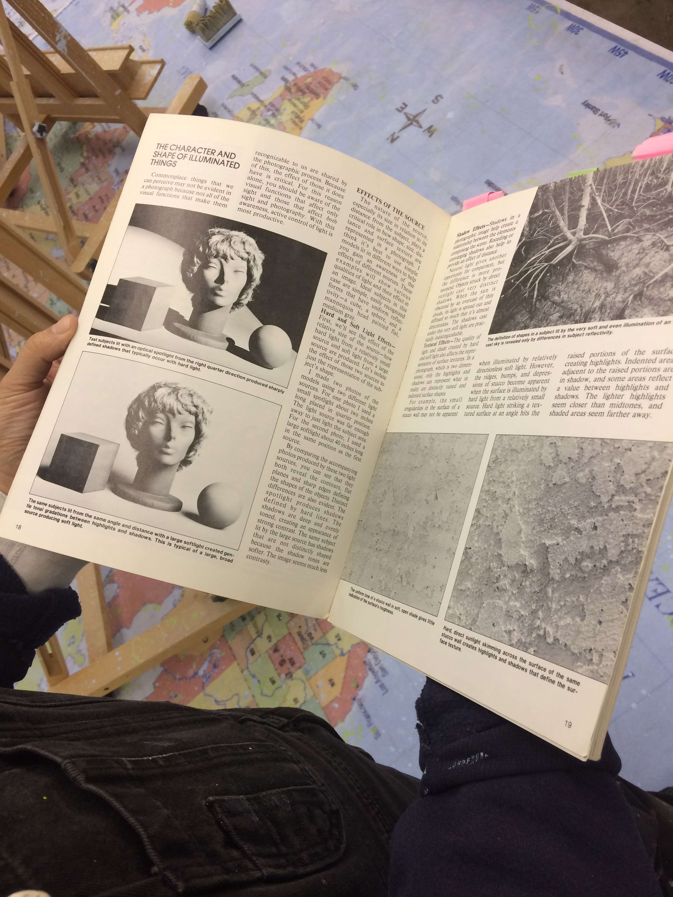
	<figcaption>Ross-Ho with David Brooks's essay, "The Character and Shape of Illuminated Things"

	</figcaption>
</figure>

##### The Source

Written in 1987 by professional photographer and writer David B. Brooks, the essay “The Character and Shape of Illuminated Things” serves a clear purpose and is model of transparent instruction. All how-to books trade in aspirational zones of self-improvement that exist just at the edge of possibility, whether the topic is closet organization, learning HTML, or folding origami. Photography, with its elusive balance of artistry and technical know-how, has been inspiring such instructional manuals since its earliest days. It is a medium that may be mastered in multiple ways, and the technical geek-out possibilities can serve as a handy surrogate for other forms of accomplishment. (One fairly reliable way to assess how seriously a photographer takes him or herself as an artist is how much they flinch when you ask what kind of lens they used.) True to its genre, in Brooks’s *How to Control and Use Photographic Lighting*, the aspiring photographer is empowered through reading, gaining step-by-step knowledge of something considered elusive, yet tantalizingly enough within reach that its mysteries might, after all, be learned. A verbal language—in this case, contrast, shadow, texture, filters—helps corral this enigmatic power into understandable terms and categories. Soon, the mysteries and poetics hinted at by the title alone—*What **is** the shape of an illuminated thing? Does it have a character?*—are quickly distilled into a series of functional directives by which the reader may master the transformative effects of light on a subject.

Though Brooks’s words were meant to instruct, it was his accompanying photo illustration that, nearly thirty years later, migrated off the page into Ross-Ho’s installation. With utilitarian intent, Brooks’s photographed model offers three physical forms—ideal forms, even—on which to practice new skills. Brooks writes, “Ideal subjects in this case are simple, easily recognized forms that have uniform reflexivity—a cube, a sphere, and a mannequin head painted flat, medium gray.” No worry that the incidence of such ideally formed, flat-gray objects in the lived world are so rare as to be virtually non-existent. These objects represent, more than anything, possibility. Ross-Ho, for her part, felt the appeal of the objects, in her words, as “an approximation of everything you might see”—an offering, perhaps, of the representation of everything, in one easy stage set. They could be seen as scaled down and simplified core samples of a much larger and more complex visual world. And yet it is not just the objects themselves that held interest for the artist, rather, it was their subsequent becoming into a photographic image.

<figure class="figure">
	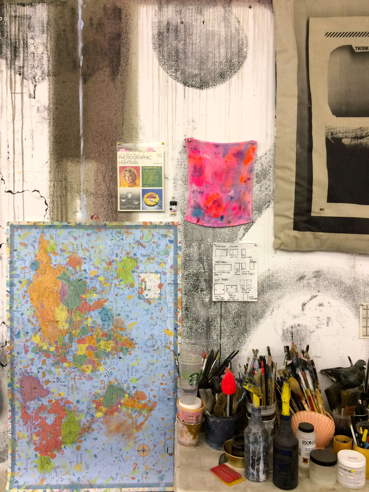
	<figcaption><em>How to Control and Use Photographic Lighting</em>  tacked to the wall at Ross-Ho's Los Angeles studio

	</figcaption>
</figure>

Ross-Ho’s initial question of scale was perhaps the most abstract, and stemmed from an intuitive attraction to Brooks’ photographic illustrations. As she put it, “I knew those photos were special for a long time.” For an artist deeply invested in materiality, scale, and the relationship of parts to a whole through systems of production and seeing, the question then becomes: how to translate the scale of her own personal affection for “the sensitivity and care seen in the anatomy of the picture”? How can physical or conceptual scale be invoked as a metaphor for the scale of feeling one holds for such a seemingly utilitarian photographic image?  

Historically, the discussion of scale in photographic terms is somewhat anemic. Photographic objects are, for the most part, circumscribed by the limitations of available commercial paper sizes and standard printing capabilities. The long-standard sizes (in the U.S.) of about 8”x10” or 11”x14” were so ubiquitous through the development of the medium as mode of a fine art as a mode of fine art that the relatively recent disruption of new printing possibilities, particularly out of Düsseldorf, Germany in the early 1990s, sparked a collective hand-wringing in the field over the meaning of the new “big” photography.

Meanwhile, the quantitative scale of reproduction through print media (as opposed to the dimensional scale of a single print) is both profoundly temporal and geographically disparate: a single photographic image published in LIFE magazine in the 1940s, for example, would reach a weekly circulation of over 13 million viewers, and yet largely vanish with the next week’s trash.

The collectively produced online life of Ross-Ho’s *The Character and Shape of Illuminated Things* takes up newly configured iterations of both of these types of photographic scale. First, it clearly recognizes the vast experiential difference between engaging with a physical object in material form of fixed size and engaging with the more amoeba-like organism of an immaterial image moving through online spaces, at once the diminutive size of the palm of your hand and the nearly incomprehensible scale of its simultaneous existence on vast numbers of other screens. And it does this without devaluing either experience as less worthy than the other. On the contrary, both are essential. Finally, it addresses a reconfigured scale of time, as the images are collated together, by disparate viewer-producers, into a series of archives organized by hashtags and stored on external servers.

##### How-to, take 2

Artists [John Baldessari](http://collections.lacma.org/node/237769), [Piotr Uklański](http://www.hatjecantz.de/piotr-uklanski-2036-1.html), and [Thomas Vanden Driessche](http://www.phototvdd.be/index.php?/how-to-be/) among others have done parodic send ups of the how-to instructional model so prevalent in photography. In 2012, the Museum of Modern Art Library [exhibited a history of photo how-to instructional manuals](http://www.moma.org/interactives/exhibitions/2012/manuals/#Specialized). And there is a growing body of literature in photographic history about the ways in which we’ve learned to see, photographically, based on cues—not to mention overt instruction—that come to us in a variety of ways, from road-trip driving maps to Kodak picture spots (now Instagram spots), whether at National Parks or Disneyland (including the Center for Land Use Interpretation's 1998 critique, [The Photo Spot Project](http://clui.org/section/suggested-photo-spots)). Throughout the twentieth century, if you weren’t sure where to point your camera, how to point it, or what type of picture to make, helpful guides were plentiful.

Despite the general perception that photography is getting easier with every passing software update, this same type of guidebook is [as](http://artofiphoneography.com/) [prevalent](http://www.chroniclebooks.com/titles/snapp-shots.html) [as](http://jenniferyoungstudio.com/categories/picture-perfect-social-media-author/) [ever](http://www.amazon.com/dp/1781579814/?tag=narwhal-20). And now, as the smartphones we use get smarter and more responsive with each generation, the camera itself can teach us how to use it, can anticipate what we want to see and what we want to record. These machines know, for the most part, that what we people like to photograph is other people’s faces.

<figure class="figure-lg">
	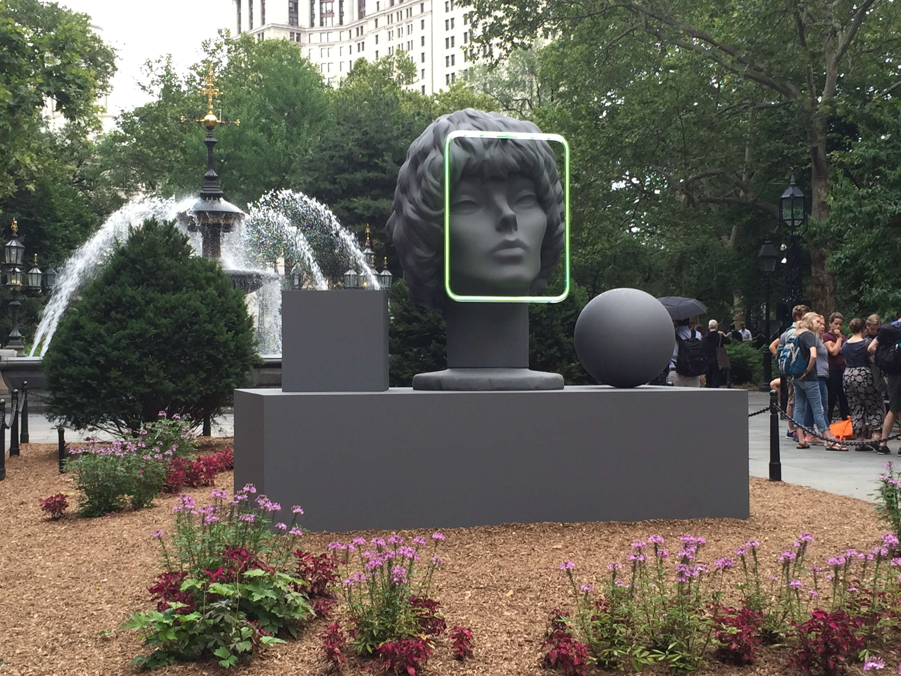
	<figcaption>Amanda Ross-Ho, <em>The Character and Shape of Illuminated Things (Facial Recognition)</em>, City Hall Park, New York, 2015. Courtesy the artist.

	</figcaption>
</figure>

The 2015 iteration of Ross-Ho’s sculpture, in New York’s City Hall Park, points us to a discrete form of this instruction: the automated facial recognition software built into most smartphone cameras. Our cameras can light up upon recognizing a human face, and automatically focus and determine the correspondingly suitable overall exposure for the image, knowing that what the photographer probably cares about most is seeing that face again later. Here, in full-circle effect, passers-by could enjoy the meta-experience of watching their cameras instruct them both to photograph their own faces alongside the sculptural ideal face—its character and shape now a literally illuminated thing—that had appeared on the page as its own instructional aid decades prior.

<figure class="figure-pair">
	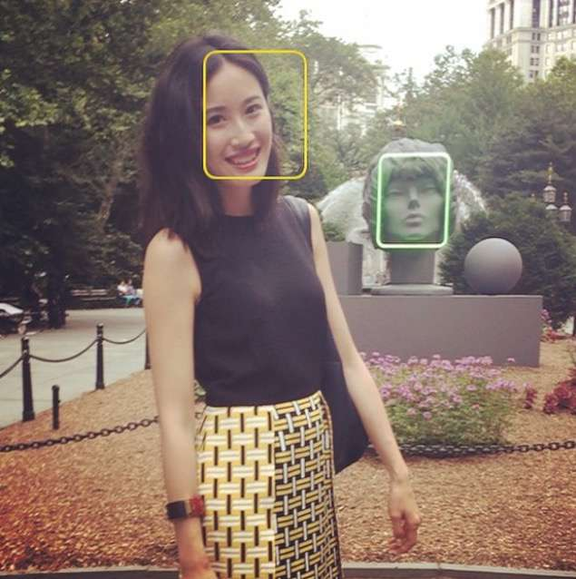
  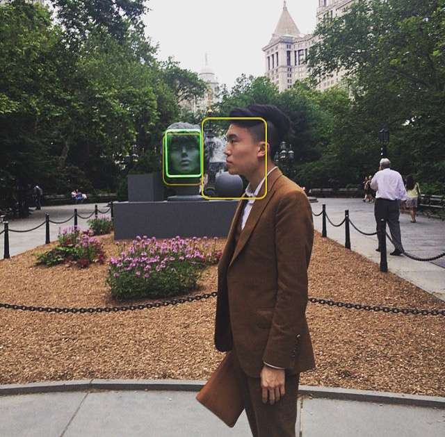
	<figcaption>
Instagram posts collected by the artist. 
	</figcaption>
</figure>

Like other large-scale artworks that produce an automatic impulse in viewers to perpetuate the immaterial image of those very physically-based works through the current networks of social distribution, Ross-Ho’s piece consciously participates in, and is enacted by, its audience—in a logical extension of the goals of public art. And yet it also does something more. *The Character and Shape of Illuminated Things*, through its multiple iterations, at once enables, produces, reflects, and reveals the reconfiguration of the habits and patterns of image creation, consumption, exchange, and storage, all while nodding both to the medium’s past and present popular appeal.  

### **Notes**
All quotations are from a conversation with the artist, Los Angeles, January 12, 2015.
