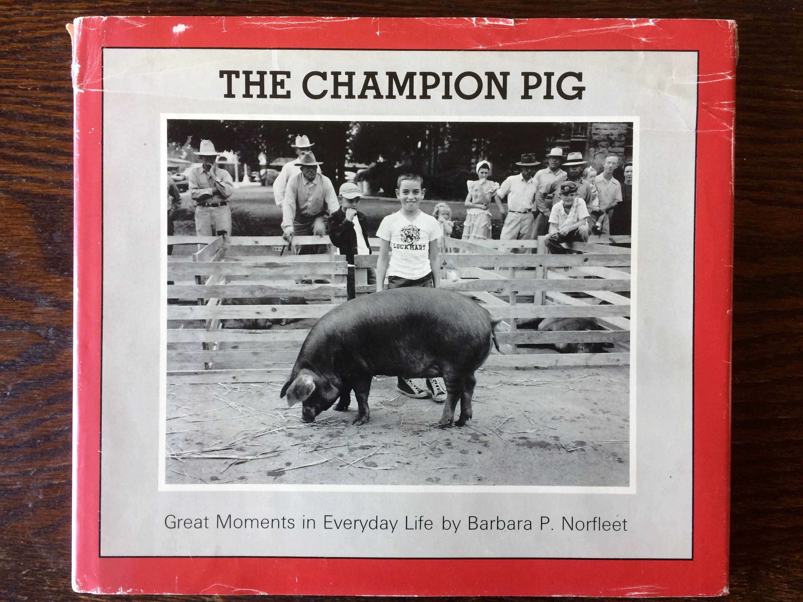

<figure class="figure">
	
	<figcaption>
	The Champion Pig: Great Moments in Everyday Life, edited by Barbara P. Norfleet. Boston: Godine, 1979
	</figcaption>
</figure>

<figure class="figure">
	
	<figcaption>
	Screenshot of Harry Annas Studio, Untitled (boy with pig, Lockhart, TX), 1948 from the Harvard University Art Museums data analysis site
	</figcaption>
</figure>

##### 1.

It can be a daunting proposition, to caption a photograph. The moment one settles on a description – here, for example, “boy with pig, Lockhart, Texas”—a host of other propositions and possibilities begin to percolate. Should the caption include something about the crowd of onlookers? That the boy is smiling? What about the presence of wooden pens, or hay on the ground, or cowboy hats, or, more abstractly, phrases like “small town” or “summer”? Choosing a caption often anticipates the future needs of an imagined viewer – rarely do we caption photographs only for our own private purposes. It is a fundamentally communicative act, then, and one that simultaneously acknowledges and tries to ignore the difficulty of re-presenting images with words, of adequately translating images into words. It’s hardly a newsflash to suggest that words can easily change the meaning of an image, but, at this moment in history, it is worth asking: how do the stakes change when it is a computer, not a human, writing the caption?

##### 2.

My first encounter with the photograph at hand, some 15 years ago, was on the cover of a book, *The Champion Pig: Great Moments in Everyday Life*, originally published in 1979 by Barbara P. Norfleet. Norfleet was the author of the book, but not of the image: that was already three decades old, the boy and pig having been photographed by Harry Annas, a professional photographer in Lockhart, Texas, a small town in Caldwell County, not far from Austin, in 1948. My first mental description of the photograph was of a non-caption variety: A young boy standing beside an enormous pig grins at me, his infectious smile explained by the book’s title, “champion pig.” The winning pig, snout to ground, is clearly oblivious to its newly crowned achievement, and the men and women in the crowd behind the boy, nearly uniformly, seem nearly as disinterested in this moment as the pig is. The boy, however, is irresistibly triumphant. A quick glance sets the scene: the wooden livestock pens—some of which contain exhausted, non-champion pigs—, the men and women clad in cowboy hats and worn denim, the stray pieces of hay scattered on a hard ground that attract the pig’s attention, and the town square setting together indicate a mix of ordinary and out-of-the-ordinary, perhaps a small town hosting the county fair or an annual 4-H club competition. But despite my immediate adoration of the boy’s smile, the heart of the photograph, for me, was in his feet – in the unselfconscious expression of his canvas high-tops, one turned into the other, a tentative sweetness not seen in his more public display of pride.

My occasion for looking at this book in the first place was having just started a part-time job in the Photography Department at the Fogg Art Museum in Cambridge, MA. The ordinary/out-of-the-ordinary photograph anchored a collection characterized in a parallel way by its constant pivot between the mundane and the extraordinary: the museum’s then-newly acquired 20,000+ photographic negatives and prints that comprised what had come to be known as the American Professional Photographers Collection (APPC). Flipping through *The Champion Pig* (the book) quickly revealed the character of the collection: photographs of newborns in hospital nurseries, schoolchildren at birthday parties, small town parades and theatrical productions, scout trips, bar mitzvahs, Halloween parties, high school dances, rodeos, batting practice, beauty pageants, weddings, family portraits, barbeques and backyard parties, church, pets, holiday celebrations, and, ultimately, old age and death as they played out in small towns across the United States from the 1920s through the 1950s. The images were gathered together by Barbara Norfleet, an artist, sociologist, and former curator at the Carpenter Center for the Arts, from professional photographers’ studios in small towns throughout the United States, where Norfleet traveled, by car, to look at archives of stored material that spanned much of the 20th century, and especially the post war years.[^1] Neither Annas, the photographer, in 1948, nor Norfleet, the curator, in 1979, offered a caption to me, the cataloguer, in 2002.

##### 3.

These types of images are alluring and beguiling because they seem, on the one hand, to offer so much, and yet, on the other, they offer such an invitingly blank slate upon which to project our own stories, narratives, and desires. This capacity of a photograph to invite narrative overwriting brings to mind the provocations of several artists and writers. I think, for example, of the lovely essay by film scholar Annette Kuhn, “she’ll always be your little girl,” in which Kuhn reflects upon competing captions inscribed upon a photograph of herself as a child.”[^2]  In Kuhn’s case, the mother and the daughter disagree about the facts of the photograph and, consequently, a charged debate of familial meaning is played out, over generations, via seemingly objective captions.

Annas’s image, and those in the rest of the book, are precisely the kind of photograph that, for better or for worse, invite just such opportunities for competing narrative, even discord among viewers. Until recently, though, they would have quickly disappeared from public view, receding into an abyss of analog archive inaccessibility. My job at the museum, however, was to prepare the recently-assembled group of otherwise disparate photographs for collective digitization (of the images) and deep storage (for the objects). In other words, the terms of their accessibility was on the brink of shifting. They had shifted already, having moved first from visual objects that told a story about a community back to that same community, in Lockhart; to negatives tucked away in a local archive; to images selected by a Harvard curator and physically re-located to Cambridge, MA to join a much broader collection of image with new (art) viewers.

My work facilitated another shift in the lives of these photographs as well: they went from objects stored in boxes onsite, viewable upon request, to objects stored offsite, viewable onscreen in digital form, at any time. The nature of the work that I was doing with these thousands upon thousands of images was, on one level, really very functional: I was looking at objects, I was re-housing them for archival storage, I was noting condition, I was capturing and transcribing relevant information about the objects into the museum’s database. I was generally aware that the words I chose as “relevant” caption description—aside from the photographers’ name and studio locations—would be the primary way future users would be able to access the images. There would be no browsing through the boxes, moving without purpose from one image to the next; that kind of looking that I was doing would be replaced by users’ specific keyword searches, perhaps for “birthday”, “woman”, “deer” or “child”. And so, this image became, “Untitled (boy with pig), Lockhart, Texas.”

##### 4.

What I could not have anticipated, a decade ago (or, rather, what I did not anticipate), was the rapid rise of computer vision and machine learning technology. In fact, 2016 may become something of a pivotal year for historians in terms of dating a shift in the ease of public access to and awareness of computer vision: iPhones now automatically sort, tag and identify our subjects, and even make us vacation albums and videos; dating apps will algorithmically choose our “best” profile pictures; Facebook automatically assembled a year-end “Best of 2016” video for its users, and, from time to time, its algorithms will produce a friendship video of posts between two people.

I am aware, viewing these algorithmically-sorted reflections of myself, that a certain identity is being constructed—one that I may or may not have chosen on my own. And I am aware that the algorithm has been programmed to identify certain visual cues to present our own self-images back to us, creating an identity based on projected use. And though I find this slightly unnerving, an auto-generated vacation album is—within its own contained framework, anyway—a relatively innocuous outcome, notable primarily for the way it makes computer vision and machine learning both visible to and accessible for an everyday user. But, of course, these images do not, in fact, exist within a closed circuit and the potential outcomes in this emerging field of artificial intelligence are vast, and, in a fundamental way, deeply de-humanizing.[^3]  It is precisely within this newly automated yet still generally uncharted and unlegislated frontier of algorithmic search terms that this radically-expanded circuitry of visibility proposes profound shifts in image use and analysis.

And yet, there remains a fascination even within the (perhaps illusory) closed circuit of one discrete collection’s caption data. When I learned that the Harvard Art Museums had found my 20,000 captions a useful data point for running their own experiments using multiple computer vision platforms to identify objects in the collection, I was nothing short of giddily intrigued. It was weirdly flattering, in a way, as well as satisfying, to know that all that grad school labor of devising “objective” captions for the thousands of photographs I looked at might potentially be compared with a machine eye. Would a computer make meaning—produce a caption—in the same way that I had?

<figure class="figure-lg">
	
	<figcaption>
	Screenshot of Harry Annas Studio, Untitled (boy with pig, Lockhart, TX), 1948 from the Harvard University Art Museums data analysis site
	</figcaption>
</figure>

The museum’s tests generated results from four different services: Clarifai, Microsoft Cognitive Services, Google Vision, and Imagga, and additionally provided “sentiment recognition” on identified faces in the images, an automated process that “reads” the visible emotional makeup of human subjects, categorizing their likelihood of feelings such as joy, happiness, anger, or sorrow. The bulk of the results provided keywords and tags: further finding aids for future object recognition of photographs. “Untitled (boy with pig)” yielded 76 tags and categories from the combined results of the four platforms: they ran the gamut from the correct (people, mammal, livestock, group, outdoor, animal, agriculture, young, monochrome, black, white, hog, swine, pen, grass) to the puzzling and awkward (animal sports, ungulate, old world buffalo, bovid, ruminant, cattle like mammal) to the just plain wrong (beaches seaside, cow, bull).

The computers had been trained to see like people see and, consequently, to privilege words and facial expressions as they worked to make meaning: the programs paid special attention to the text on the boy’s t-shirt (“Lockhart”) and honed in on his facial expression, identifying him as “very likely” to be feeling joy, while “very unlikely” to be feeling anger, sorrow, or surprise (and similarly unlikely to be wearing a hat, or have the misfortune of turning up in a photograph blurred or underexposed). The programs found more or less all the quantitative details I had considered, except for those canvas high tops. But surely no search function would be performed for “whimsical feet” or “tentative shoes.” And neither would I have considered adding this very punctum-like detail to my own efforts at objectivity.[^4] 

##### 5.

Though tempted by the idea that a computer, somewhere, like me, had also zeroed in on the high tops yet ultimately found them inadequate to fulfill search term status, the more salient point with which to conclude is the trio of multiword captions, offered by Microsoft Cognitive Services. More complex and sophisticated than a single word tag or category, these short phrases represent the current acme of computer vision recognition capabilities: the program moves from identifying “cow” “crowd” and “standing” to forming a sentence, “a cow is standing in front of a crowd” (never mind that the livestock identification is rather off the mark; we can give the computer the benefit of the doubt since it is, after all, a “champion” pig, so its scale, we know, is outside of normal expectation).

But though the computer does not (yet) recognize cultural custom or an intangible (non-concretely-visible) quality of county-fair pride, it has become confident enough in facial recognition to offer a name: Kathleen ‘Kick’ Kennedy. Many human viewers will quickly deduce an error in identifying this small-town boy as a woman from the Kennedy family dynasty. But, like the pig/cow mix-up, an error of identification is not the interesting point. Rather, it’s what the error points to that should give us pause: the presumably substantial number of images online previously tagged “Kathleen ‘Kick’ Kennedy”, in which her facial features have already received mechanized scrutiny analyzing the precise distance from brow to hairline, or from pupil to pupil, or from nose to upper lip – data points long in place in the fraught histories (and presents) of physiognomy and biometrics.

The stakes of misidentifying this boy—who is now an old man, if alive at all—for a well-known public figure are low, just as the stakes of Facebook’s algorithm choosing one vacation photo over another for my automated album are similarly without much consequence. But variations on this associative visual dynamic play out with ever-greater frequency and in environments in which the stakes of computer recognition do matter: in sorting through accumulations of surveillance, policing, security, and warfare imagery, to name arenas that come immediately to mind. The larger point here, then, is to dwell on the mode and means of making an identification, which is to say, of producing meaning.

#### 6.

We understand images not just through the visual content they offer, but through the other images with which they are associated, by the company they keep. “Untitled (boy with pig)” has seen previous shifts in these associations—first, moving from an association with an individual and his family or activity; on to an association with a town (Lockhart) and a maker (Annas); then as a representative of a type of photograph made in the US at midcentury, by a particular kind of photographer (as seen by Norfleet). In each of these moves, the circuitry of meaning shifted. The borders of association have expanded, previously, but the kind of sight offered by computer vision is qualitatively and quantitatively different in terms of seeking these associations.

But as the image has traveled it has, over time, come to require—for different reasons—an abbreviated caption description. The impulse to caption at all speaks to a communicative impulse, but also to a desire for simplicity, for fixed, straightforward, and searchable meaning. In the space of a caption, nuance necessarily escapes, as did my own impulses toward human quirks and a kind of diffuse nostalgia for the small triumphs of a small-town childhood. Ultimately, the computer and I understood our captioning assignments to produce a kind of bureaucratic and reductive seeing on more or less similar terms.

There is, however, no reason not to imagine that the computer’s vision—trained *by* humans, if in large part *for* other computers—will not become more nuanced. These nuances will reflect the humans who construct the algorithms. But the slight distinctions of perception that inform our human views reveal nothing if not our subjective biases. What, beyond a caption, do I consider noteworthy, or self-evident? Surely the answers to these more complex frameworks of viewing reveal, for better or worse, the subtle – and not so subtle – systems of preference and hierarchy that subconsciously permeate our subjective views of the world. The history of photography is rife with instances of human bias informing an apparently neutral technology with undetected programmatic bias. In just one recently popular example, the history of color film production reveals that the film was “optimized” to record fair skin tones with greater sensitivity and accuracy than darker pigmentation; the most “neutral” of visual recording systems (camera + film) in fact was built with a preference for pale complexions. These are areas where the stakes *are* high. In such arenas, the human programmers of computer vision have an extraordinary opportunity to encode nuances that correct for past biases. Whether or not they act on this opportunity remains to be seen.

**************

### **Acknowledgments**

I'm grateful to the editor of PLOT, Claudia Weber, for the invitation to consider two images in conversation, and for her insightful feedback on my drafts. I thank Jeff Steward, Director of Digital Infrastructure and Emerging Technology, Harvard Art Museums, for sharing several sample sets with me; and Matthew Battles and Sarah Newman at the university’s MetaLab for the opportunity to re-visit the American Professional Photographers Collection material in 2016.

### **Notes**

[^1]: See Barbara Norfleet, grant application to support her project from the National Endowment for the Humanities, “Assemble, Protect, and Use Photographs made by Professional Photographers as a Unique and Valuable Record of American Life,” 1975.

[^2]: Annette Kuhn, “She’ll Always Be Your Little Girl,” in *Family Secrets: Acts of Memory and Imagination* (London: Verso, 2002).

[^3]: See two recent and incisive essays on this topic: Trevor Paglen, [“Invisible Images (Your Pictures Are Looking at You),”](http://thenewinquiry.com/essays/invisible-images-your-pictures-are-looking-at-you) in *The New Inquiry* December 8, 2016 and Hito Steyrl and Kate Crawford, [“Data Streams,”](http://thenewinquiry.com/features/data-streams/ ) in The New Inquiry January 23, 2017.

[^4]: I am referring to Roland Barthes’s opposition of “studium” and “punctum” modes of photographic viewing, the former referring to a viewer’s generic interest in a scene and the latter referring to a photographic detail or quality within an image that may “puncture” or “wound” the viewer, creating an individual and highly charged viewing space. Roland Barthes, Camera Lucida: Reflections on Photography (New York: Hill and Wang, 1981), originally published in Paris as La chambre claire: Note sur la photographie (1980).

