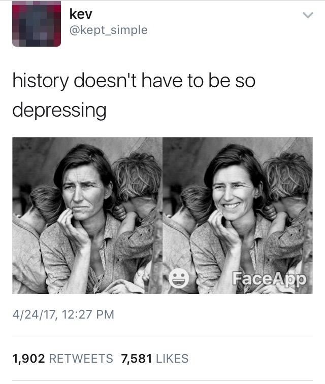

<figure class="figure">
	
	<figcaption>
	
	</figcaption>
</figure>

**The Smile, the Pose, and FaceApp: Portraiture and Ethics, 1936-2017**
Professor Kate Palmer Albers                                                                                           
Mondays, 1-3:50pm                                                                                                                               
Art Building 245

This graduate seminar will address the emergence in the 1930s of the concept of documentary photography, the shifting possibilities of photographs as agents for social change and persuasion, the ethics of photographic portraiture, the gender politics of asking women to smile, and the dynamically changing role and function of iconic images. Course topics will also include the influence of both technology and advertising on the history of photographic smiles (covering advances in film speed and dentistry as well as Kodak's early 20th century advertising campaigns in the US), artificial intelligence in machine learning and computer facial recognition, and the effects of social media, meme culture, and viral social contagion on each of the above. This course will also include several practicums designed to enhance students' technical facility with the latest advances in flattering selfie angles and beautifying, age-defying apps. 

Outcomes and assessments: Upon completion of the course students will be able to accurately identify their own inability to read facial expressions as captured in photographs, they will be aware of a long and fraught history of efforts to do so, and be filled with a sense of wonderment at the persistent impulse of people to still try, even in the face of long odds. Students will also become expert in the feminist politics of gaze, desire, and resistance, and the ongoing efforts — via technology, commerce, and even one's own complicit self — to undermine and flatten complex experiences of visibility, gender and sexuality. 

**************

### **Note**

*This is not a real course that I'm teaching, but it sure could be. And, I don't know kev @keptsimple, but I wish I did, and I am grateful for the inspired tweet. It took me 243 words to begin to get at what kev suggested in just seven words and two images -- I can only hope my translation is fair. I'll add a shout out as well to @JonEHecht whose comment, "Great Depression, or GREATEST Depression?" on the tweet above made me laugh more than it should have.*

*p.s. Who is writing this dissertation?*
