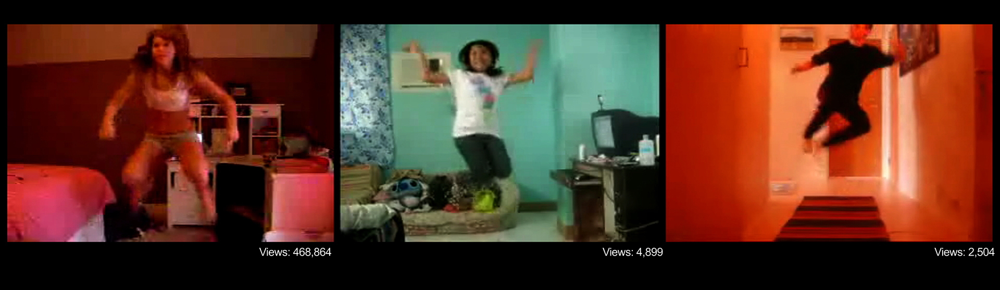
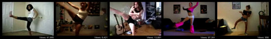
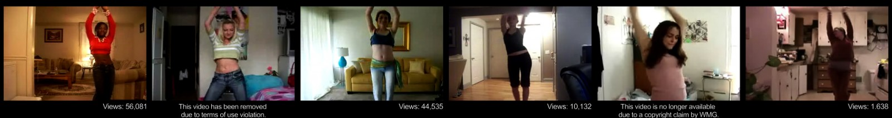
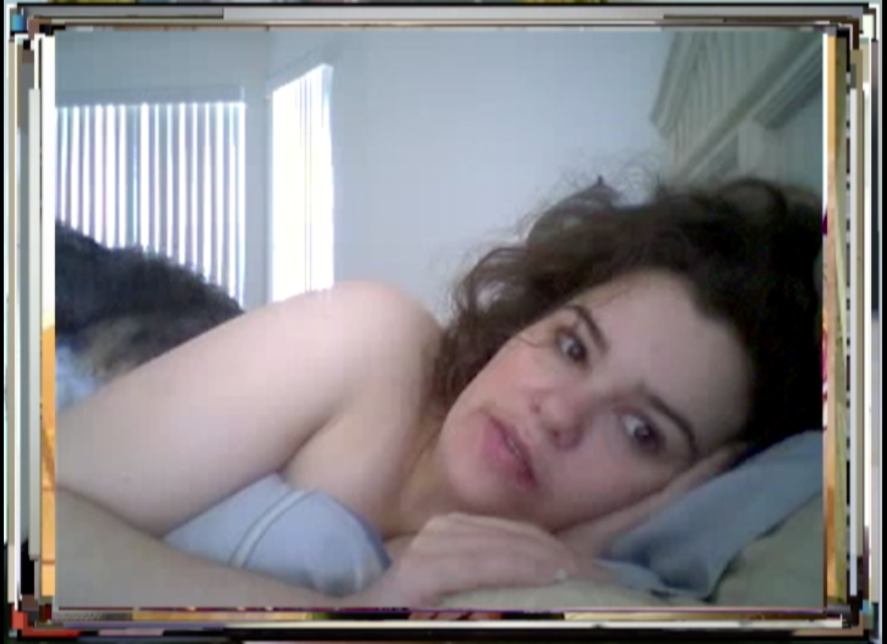

This conversation took place as part of the symposium [**Second Century: Photography, Feminism, Politics**](https://2017.fotofocussymposium.org/) for **FotoFocus**, Cincinnati, October 7th, 2017. It has been edited for length and clarity.

Speakers: [Nora N. Khan](https://noranahidkhan.com/), writer, and [Natalie Bookchin](https://bookchin.net/), artist

Moderator: Kate Palmer Albers

*********************

**KATE**:  I’d like to frame this conversation with a project that the artist Martha Rosler did in the mid-1970s, [*The Bowery in two inadequate descriptive systems*](https://whitney.org/collection/works/8304). Among other things, Rosler’s gesture was to look at a basic and conventional exchange that happens in a photographic transaction, critiquing documentary photography in particular. There's a person with a camera, there's the person being photographed. There's a viewer of those photographs. And there's a whole system and set of exchanges in the dynamic, that involve all kinds of shifts in power and balance. She very nicely got at the distinction—or exchange—between the lives we live as individuals, a very personal experience, and the larger conventions that come to be naturalized around us and that we often come to take as neutral in how these processes work.

It seems very important to ask: what has changed over the course of 40 years? In many ways, that basic photographic dynamic hasn't actually changed that much. But now we have another major component or player in what that dynamic is. I’m referring to what happens online. And this doesn't have to be in the art world. This is just in the course of living our lives in our culture today...we have our devices in our pockets. We have our computers. The way that we have images sorted for us, the way that images come to us, the way that we put images out in the world—this is both very personal, and part of a much larger cultural conversation. This is a question of visibility, of making these structures and systems more transparent, more evident.

And these are all questions that both Natalie, in your work as a video and film and media artist, and Nora in your work as a writer, have considered very deeply. So I'm delighted and really thrilled to be having this conversation with you now, to think about where we are in this set of dynamics, this exchange of photographic and informational material. Let’s start with Natalie's work, *Mass Ornament*. 

**NATALIE**:  Sure. [*Mass Ornament*](https://bookchin.net/projects/mass-ornament/) is the first in what would be a decade long series that I began in 2008, the year of the Financial Crisis and the election of Obama and completed in 2017, the summer after Trump was elected. The series draws from archives of first-person videos mostly found and collected from the internet. With these archives, I create sound and video installations of montages of hundreds of videos of people speaking, dancing and performing to webcams. In *Mass Ornament* I was looking at the way that people situated their bodies in front of their webcams. The work was made only a few years after the iPhone had been released, but at the time, many people were still using desktops computers and webcams to make videos for the web, so the movement of the bodies is circumscribed around the fixed webcam, and in the videos I collect there are glimpses into people in their homes, bedrooms and living rooms as they narrate or dance for their online viewers. 

<figure class="figure-lg">
	
	<figcaption>
	Natalie Bookchin, still from Mass Ornament, single-channel video installation, surround sound, 2009. Courtesy the artist.
	</figcaption>

</figure>

**KATE**:  There are a lot of ways to get into this work. But I think maybe one of the first ways is the contrast between a very personal, individual experience that all of these people who were making the videos are having, and then putting that out onto the internet, for you—or anyone—to find. What was your process for finding these videos, what was that experience for you?

**NATALIE**:  I became really interested in these videos because … even though we all have danced in front of our mirrors, or many of us probably have, alone in our rooms, there was something very different about what was happening in these videos. People were dancing in front of a different kind of mirror—they could see themselves on their screens, but they were also allowing a potentially limitless public to watch along. The videos feel very private—we view people alone at home by themselves—but they are also extremely—and strangely—public and social. It’s a public we can’t see but we are a part of.  And that blend of private and public, for me, was just so interesting and puzzling and disturbing, and felt like something that spoke to what was going on in the world in a bigger way. And I hadn't put my finger on what it was when I started this work. 

[*7-minute clip of Mass Ornament (scroll down)*](https://bookchin.net/projects/mass-ornament/)

Searching on YouTube was also a big part of the work, so much so that I saw it in some way as a collaboration with and an intervention into Google’s search engine. In some of the later works, many of the videos that I found had two viewers. There was the person who made it, and there was me. Most  of the videos I collected were buried by Google’s algorithm. And so it took digging, doing the labor that most people don't do. You know, we're busy. We go with the first search results. 

<figure class="figure-lg">
	
	<figcaption>
	
	</figcaption>
</figure>

<figure class="figure-lg">
	
	<figcaption>
	Natalie Bookchin, stills from Mass Ornament, single-channel video installation, surround sound, 2009. Courtesy the artist.
	</figcaption>
</figure>

The videos seen together revealed the extent of people’s isolation. Our society isolates people, the camera isolates people. Social media isolates people. But that within that isolation, there was something more in the videos. You know, there was a possibility of a kind of collective or sociality that was imminent, but not yet there. But seen on YouTube that can be hard to see. Social media platforms reproduce the idea of a competitive, unique individual trying to get views and attention. I wanted to show something else that seemed buried, that wasn’t quite visible through YouTube’s interface, which was that many people were in it together, were acting and desiring in similar ways, expressing a longing for kind of publicness or connection that wasn’t quite was possible within these limited systems and platforms.

**NORA**:  Absolutely. This piece is incredibly moving to me, and watching, in all of your pieces, how you collate all of these private experiences that we bring online, that are not necessarily meant to be seen, where you bring your private self—in that possibility of someone seeing you, a space is opened up in which you're able to express something differently that you might not do in your private journal, alone. I'd like to put this in the history of the last 20 years. Maybe people remember a time before the internet. I certainly do. I remember my first dial-up connection. I remember being an only child in a remote suburban, rural town, as well. And that the world opened up through them. You could go onto fan forums around your favorite show. You could go to LiveJournal. LiveJournal was very important for a lot of teenaged girls. 

Over time, that has been concentrated, as the architecture of the internet has gone from very open in the 1990s to extremely closed now. Powers are concentrated in four or five platforms, material is then tagged, and you're this branded, curated self that we're encouraged to give back through social platforms. This is in such contrast to the kind of spontaneity and roughness and friction, like these beautiful personal narratives that you can find on YouTube. You can go onto YouTube and find just endless, endless testimonials and confessionals from people all over, and then you can start to discern patterns through it. We're all expressing the same fears and griefs and patterns of living. Social media and these other platforms extract those patterns, and try to make them systemizable—that comes into fierce contrast with this. I'm interested in artists who offer this kind of resistance to the closed-in feeling that we get through the technology that's subsuming us.

**NATALIE**:  It’s painful to think about what has happened with the internet today. The series is really about a different era, and about some of the hope that we once held about the potential of the internet for connection. Where people could use it to be seen, whether it was to be seen dancing or playing, to be seen as beautiful, to be seen as a subject in a world, in what we all once were hoping would be a public space. But in the end, and thanks to black box algorithms and internet giants, that's not how it has turned out.
 
*****
I just finished another video *Count*, one that I began in 2008. It’s a video where people are portrayed speaking a single number, starting with 300-something and counting backwards to 105. People say a number with incredible enthusiasm and excitement or with deep disappointment. I sent it to Kate, and it took her a minute to figure out that people were stating their weight. And using YouTube to share their weight loss journey.

**KATE**:  It initially seemed like people saying random miscellaneous numbers, or like a Christian Marclay piece. I had no idea what was going on. And then you start to match the number with the body that you're seeing on the screen, and the sense of disappointment, or this revealing, this sharing of a personal process. And it has this "Aha!" moment, with the quantified self. You’re seeing a very personal experience of someone's journey, toward a self they're trying to achieve privately, made public for review and analysis by some unknown public, which comes to be you. 

<figure class="figure">
	
	<figcaption>
	Natalie Bookchin, still from Count, 2017. Courtesy the artist.
	</figcaption>
</figure>

**NATALIE**:  Right. The French theorist, Gilles Deleuze, in 1990, wrote an essay called ["Societies of Control"](https://theanarchistlibrary.org/library/gilles-deleuze-postscript-on-the-societies-of-control). He talks about new ways people are disciplined in digitally networked  society. Instead of individuals, he talks about *dividuals*, where bodies and selves are quantified by governments and corporations. In *Count*, people make self portraits videos by quantifying themselves, turning themselves into digits, even while seeking to connect with others and share their struggles. But ultimately what happens to the videos that people make is that that they are monetized- sold and fed to algorithms. As people try to connect and find community, the tech companies get really, really rich, while the rest of us get really, really poor. 

<figure class="figure">
	
	<figcaption>
	Natalie Bookchin, still from Count, 2017. Courtesy the artist.
	</figcaption>
</figure>

**KATE**:  That’s a dynamic I'd like to get at a little bit, this tension between the oppressive systems of structures in which our images and information are circulating, and how to resist that. Nora, one of the things that you've advocated for in your writing is making spaces for creative gestures or poetic gestures, either working with or resisting these algorithms. Can you talk about that a little bit?

**NORA**:  Sure. This goes back to what machine learning is. I assume most people are on social media in some way, whether you love it or hate it. It's necessary to be considered a good worker. Aside from the option of being a Luddite and tossing everything into the ocean, you have some sort of ambivalent relationship with social media. I think what is painful to see are these early days of tenderness, and real honesty and openness that people donate: their emotional energy, their information, their pictures. Pictures of breakups, relationships. But then that is obviously monetized. There’s a lot of research on the question: why do we still use social media when we know that our private information is used? It's because there is a real psychological grip. The way the platforms are designed now—they have cognitive linguists, they have psychologists sitting in a room, studying how your affect and emotion is linked to behavior. 

**KATE**:  It's no accident.

**NORA**:  There's no accident, exactly. It’s important to be pragmatic, and educated as a user of these platforms. When we talk about the gendered aspect of this, there are studies of how advertisers go onto Twitter between one and four in the morning, which is when most women express feelings of loneliness or sadness on Twitter. And advertisers mine that.

**KATE**:  Between one and four a.m.

**NORA**:  One and four a.m. And advertisers mine that information, to then show products for exercise, for yoga, for CrossFit, for clean eating. To make you into someone more attractive, to then get a partner so you won't be on Twitter between one and four in the morning. [LAUGHTER] 

**NORA**:  If it's three a.m. and you see that ad, you know, you might be in a vulnerable enough state that you think: "Maybe I should do CrossFit. Maybe this will solve everything for me."
It’s a very seductive kind of loop, and it taps into our deepest vulnerabilities, in that we engage in these platforms knowing this. Regarding artists providing interventions, one issue is with our relationship to technology—a lot of it is becoming illegible. The language is inaccessible, how the systems actually work, how they use your information, where the information is stored, what advertisers have access to, what government agencies have access to… it’s all illegible.  Artists such as [Trevor Paglen](http://www.paglen.com/) and [Ian Cheng](http://iancheng.com/) and [Katja Novitskova](http://katjanovi.net/) talk about how the language has to be more accessible. You don't need to understand how the tool itself works, to understand how it's making you feel and what it's doing with your experience. I'm fundamentally hopeful for artists who have programming or software background to make this language of tech—a language that's meant to be opaque and not understandable—a little bit more legible and open.

**KATE**:  That connects back to the idea of the Rosler piece I was thinking about earlier, this challenge of making legible something that is meant to be opaque. Something that is intended to become naturalized or neutralized, so that you engage with it without thinking twice about it. There is labor involved in making those things transparent. 

**NATALIE**: Trevor Paglen has a show in New York right now ([*A Study of Invisible Images* at Metro Pictures](https://www.metropictures.com/exhibitions/trevor-paglen4/installation-views)) and [recently wrote an essay about invisible images](https://thenewinquiry.com/invisible-images-your-pictures-are-looking-at-you/), and the way that most images in the world that exist right now, we don't see. They're made by machines, for machines. And he's trying to make those images legible. In my work I try to make visible the manipulation of search results that serve us some images and not others, and to reveal content buried by top search results. Google’s algorithms determine the hierarchy of search results and make video recommendations based on how what they determine the individual searcher wants. Those search results tell a particular story determined by the algorithm (and the coders who wrote the algorithm, and the data that trained the algorithm) as well as the searcher’s history. I try to tell a different story. My selection is subjective, but so is Google's. Yet their stories, coming from a machine, appear seamless and automatic. I try to reveal the seams, the stitches and the omissions.

**NORA**:  You mentioned Trevor Paglen. From that essay, he started to work with Hito Steyerl, the critic and theorist. They worked with Google to learn how to use a machine-learning system, the system that interprets all of your data and then feeds back a version of you, or feeds back advertisements to you. This is related to facial recognition software, which is now used in predictive policing, and is being sold to local police departments, being put in airports, being refined constantly. Paglen took 1000 pictures of Hito's face, in various emotional states. She's angry, she was placid or calm or neutral, she's sad. He ran a network over it to see how the network would read her gender, based on her emotion. Where she's angry, she was read as male. When she's neutral or soft or happy, she's read as a woman. And then there's a lot of contradiction, because you can train different networks to interpret the images.

What this was meant to reveal is that there's no technology that's neutral. There's no software that we use that is neutral. This idea that tech has no values is completely wrong. There's always a person making it. There's always a person who can reformat it, reprogram it, and redesign it. If you put in our old biases about what a woman should be like, or how a woman should compose her face or how a man should compose his face, or what reads as a certain gender—it's framing tacked along this really old binary. We obviously know lived experience is much more messy and complicated. You can redesign systems, you can redesign software, to reflect the messiness of human experience. I hope.

**KATE**:  This makes me think of something I just heard about this week. And I'm curious to get both of your reactions to this. Google keeps coming up. They’ve just put out a camera that is a little bit like some of these life-logging cameras that take a picture automatically every 30 seconds of whatever you are doing. But this new camera is actually quite different, because it's trained by artificial intelligence, and it runs on artificial intelligence. So it operates independently from any human operator. You put the camera out, and it watches the scene. It watches the room, it watches what's going on, and it waits for something interesting to happen, or a “good” picture to happen in front of it. This is really fascinating. It gets at the idea of labor, it gets at the question of whose agency is behind the lens. Who is taking the picture? Who coded and trained the camera to read what a “good” picture is? 

**NATALIE**:  Right. I saw that. It's incredible. So you no longer have to take good pictures, because your camera will do it for you. [LAUGHTER] And will determine what those pictures should be.

**KATE**:  And they might be better.

**NATALIE**:  They will be more beautiful. And they will be happier. And they will be sentimental. 

**KATE**:  Presumably. We're assuming that the programmers of the camera are operating on a set of conventions of what we collectively could agree makes a “good” picture.

*********

**NATALIE**:  One thing that I wanted to bring up.... Hito Steyerl, an amazing artist, made a piece in 2013, called [*How Not to Be Seen, A Fucking Didactic Educational .MOV File*](https://www.artforum.com/video/hito-steyerl-how-not-to-be-seen-a-fucking-didactic-educational-mov-file-2013-51651). Now, instead of visibility, she's arguing that it's better for people to be invisible. Because with visibility, you're tracked and you're quantified. 

**KATE**:  You're contributing to the corporate collection of data.

**NATALIE**:  Yet at the same time remaining invisible is a privileged position. There are many who don't have the luxury of refusing the visibility. 

**KATE**:  Yeah, absolutely.

**NORA**:  Especially with facial recognition software. There are all these horrifying stories that come out once a week, that now facial recognition can analyze the structure of your face to try and predict if you would commit a crime, or if you're the kind of person who would commit a crime. This obviously reifies every racial and class bias. The way that software is designed reifies assumptions and bias. There is a program that can predict your sexuality based on your image.…If someone else takes it upon themselves to reveal what they think your sexual orientation might be, that that can affect your employment, that can affect your relationship with your family. It’s this idea that you can make the complexity of identity legible, and that it's revealed through your face and your facial structure. It's like 21st century phrenology.* The 19th century practice of trying to figure out from someone's skull size, what kind of person they are. But actually, AI is very stupid, AI is very dumb. We're not anywhere close to a truly human intelligence system, which would mean coding emotion. It would mean coding interpretive capabilities. Being able to discern context, and understand a person as more than a set of markers that a system might be able to discern. 

**KATE**:  I wonder about the possibilities of becoming aware of the biases of the systems, as a route to becoming more aware of the biases of the people, and of the culture.

**NORA**:  Oh, absolutely. It's a circuit that goes back.

*********

*At this point, the conversation opened to audience questions; below is one exchange from that period.*

**AUDIENCE MEMBER**:  I'm very struck by the phrase about privilege and invisibility. It resonated. The ability to resist being programmed, being indoctrinated. We're all indoctrinated, we're all programmable. Our brains have been modified by constant use of our devices. But there is something about that theme of invisibility, next to your capacity to think independently. To resist authority. Resist, or at least be conscious that I'm being programmed, and step out of it, so that you have the capacity to exist. Can you link the responsibility you see for those who have the privilege of invisibility and consciousness, to be able to resist and to be able to affect systems?

**NATALIE**:  Yes. I think that if we're here in this room, we're probably somewhat privileged. Right? And we're interested in these subjects, and that's great. And I think that that's the way that we can start to get involved, and start being aware of the things that we're not so aware of. I post on Facebook. Because I need to vent. But I know I'm compromised. I know it's not doing anything. It’s not gonna change anything. And I don't know what the solution is. I think artists need to work really hard on these subjects. I don't think there are enough artists working on these subjects in interesting ways. I think writers need to continue. Nora's doing amazing work. I think that this conversation is part of that consciousness, being aware of these things. They’re small things, but they matter. Like this matters. Being here now matters. 

**KATE**:  That sounds like a good note to end on. Thank you, everyone.

*********

*for more on 21st century phrenology, see Blaise Agüera y Arcas, Margaret Mitchell and Alexander Todorov, ["Physiognomy's New Clothes"](https://medium.com/@blaisea/physiognomys-new-clothes-f2d4b59fdd6a) (2017).

A video recording is available [here](https://vimeo.com/238802596).

**Natalie Bookchin** is an artist whose work exposes social realities that lie beneath the surface of life lived under the glare and the shadow of the Internet. Her critically acclaimed artwork has been exhibited around the world including at MoMA, LACMA, PS1, Mass MOCA, the Walker Art Center, the Pompidou Centre, MOCA LA, the Whitney Museum, the Tate, the Kitchen, and Creative Time. She has received numerous grants and awards, including from Creative Capital, California Arts Council, the Guggenheim Foundation, the Durfee Foundation, the Rockefeller Foundation, California Community Foundation, the Daniel Langlois Foundation, a COLA Artist Fellowship, the Center for Cultural Innovation, the MacArthur Foundation, a NYSCA Individual Artist Fellowship, a NYFA Opportunity Grant, a NYSCA/MAAF award, among others. Bookchin is a professor of Media and Graduate Director in the Department of Art & Design at Mason Gross School of the Arts at Rutgers University.

**Nora N. Khan** writes criticism on emerging issues within digital visual culture, experimental art and music practices, and philosophy of emerging technology. She is a professor at RISD in Digital + Media. Khan’s writing practice extends to a large range of collaborations, which include shows, performances, and exhibition essays, scripts, and sometimes, librettos. She is a longtime editor at *Rhizome*. She is currently editor of *Prototype*, the book of Google’s Artist and Machine Intelligence Group forthcoming in spring of 2019. Last year, she edited *What’s To Be Done?*, a magazine marking the tenth anniversary of 7×7. Designed by Richard Turley, it features works and interviews with Paul Ford, Claire L. Evans, Kate Ray, and Martine Syms, and an interview Khan conducted with Stanford professor and Silicon Valley scholar Fred Turner, “We Are As Gods.” 

