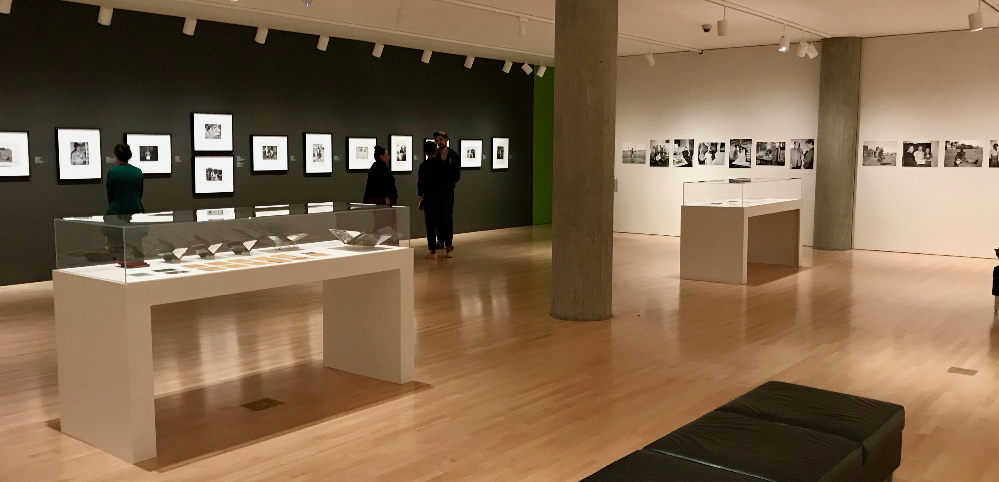
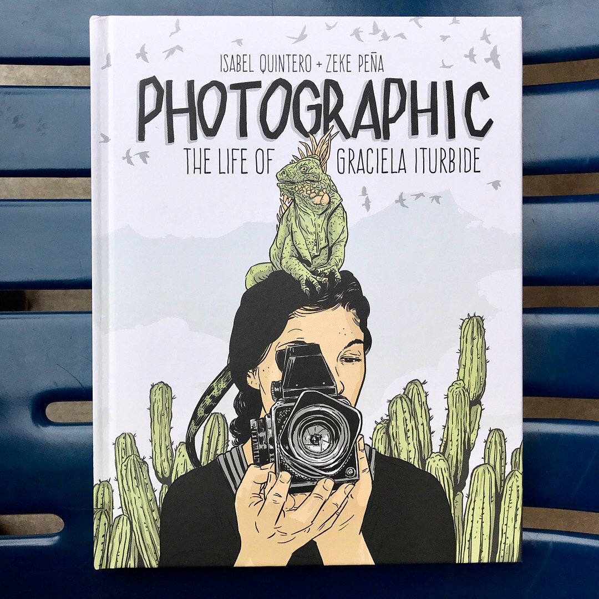
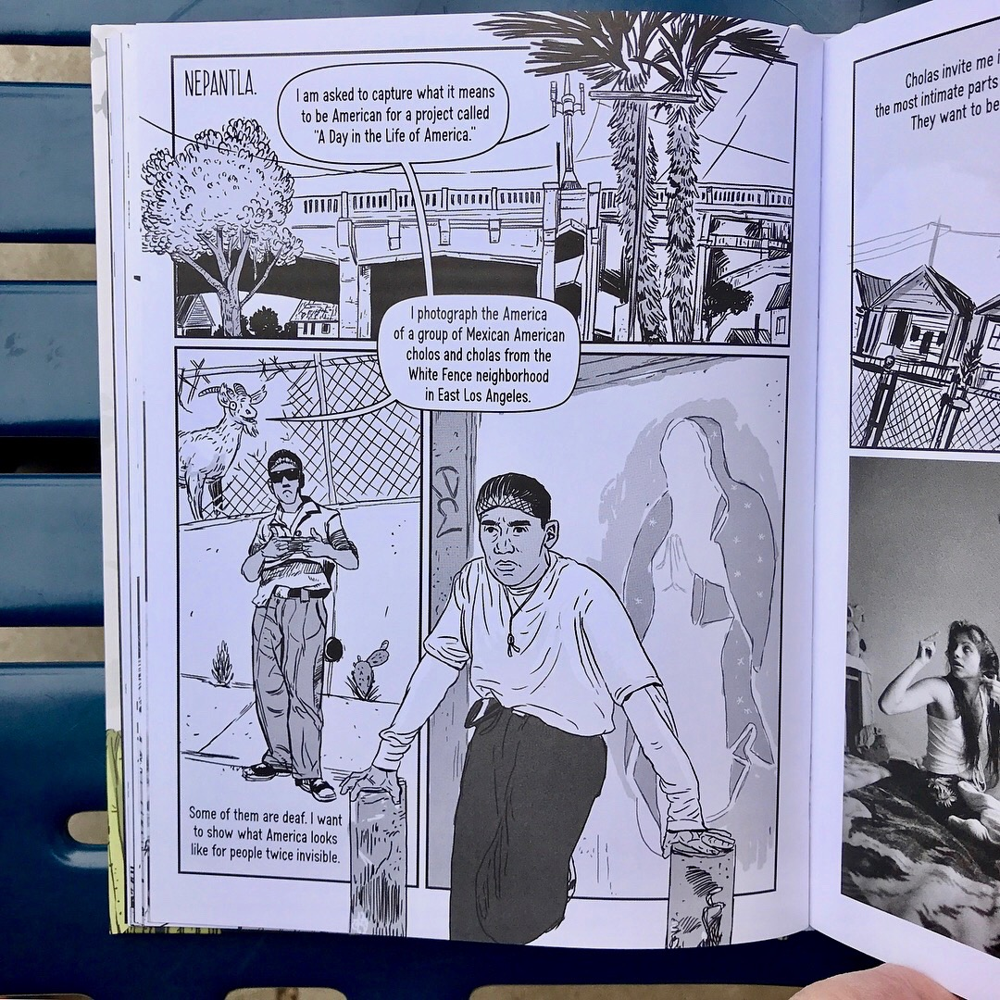
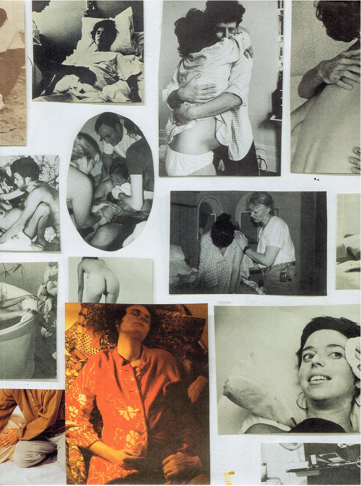
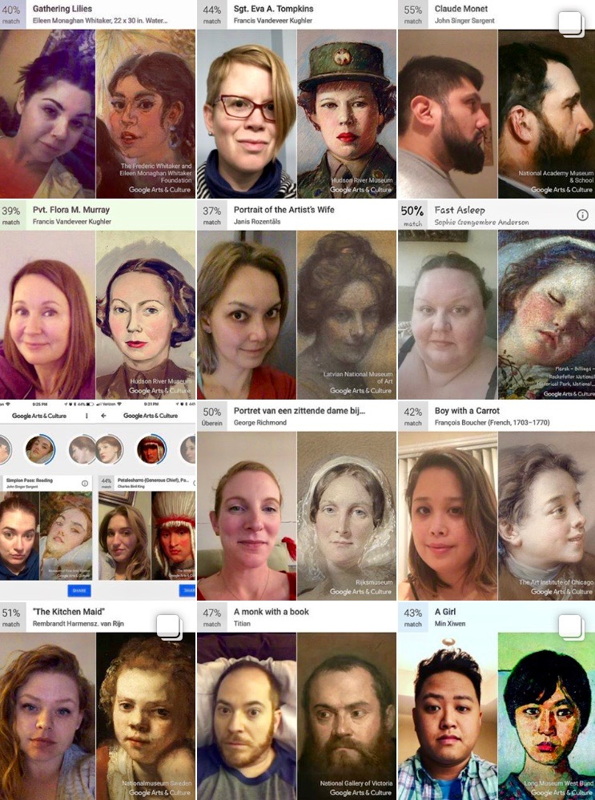
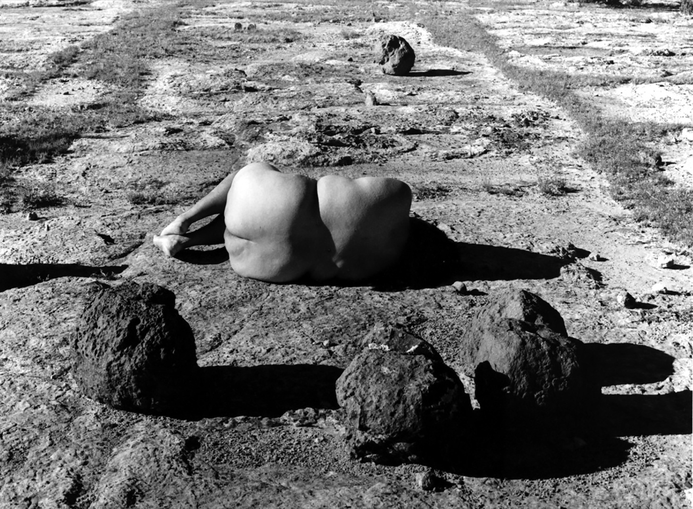
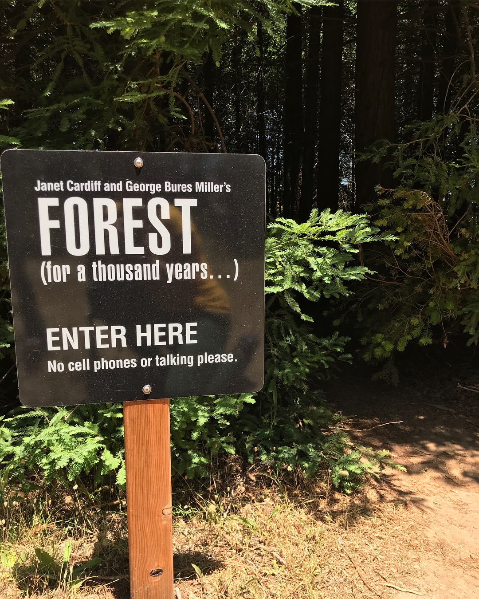
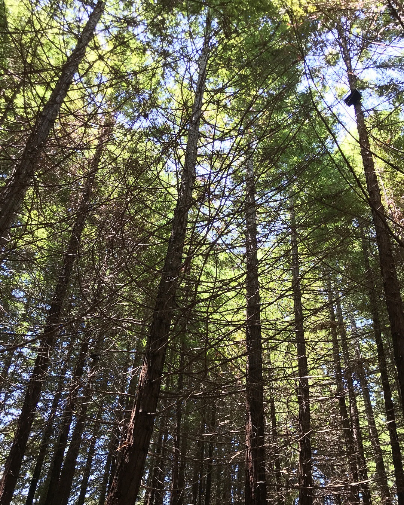
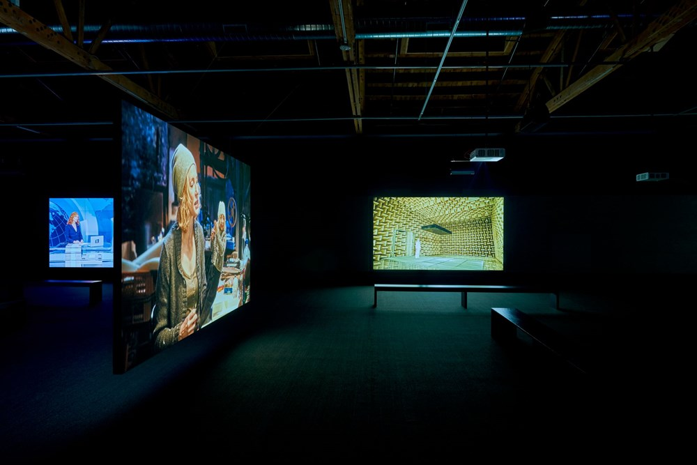
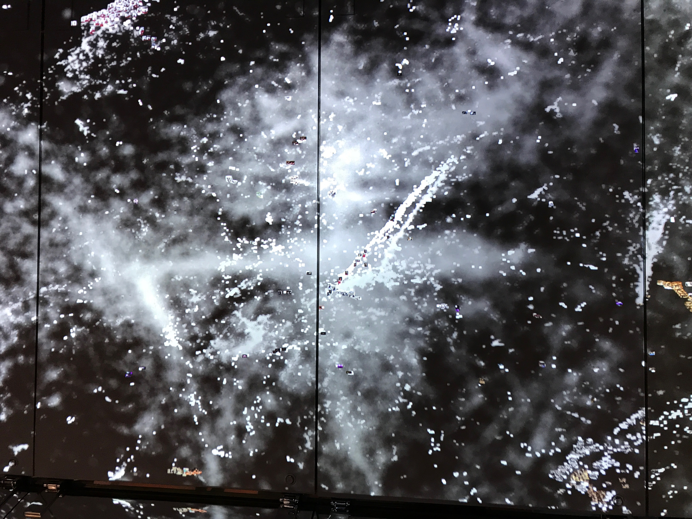

I like lists, and I kind of missed making one last year. Art in books, art in museums, images on apps, art in the trees...I hadn’t intended for so much of this one to be photographic, but it’s not much of a surprise, in the end.

***1. The San Quentin Project: Nigel Poor and the Men of San Quentin State Prison*, The Milwaukee Art Museum**

<figure class="figure">
	
	<figcaption>
	</figcaption>
</figure>

I had been aware, on some level, of the artist Nigel Poor’s work with the Prison University Project at San Quentin State Prison. But the exhibition of work, in conjunction with a multi-day symposium [*The Milwaukee Model: Envisioning the Role of the Arts in Criminal Justice Reform*](https://mam.org/calendar/events/mkemodel.php), blew me away with the depth of its humanity, and its effort to make some headway into the complex terrain of creating a nuanced visibility of the incarcerated population in general, and individual experience within a profoundly dehumanized context, in particular. In addition to exhibiting the results of the close visual studies her incarcerated students had done on the work of contemporary American photographers, the exhibit, organized by Lisa Sutcliffe, also featured the prison’s archive of glass plate negatives that Poor had selected and printed. 

**2. *Photographic: The Life of Graciela Iturbide* by Isabel Quintero and Zeke Peña (Getty Publications, 2018)**
<figure class="figure-pair">
	
  
</figure>

This one is a bit of a cheat… I read *Photographic: The Life of Graciela Iturbide* at the tail end of 2017. But of the several artist biographies, journals and autobiographies I read over the course of 2018, this might have been my favorite for its departure from conventional approaches to those genres.  Weaving together graphic illustrations and photographs in with the text all as narrative elements, writer Isabel Quintero and illustrator Zeke Peña poetically distill Iturbide’s life into a complex and moving portrayal of one artist’s experience. I particularly like the section about her work in the White Fence neighborhood of East Los Angeles, which grew out of an assignment for a book project called *A Day in the Life of America*, for which Iturbide was one of 200 photographers to portray life in the U.S. on one day, May 2, 1986. 

**3. Carmen Winant, *My Birth* (Self Publish Be Happy, 2018)**
<figure class="figure-md">
	
	</figure>
I had seen—and been riveted by—Carmen Winant’s [installation at the Museum of Modern Art](http://carmenwinant.com/work/my-birth-museum-of-modern-art-moma-nyc) (March-August 2018), but when the book arrived at my house, I opened it and almost dropped it like a hot potato – I knew I was going to have to wait to look at it until I could absorb it. It sat on my shelf for a long time; I would eye it from time to time and wonder if I had the bandwidth to take it in. Ultimately I was transfixed in the same way I had been at the exhibition. Part of this was intellectual: in the installation, I was aware, and fascinated, that Winant’s subject—images of birth— were an image category I literally had not laid eyes on before, at least in any meaningful way. And yet, in a discrepancy that astonishes me, it was a subject I knew intimately. 

But the real impact, with the book, was a flood of memories, accompanied by a corresponding constellation of emotions. They are memories that feel present, stored in my body: looking through the images, I can feel, still, the dense heaviness of my own belly during pregnancy; the strange coolness of medical equipment against my skin and flesh, felt in my births, certainly, but also as a mainstay of pregnancy; the time-stopping fear in the moments after my son was born when he was blue and had not yet cried, and the doctors rushed him away; the out-of-body sense of hearing, as if from the hallway outside of my daughter’s birth room, my own loud moans and grunts and cries during my first natural birth; my now inevitable association of pregnancy and birth with miscarriage and loss… the viscerality, then, of making my way through *My Birth* echoed what both Winant and the writer Maggie Nelson have described as an essential queerness of pregnancy and childbirth. Nelson asks, in *The Argonauts* (2015), “Is there something inherently queer about pregnancy itself, insofar as it profoundly alters one’s ‘normal’ state, and occasions a radical intimacy with – and radical alienation from – one’s body?” 

**4. *Holding Court: Lorna Simpson and Thelma Golden* in conversation at The Underground Museum**

Every time I go to [The Underground Museum](https://theunderground-museum.org/) I feel grateful to live in Los Angeles in the present moment. The content of this conversation, between two luminaries who are also old friends, was excellent, and both the mood and crowd gathered in the museum’s purple garden were sparkling. 

**5. Google Arts & Culture “Art Selfie” app**
<figure class="figure-pair">
	
  
  </figure>
I don’t mean this one to be cynical, but rather, a reflection on the depth to which our casual photographic lives are enmeshed within deeply powerful photographic systems. I watched with fascination and even a kind of glee as the results of this app flooded my social media feed last January. I went crazy screenshotting the posts of friends and strangers alike – I probably have one of you. For an essay I was working on last year, I wrote this on the topic:

> Google Arts & Culture capitalized on social media users’ voracious and presumably narcissistic appetite for selfies in their wildly popular app featuring computer vision “matches” made with portrait subjects drawn from the museums and collections in institutional partnership with the Google Arts & Culture conglomerate. Predictably, and rightly, there were immediate reactions of dismay as search results skewed toward the white subjects that no doubt are grossly over-represented—by measure of objective population data—as subjects in the collections consulted. [(Adrian Chen, 2018)](https://www.newyorker.com/tech/annals-of-technology/the-google-arts-and-culture-app-and-the-rise-of-the-coded-gaze-doppelganger) The popularity of the app raised privacy concerns that the dramatic increase in uniformly photographed (and identified) faces would be used as fuel for the growing Google facial recognition data set, as the app encouraged users to photograph themselves within a passport-style and sized box, at arm’s length, and, presumably not smiling, per the historical conventions of portraiture.

**6. Art with kids**

Going to art exhibitions on my own is a rare activity, usually I have my kids (ages 12 and 6) with me. It inevitably changes the experience, often in remarkable and eye-opening ways. These shows were highlights on their own, and have the indelible mark, too, of having been highlights with my kids. 

### Laura Aguilar, *Show and Tell*, Vincent Price Art Museum

<figure class="figure-md">
	
	<figcaption> 
		Laura Aguilar, Nature Self Portrait, 1996
	</figcaption>
</figure>
The brilliant artist Laura Aguilar (1959 – 2018) had a long-overdue retrospective, [*Show and Tell*](http://vincentpriceartmuseum.org/exhibitions%EF%80%A2lauraaguilar.html), organized by Pilar Tompkins Rivas at the Vincent Price Art Museum in East Los Angeles last year. Aguilar’s work is an important personal marker for me: I vividly remember when one of my early grad school professors, Amelia Jones, showed the work in class in the late 1990s; at the time it was a recently-made series. The photographs were such a striking, clear, and powerful alternative to the photo history I’d absorbed previously: an unmistakable response to (and critique of) the modernist canon and to cultural expectations of beauty, while at the same time also being a person just doing her thing in the desert. At the exhibition, I talked with my kids about bodies and landscape as form; what it means to be beautiful; and what it means to be seen. I was heartened by their openness and attention to these big topics, a state that the photographs must have encouraged.

###Janet Cardiff and George Bures Miller, *Forest (for a thousand years...)*, 2018, 22-speaker sound installation in a grove of redwoods at the UC Santa Cruz arboretum
<figure class="figure-pair">
	
  
	<figcaption>
	</figcaption>
</figure>
[*Forest (for a thousand years...)*](http://ias.ucsc.edu/content/2018/forest-thousand-years-janet-cardiff-and-george-bures-miller) made me wish I could experience more art in a grove of redwood trees. It was obvious my kids felt the same way. The older one wandered off to an edge of the grove and made himself comfortable in the forest floor, thick with pine needles, where he stayed for over an hour, out of sight of the rest of us. The younger one sat with me on a tree stump and listened to the 28-minute loop—at times, subtle, and at other times, booming and a bit terrifying—and then wandered around the grove with my mom, poking at things on the ground: a feather, scat, pinecones. We all stayed and listened to the intermingling of art sounds and natural sounds—and looked at and otherwise absorbed our surroundings—far longer than I imagined we might. 

**7. Suné Woods, Fred Moten & James Gordon Williams, *You are mine. I see now, I’m a have to let you go*, Hammer Museum**

There was a lot to like in this year’s [*Made in L.A.*](https://hammer.ucla.edu/exhibitions/2018/made-in-la-2018/) biennial exhibit, put on by the Hammer Museum. And as usual, the Hammer’s public programming brilliantly complemented the institution’s curatorial work. *You are mine. I see now, I’m a have to let you go* featured a performance by the exhibiting artist Suné Woods with musician James Gordon Williams and poet Fred Moten. The trio together performed a largely improvised live collage of video, sound, and words.

**8. MANIFESTO, by Julian Rosefeldt (2015), Hauser & Wirth**
<figure class="figure">
	
</figure>

In a grad school seminar at least 15 years ago, the professor Caroline A. Jones started the day’s session by leaning back in her chair and asking all of us around the table: “Who, among us, is prepared to write a manifesto?” That question has stuck with me, along with an awe and appreciation for the power of stated belief. Rosefeldt’s [13-channel video](https://www.julianrosefeldt.com/film-and-video-works/manifesto-_2014-2015/), each large screen emerging from near total darkness in two expansive rooms, and synchronized in sound, were a moving extended meditation (of impressive complexity and imagination) on belief itself. 

**9. *Peter Hujar: Speed of Life* at the Morgan Library**

Everyone went crazy for [this show](https://www.themorgan.org/exhibitions/peter-hujar), curated by Joel Smith, and I did, too. 

## Coda

**Finally, a pair of images I'd just like to think more about.**

<figure class="figure">
	
</figure>

<figure class="figure">
	
</figure>

These are a set of pictures I took at Jean Shin's installation, [*Metacloud*](https://pioneerworks.org/exhibitions/jean-shin-metacloud/), at Pioneer Works, in Brooklyn, and Refik Anadol's installation [*WDCH Dreams*](https://www.laphil.com/wdchdreams/) in a small gallery at the Walt Disney Concert Hall in Los Angeles. Shin's is a "cloud" of analog slides (a format I used as a teacher for several years in graduate school) and Anadol's a visualization of a database of images seen through time, as if traveling through a galaxy, or star cluster, (or metacloud?) of images. What they mean side-by-side seems, on the one hand, obvious, and on the other hand, not. 

