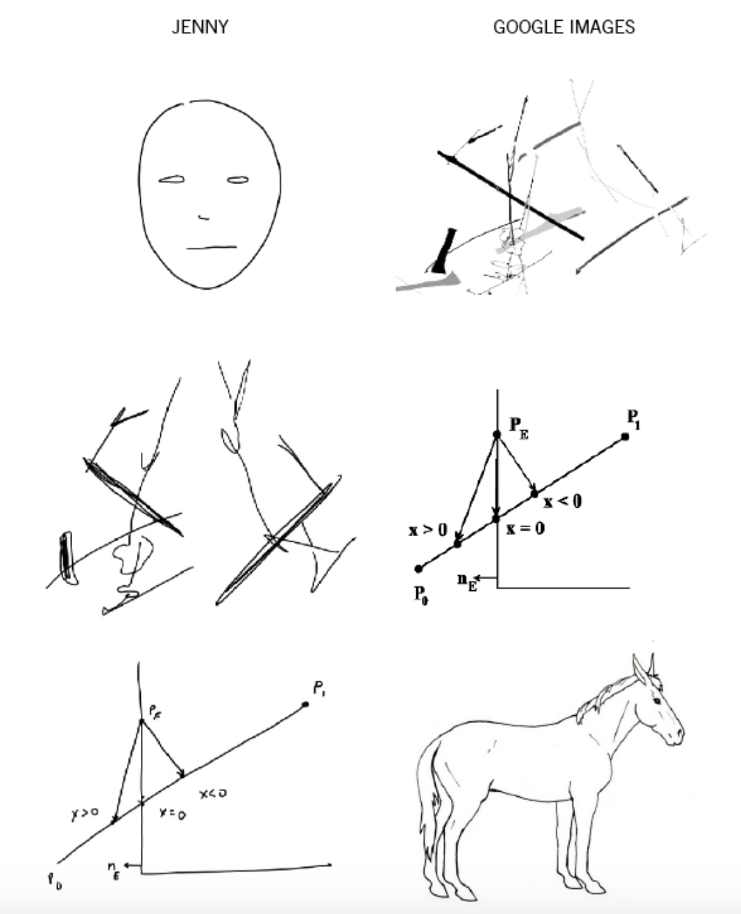
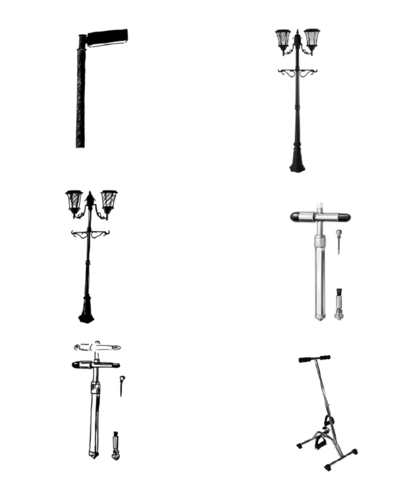
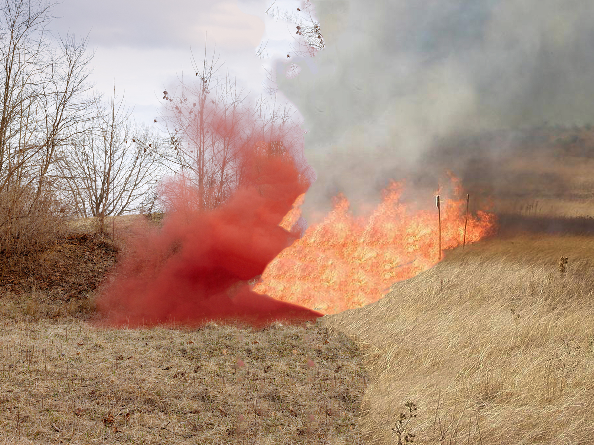
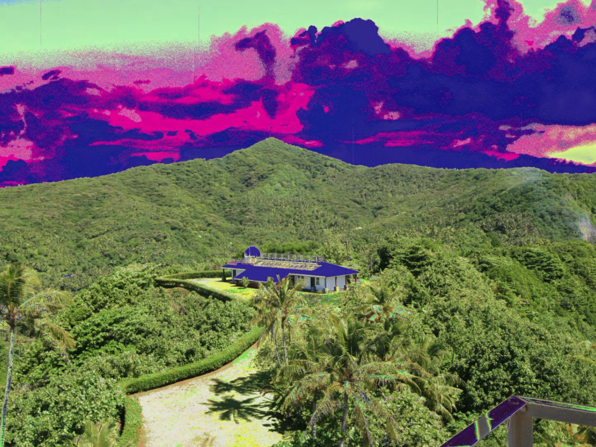
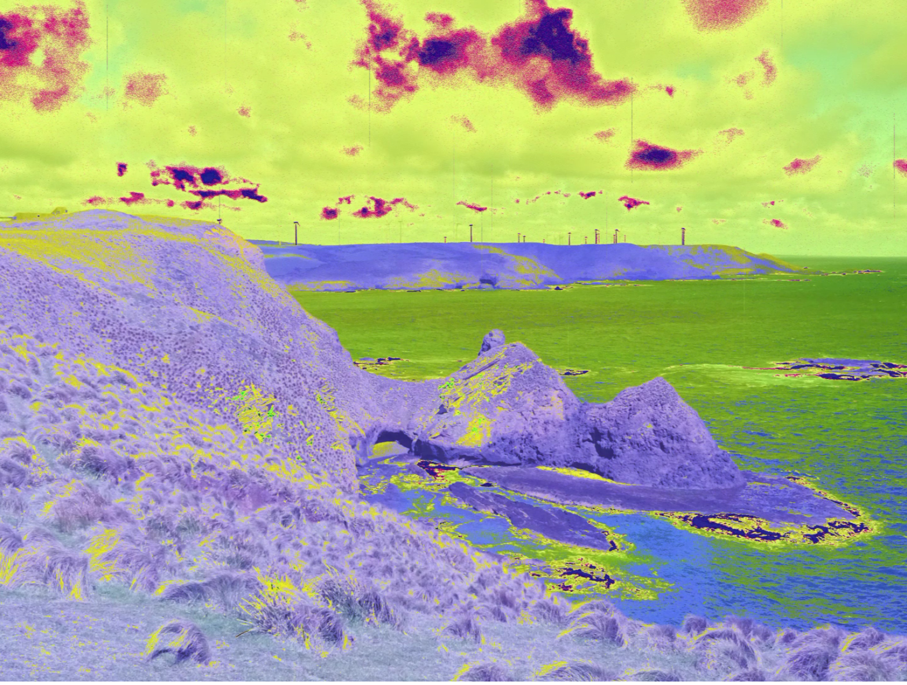
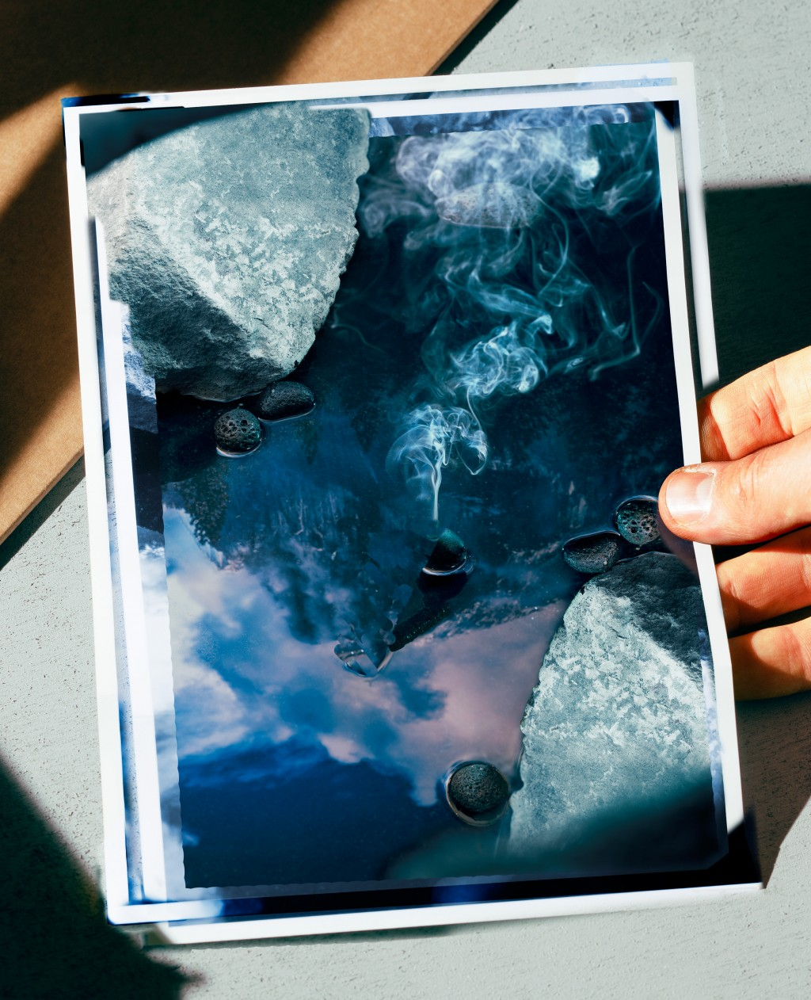
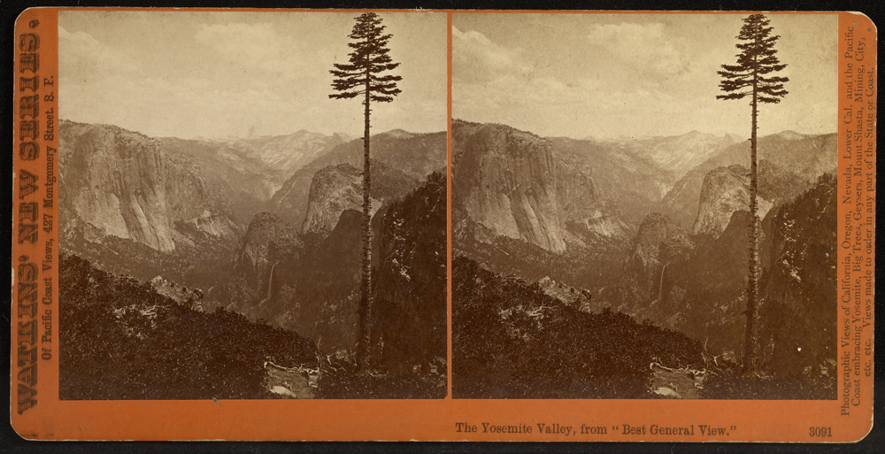
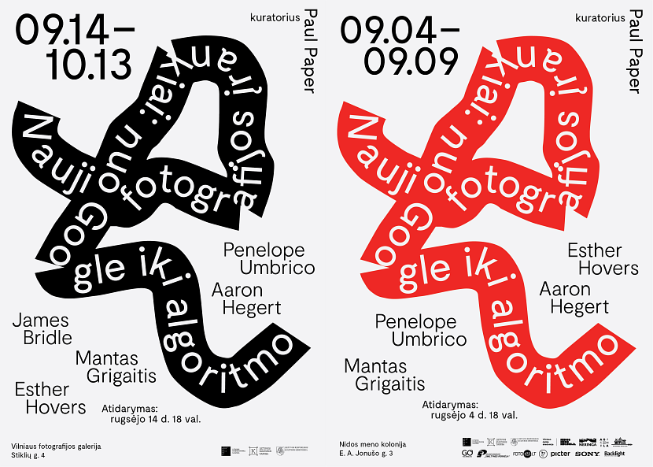
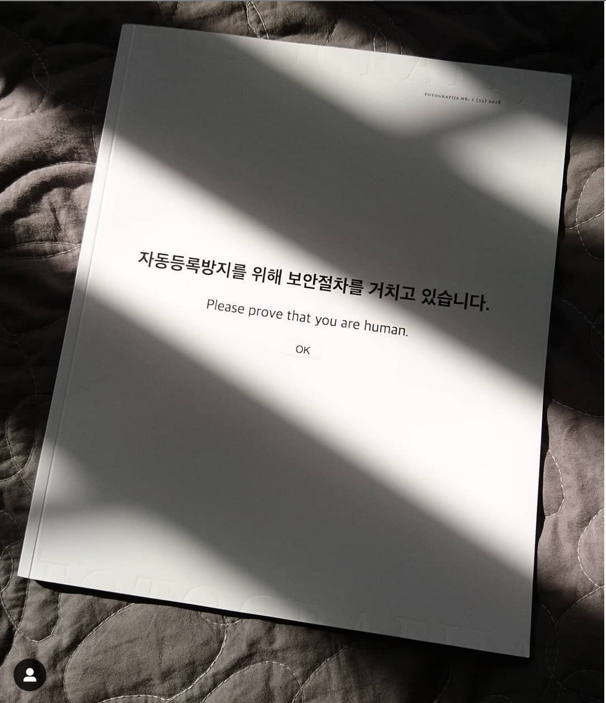

When does sight become visible? And how? Human perception is both profoundly singular and deeply connected to the core of what makes us human. It’s also easy to ignore, overlook, or just forget about. Interruptions into the ordinary can be useful in this regard: mistakes and illusions disrupt the continuity of sensory perception, as do moments of particular clarity and lucidity. The former may generally be considered a negative and the latter an appealing state, but both are notable for being outside the ordinary. 

Understanding how another person sees the world is one way we get to know one another, and how we become empathetic for other views of the world, outside our own. Connecting on the level of perception can be profound: feeling “seen” by another person can be deeply comforting, it can be exhilarating, or terrifying, or perhaps all things at once. In a fundamental way, trying to understand how another person sees can be an expression of interest or an act of love. None of this is a news flash, of course. But what is relatively new is the project of understanding how machines see, how “they” see “us”, and how these new modes of vision might affect our own understandings of human perception. 

Certainly at one level, perhaps the most pervasive level, this is a question of commodity and market, the most pressing question for advertisers seeking to quantify attention and promote products.  These processes, no doubt, have provided a good deal of the financial incentive to develop new technologies of sight and vision in the first place. But it’s also worthwhile to consider the question at a slightly different level of consciousness, one that is less transactional and more fundamental. And while I’m not suggesting that we all develop love affairs with our machines, like Theodore and his operating system, Samantha, in the barely-science-fiction Spike Jonze movie *Her* (2013), it is worth considering this new realm of mutual regard for more than customized lists of book, friend, or YouTube playlist recommendations. 

The work that artists are doing around questions of human and computer vision working in tandem, in exchange, or even, potentially, in modes of collaboration, suggests that these relationships might be playful, or confrontational, or characterized by an idea about the potentials of mutual curiosity or mutual problem solving. The artists in this issue engage in these possibilities. 

One example of a kind of playful reciprocity and mutual exchange in an artist’s curiosity about how Google sees—and Google is certainly among the most pervasive of computer vision platforms—is **Jenny Odell’s [*Google Drawing Game*](http://www.jennyodell.com/google-drawing-game.html) (2014-ongoing)**, in which she engages in an iterative trade sequence with Google Image Search, like an updated version of the favorite Surrealist parlor game, the exquisite corpse. 

<figure class="figure">
	
	<figcaption>
	
	</figcaption>
</figure>

Odell begins with a set of instructions (why not call it an algorithm – the program to enact the game):

1. Make a drawing.

2. Take a photo or a screenshot, and drag it into the Google Image search bar.
3. Draw whatever comes up as the first image result ("visually similar images").
4. Take a photo or a screenshot, and drag it into the Google Image search bar.
5. Repeat ad infinitum.

As humans talk more and more with images, creating visual conversational structures that range from banal banter to poetic observation, saucy exchange to visual kiss-offs, and sly asides to elaborate, ongoing inside jokes, Odell’s conversation with Google, over time, reveals a certain insight into the structure and logic of computer vision. 

The shifts as they play the game (“they” being Odell and the Search by Image algorithm) are both formal and based in content, the “mistakes” easily demonstrating the visual priorities of the code: a line drawing of a sailboat, as a child would make, becomes a diagram of luminous intensity; one type of streetlamp becomes another; a *New Yorker* cartoon somewhat magically transforms into a chemical diagram that in turn becomes an alphabet in script until, almost miraculously, from a back-and-forth of language and letters emerges a punkish puppy. Ultimately, the game is predicated on understanding visual mistakes as generative spaces for change and, even, innovation. Because of this baseline, the tone of the exchanges is lighthearted and curious, a kind of witty banter. 

<figure class="figure">
	
	<figcaption>
	
	</figcaption>
</figure>

The artist **Aaron Hegert** introduces a more contained version of this algorithmic guessing game, bringing it distinctly within the realm of the photographic. In his recent series [*Shallow Learning*](http://ww.aaronhegert.com/shallow-learning), Hegert similarly engages with a kind of collaborative approach toward understanding, or, at least, visualizing, how algorithms “see” unfamiliar photographic images. Deep learning programs around object recognition require massive training sets of images containing subjects that are both similar yet dissimilar: 100,000 totally different photographic images are useless, but 100,000 photographs of cats are collectively quite useful.  Like a toddler learning the range of what might be included or excluded in the categories “truck”, “van”, “SUV”, and “car” by asking a parent 100,000 questions, an object recognition algorithm can learn that “cat” applies as a single category to those cats that are sleeping, those that are stretching, those that are staring at the camera unblinkingly, and those that are obscured by foliage; in other words, like a human mind, the computer’s “vision” comes to perceive a categorical similarity despite different angles, poses, and contextual circumstances. 

<figure class="figure">
	
	<figcaption>
	
	</figcaption>
</figure>

Hegert sought, however, to present the search algorithm with an unknown image, one that it might not immediately recognize as linked to a clear object in a data training set. Offered an image it has not “seen” before, how will the program respond? Like Odell’s game, *Shallow Learning* is built on the promise of a mistake, a necessary failure in the generative, if sometimes slow, processes of curiosity and seeking to understand. Hegert also, though, gets at questions of human autonomy and creativity. Yet another tool, Photoshop’s evocatively named “Content Aware” fill function merges the two forms of vision: human and machine. The results may be awkward, but effectively so, visibly seeking to connect the disparate sensibilities. What are the images that are easy for computers to understand? Conversely, what are the images that don’t seem to translate? 

<figure class="figure">
	
	<figcaption>
	
	</figcaption>
</figure>

In many ways, however, what is accessible to human sight is just the beginning. Most photographic images today contain well more information than is initially visible. To start, a host of metadata makes even the most basic sorting and sharing functions possible, from embedded date and time to geolocation coordinates. This information shifts the function of photographs into realms of data sharing and non-visual tracking and identifications. In fact, it’s probably more accurate to think of photographic images as sets of data that, when called to do so, assume forms designed for humans to perceive them as visual images akin to what we have historically and culturally learned to understand as “photographs”. These data sets (photographs) spend most of their time as dormant numerical sequences, until they are conjured into viewable form from the devices we store them on, whether personal computers, mobile phones, or internet servers. But if the data encoded into what we think of and perceive as photographic images is typically out-of-sight and thus largely out-of-mind, the artists here insist on its primacy and, more intriguingly, treat it as a source of potential creative collaboration. 

**Zachary Norman** is interested in the relationship between human and artificial that is newly posed by emerging photographic technologies, as well as how we might embed other types of data within photographic imagery, beyond the information that is already extraneous to the image. That is, if we think of photographs as already containers for storing information well beyond their visual identities, we can begin to imagine additions to the default storage settings for even our most common photographic activity. Here is a thought exercise: Your camera is a sensor, potentially linked to other sensors, that can gather a multitude of information about the world around it at any given moment, information that is both visual and non-visual. The photographs you take on your phone will automatically also store your location for you, but what else would you like them to contain? What would be useful? 

<figure class="figure">
	
	<figcaption>
	
	</figcaption>
</figure>

<figure class="figure">
	
	<figcaption>
	
	</figcaption>
</figure>

In Norman’s series [*Endangered Data*](http://www.zacharydeannorman.com/), one answer to this question is: environmental data, correlated with location over time. In particular, measurements of greenhouse gases, such as methane. Norman thus determined to embed the scientific data readings from measurement stations around the world into the data of photographic images of those stations’ locations. He refers to this embedded data as a form of cryptography known as steganography, a practice in which coded information is hidden within visual images. This is an appealing analogy for all manner of photography and photographic interpretation, but Norman’s use of it is precise, and specifically geared around a critique of the current U.S. political administration’s approach to the extensive array of publicly accessible datasets of scientific measurement of greenhouse gases, an approach that appears to range from cavalier, at best, to intentionally destructive, at worst. By preserving this newly vulnerable data within the framework of photographic images—but in hidden form—Norman’s cryptographic efforts serve as a form of potentially crucial, and creative, preservation of information. In short, the images in *Endangered Data* can be activated to demonstrate, or visualize, rising levels of methane in key environmental locations around the globe. 

This particular function of data encryption within photographic imagery is densely layered and politically impactful, but it's also worth pointing out that all photographic images now are embedded with “extraneous” information: whether we call it “encryption” and think of the contents as hidden or secretive is our own choice. We can also think of this kind of embedded data as, now, a normal part of photography that can be marshalled in directions of our own choosing. In this way, *Endangered Data* points to a newly useful way to think of algorithmic coding interventions as useful and productive possibilities that may alter—and expand—our view of the capacious possibilities of photography and, indeed, our relationship to it. Norman and his data function as partners, working together to both store and share information, as well as information about that information. 

Yet not all information is so logical. **Thomas Albdorf**’s [*General View*](http://thomasalbdorf.com/generalview) takes a certain pleasure in further confusing the irrational mistakes or errors of coding, mishaps that, expected though they are, still provide an entryway into the foibles of what might otherwise (and rightly) be considered a system closed to such idiosyncratic allowance. 

<figure class="figure">
	
	<figcaption>
	Thomas Albdorf, Remember When I Made This For You, from Best General View, 2017
	</figcaption>
</figure>

Albdorf’s title immediately evokes one particularly canonical General View in the history of photography: Carleton Watkins’ “Best General View” at Yosemite, made in 1866 and circulated both as a print and a stereographic (three-dimensional) view. Watkins was among the first photographers to picture, and thus produce, the now-iconic imagery of Yosemite Valley – his “general” view was also figured as a “best” view, containing within it several of Yosemite’s natural wonders: Half Dome, El Capitan, Bridalveil Falls, Cathedral Rock. 

<figure class="figure">
	
	<figcaption>
	Carleton Watkins, Best General View, 1866
	</figcaption>
</figure>

Countless photographers since, of course, have returned to these sites, as well as to this site, cameras in hand, poised to participate in the ongoing and cumulative photographic density of this place.  Since at least the 1970s, it has been a challenge for photographers who care about originality to see Yosemite as a subject, and many have addressed its photographic legacy as subject. Albdorf updates the creative possibilities of photographic engagement with Yosemite as a site of collective vision by taking the new algorithmic view into account. This view, it turns out, counterintuitively offers a more unique view than the human collective, making it a (perhaps surprisingly) nimble and inventive collaborator. Albdorf’s imagery, over and over, maintains and extends the puzzle and confusion of what it means to see, in the first place, an effect all the more striking for its location in one of the most “seen” places on earth. 

In a place like Yosemite, even the most critically attuned photographic images still benefit from the aesthetics of place, culturally ingrained to transmit the benefits of the natural world, in all of its mediated glory. [**Indré Šerpytytė**](http://www.indre-serpytyte.com/), however, takes up the issue of photographic representation—and overrepresentation—from both a human and ethical realm. If, in cases of torture, abuse, or violence, the camera acts as both an extension and its own discrete form of that personal violation, the magnifying effects of mediated distribution can numb, alter, or amplify the effect of the image. In *2 Seconds of Color*, Šerpytytė imagines a space to linger on the long arc of inhumane photographic representation. Fittingly, the space is provided by the lag-time glitch of Google image search; Šerpytytė extends this moment of pause, holding in suspension for the viewer the moment between entering a search term—“Isis beheadings”—and the inevitable grisly results. It is a moment so fleeting as typically to be missed entirely, but a slow or otherwise poor connection provides something other than the expected and sought-after “results”. *2 Seconds of Color* finds a new way to ask: What is it we are looking for, and why?

<figure class="figure">
	
	<figcaption>
	
	</figcaption>
</figure>

It may seem that the stakes run higher and the ethics more fraught for some of these artists than others. But perhaps there is not such a difference in fundamental concern, despite the range of subject matter each artist addresses. How—and what—we see is crucial to who we are. These works ask old questions in new ways, posing the roles of computer vision and the online experience of photographic images as a deservingly complex, nuanced, and necessary complement to the ways of seeing we experience today. Collectively, these works offer an opportunity to understand the pervasiveness of new imaging systems and their effects on how we work, how we think, and how we see. But ultimately they also offer a reminder that thinking with computers, or thinking through algorithms, also means thinking with people—the people who made the decisions that inform the ways computers see and machines learn.

*********************************

**Note: this essay was first published in 2017 in the Lithuanian journal *Fotografija*, in a special issue titled *New Tools in Photography: from Google to Algorithm*.** The volume was organized by [Paul Paper](www.itismyparty.org/), who also organized an exhibition of the same name. 

<figure class="figure-pair">
	
  
</figure>

The exhibition featured the work of Aaron Hegert, James Bridle, Esther Hovers, Mantas Grigaitis, and Penelope Umbrico, and was on view at the Vilnius Photography Gallery, in Lithuania, through October 13, 2018. 

The publication features an expanded range of artists and essays.

Paul Paper and I got in touch first several years ago because he put together an exhibition on Snapchat, which I thought was brilliant, and wished I'd done myself (and I wrote about [here](http://circulationexchange.org/articles/digital_materiality.html)). 

 

