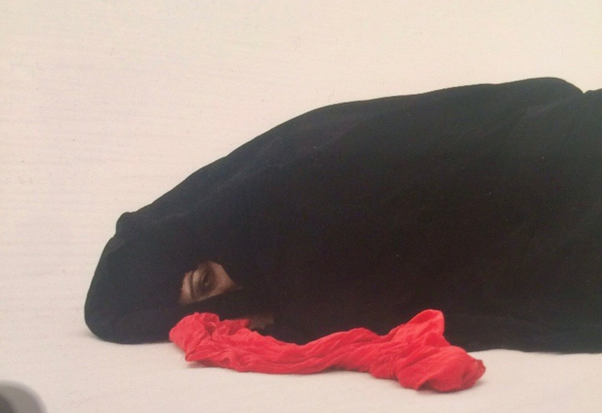
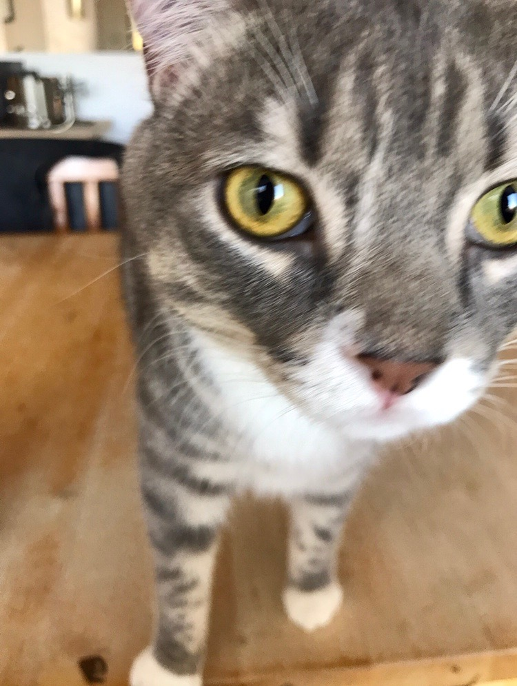

I don’t have 37 cats in my house. I don’t even have one cat in my house. So, recently, when Peter Leonard, of [Yale’s Digital Humanities lab](http://dhlab.yale.edu/about.html), suggested to those of us attending a workshop, that we search our phone’s photos for “cat”, I thought I might get a handful of results, probably photos I’d taken of a friend’s cat while I was staying at her house. To my surprise, 37 results appeared. 

Also somewhat to my surprise was the fact that I could search my phone’s photographs this way, by keyword, and my phone would know what to look for. I have grown accustomed to searching my phone’s pictures by location, by date, and—to some degree—by the facial recognition feature that sorts my friends and family members into useful—if creepy—categories. Location and date are keyed to metadata, of course, but new advances in artificial intelligence, and object recognition in particular, allow for different methods of organizing images. 

When it comes to personal photographs, the stakes of what is involved in organizing images differs wildly from the criteria a museum might use to organize photographs (maker, subject, date, medium, etc). When our memories sort personal photographs, meaning takes on an entirely different cast. It’s probably the case that I didn’t remember any of the photographs of cats I had because I hadn’t registered them—consciously or unconsciously—as a personally meaningful category. But as I’ve been struck before, sometimes the results of an automated sort offer unexpected connections, even insights. In this case, I felt like I was seeing a small part of myself I’d never quite recognized. 

Of my 37 cats, a number of them are art cats. Others are meme cats. A couple are autobiographical cats; still others are research cats. A handful are, as expected, my friend’s cat. 

*********************

**A Selected Inventory (13 of 37)**

## 1

<figure class="figure">
	
	<figcaption>
	
	</figcaption>
</figure>

The first cat my phone found for me—and they are sorted in chronological order—is from September 24, 2014: the Los Angeles artist Lisa Anne Auerbach’s knitted cat, from [her show at Gavlak Gallery](http://www.gavlakgallery.com/exhibitions/lisa-anne-auerbach-spells?view=slider#5), which I liked a lot. 

It is worth pointing out that computer vision does not distinguish between photographs of live cats, screenshots of already reproduced cats, and knitted cats.

## 2

A very musical cat follows… I have a dim memory of someone texting me this cat, and I still think it’s funny, but I couldn’t tell you the story. 

<figure class="figure">
	
	<figcaption>
	
	</figcaption>
</figure>

## 3

Next, another art cat. This is Andrea Zittel’s cat. I toured her home and studio in Joshua Tree in May of 2016; she was not home, but her cat was. Aren’t her floors incredible? In the several years since I took this picture, I've shared my love and enthusiasm for Zittel’s [A-Z West compound](http://www.zittel.org/work/a-z-west) with many people, but never once have I thought to mention meeting her blue-eyed cat.  

<figure class="figure">
	
	<figcaption>
	
	</figcaption>
</figure>

## 4

<figure class="figure">
	
	<figcaption>
	
	</figcaption>
</figure>
The library cats. I met these cats in person over 30 years ago in [Minden, Nevada](https://www.google.com/maps/place/Minden,+NV+89423/@38.8578633,-119.9124385,11z/data=!4m5!3m4!1s0x8099bd2ff4425ff7:0x21ce2fce3bce862!8m2!3d38.9540739!4d-119.7657332), when my family was on a road trip and our car broke down. While my dad dealt with the car, my mom took my brother and me to the local library. We met, and loved, the cats, and, it turned out, [the cats are famous](https://www.today.com/pets/how-library-cats-baker-taylor-read-their-way-america-s-t88616). I believe there is a new generation of library cats in Minden now. 

## 5

<figure class="figure">
	
	<figcaption>
	
	</figcaption>
</figure>

Meme cat.

## 6 

<figure class="figure">
	
	<figcaption>
	
	</figcaption>
</figure>

This one made me laugh and, I have to say I am pretty impressed with my phone for finding this cat. This is a photograph of my computer screen, showing Facebook displaying a memory from 5 years earlier. I photographed my computer screen in 2016, so the “memory” must be from 2011. This is my husband at his parents’ house; he was going through some boxes of childhood stuff… including a sushi cat poster he used to have in his bedroom growing up. Now, the poster has found a new home in our 12-year-old son’s room. 

## 7

Here is my son. He made this on Snapchat, but it still exists today thanks to the wonder of screenshots, and the foresight of his mother. Dated July 10, 2016. 

<figure class="figure">
	
	<figcaption>
	
	</figcaption>
</figure>

## 8

This one is a mistake. This is a detail of a photograph by my friend and colleague Sama Alshaibi, [on the occasion of her exhibition](https://smoca.org/exhibition/southwestnet-sama-alshaibi-silsila/) at the Scottsdale Museum of Contemporary Art, also in 2016. I don’t remember why I took this photo. It does kind of look like a cat, and it's interesting to see how the computer sees, but, more importantly, it’s nice to unexpectedly think of an old colleague. 

<figure class="figure">
	
	<figcaption>
	
	</figcaption>
</figure>

## 9

<figure class="figure">
	
	<figcaption>
	
	</figcaption>
</figure>

Another favorite art cat. This is a page from a handmade and one-of-a-kind book in the archives of Edward Weston at the Center for Creative Photography... "Kissed the Kitties Good By". It was a gift to Weston by a designer he was working with, and I count it among my favorite finds in my all-time-favorite archive research project (see below). 

## 9

<figure class="figure">
	
	<figcaption>
	
	</figcaption>
</figure>

A detail… who can resist? I used this picture on a Twitter account I made when I was deep in the heart of my research on the writer and curator Nancy Newhall. In real life, she and Edward Weston wrote to each other often with news of their cats. The twitter feed, [@Love_Euripides](https://twitter.com/Love_Euripides), recorded this cat conversation, from Nancy Newhall’s cat, Euripides, to Edward Weston’s cat, Runty. I only lasted for 50 tweets, but feel happy that among the 20 followers of @love_euripides are @charliethecat, @purrrform, @handsomeharry (a cat), and @awesomepawsome8. 

## 10

<figure class="figure">
	
	<figcaption>
	
	</figcaption>
</figure>

A screenshot. I love photo cake. And, from time to time, I check in on the hashtag “#selfiecake” on Instagram. Obviously this cat selfie photo cake was—and is—irresistible. This might be the best discovery of my phone’s computer vision, as I have no memory of this otherwise. 

## 11-12

<figure class="figure-pair">
	
  
</figure>

Also while doing research on Nancy Newhall, I found this publication dedicated to cat photography in her library (which is now in Santa Fe, NM). I’m sure I was thinking about it in connection to Edward Weston’s amazing and little-known book, *The Cats of Wildcat Hill* (which, now that I think of it, is curiously absent from my 37 cats, because I defnitely photographed it) and the aforementioned cat correspondence between Euripides and Runty. 

## 13

Finally, here is the cat I was expecting to find all along. March 23, 2018. A regular (and very wonderful) house cat.

<figure class="figure">
	
	<figcaption>
	
	</figcaption>
</figure>

****************

In giving us a directive to search for "cat" on our phones, Peter Leonard’s aim was to illustrate the (benign) ways that computer vision and object recognition technology is embedded in our lives already, starting with what our phones know. One of my interests is similar… what is the human impact of these newly developing technologies? I don't want to get too carried away about the significance of my 37 cats, but it does occur to me that, as an autobiography in 13 pictures, I could do a lot worse. 

