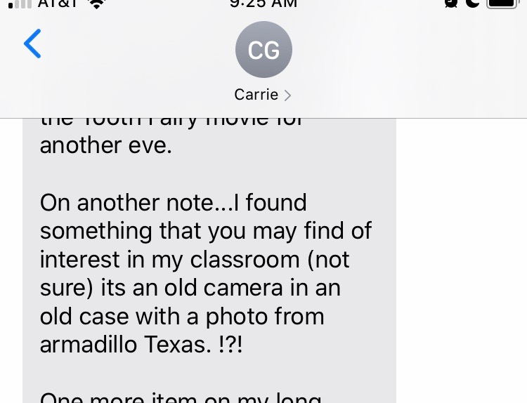
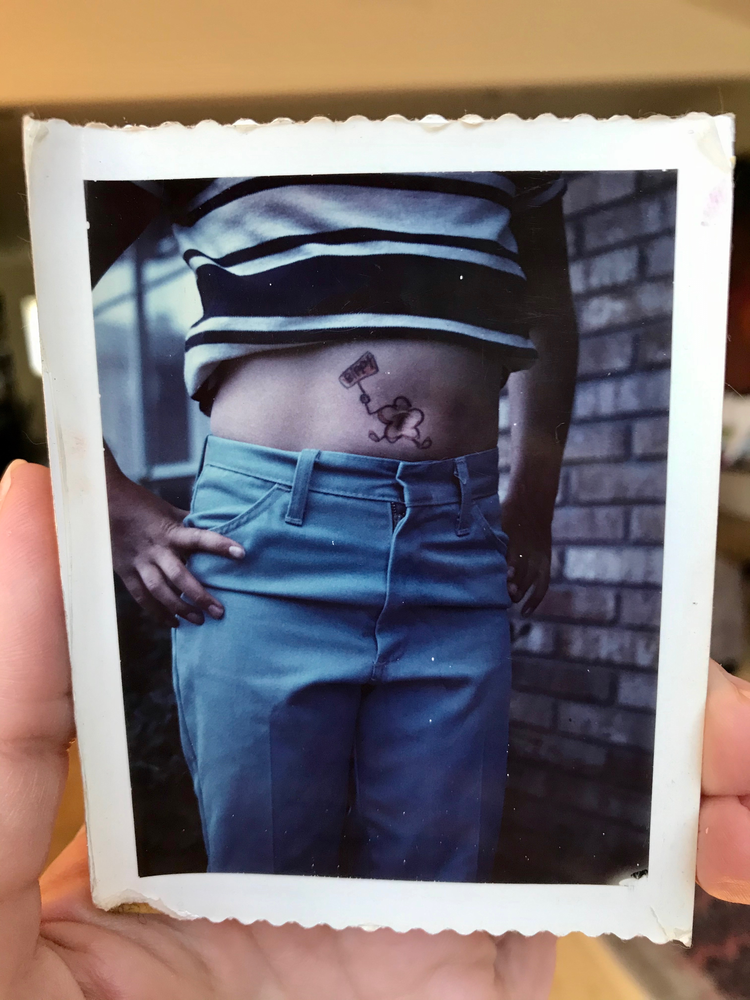
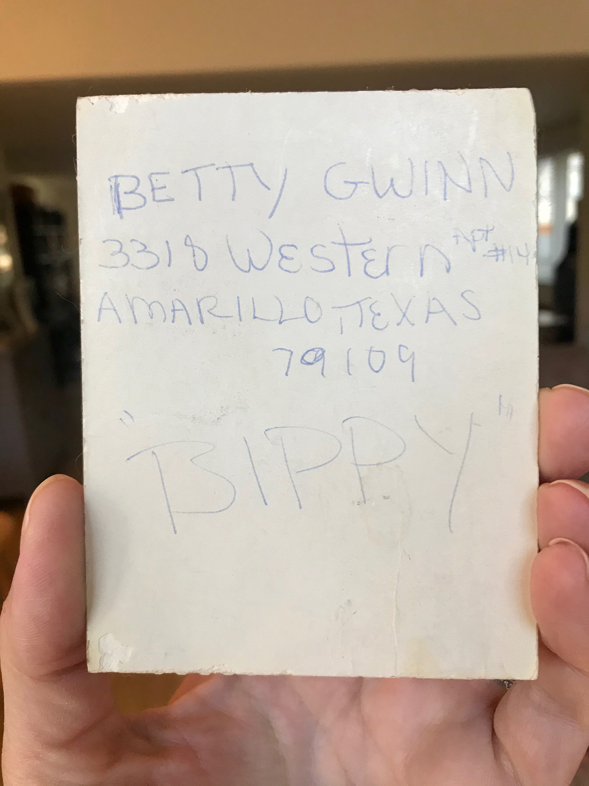
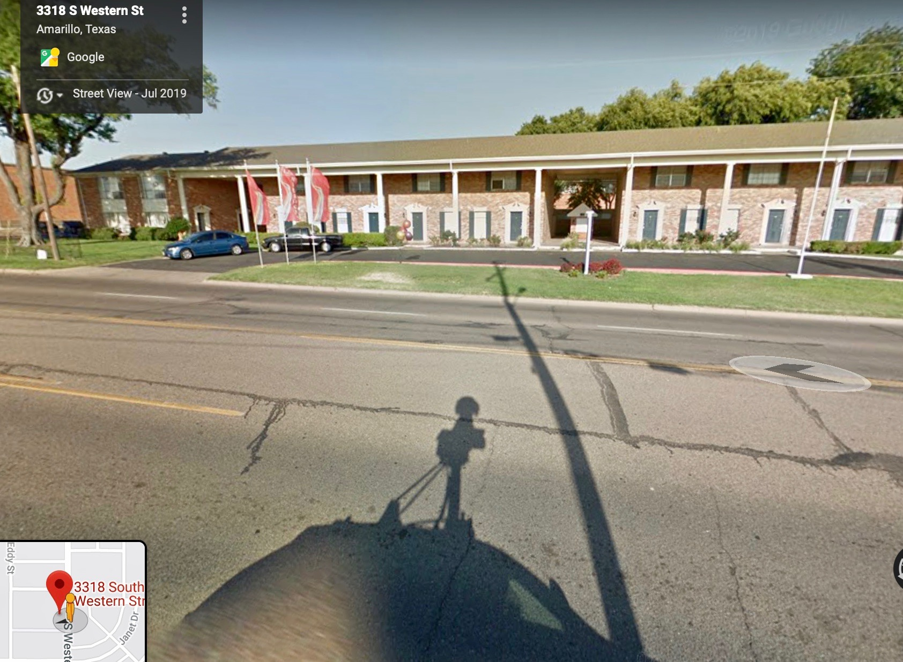
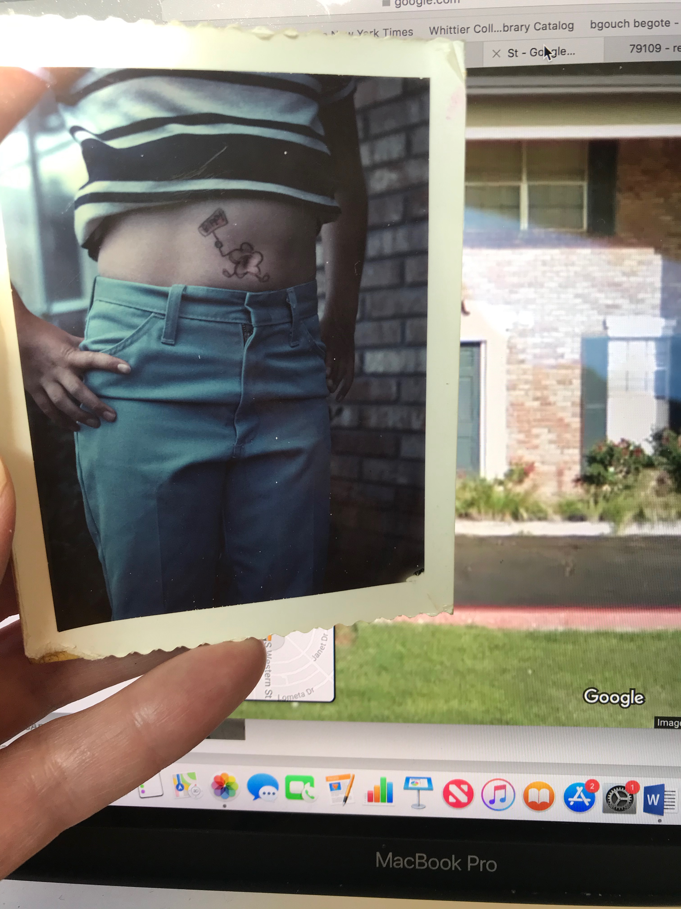
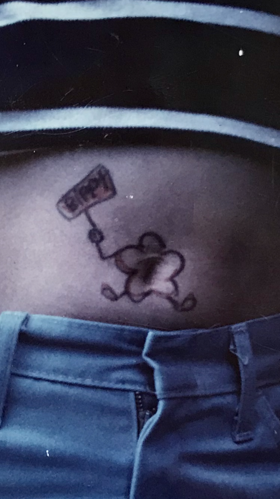

<figure class="figure">
	
	<figcaption>
	
	</figcaption>
</figure>

This little query came as part of a long text from a friend.... I wrote back that I probably didn’t want an old camera, but, sure, to swing by on her way home from the store. An hour or so later, she walked in to my house, with a cute old faux-leather Kodak bag slung over her shoulder, saying she thought I could use it as a purse. There were two Instamatic cameras inside — she’d found them while cleaning out her classroom at our neighborhood middle school, where she teaches History and my son is in 8th grade. I fiddled with the metal releases to load and unload film; both were a little corroded. I finally took another look inside the leatherette bag, pulled out a small color snapshot, and was immediately smitten:

<figure class="figure">
	
	<figcaption>
	
	</figcaption>
</figure>

Who could resist this exposed belly, the black and white striped shirt pulled up to display a jaunty and fleet-footed little flower, mid-dash, holding a tiny sign aloft? And was it a tattoo? Was it hand-drawn in ink? 

I thought immediately of the girl I had met years ago on a summer exchange program in college, who had a hotdog with wings tattooed on the exact same spot on *her* belly. Why a flying hot dog? The better question was: Why not? I had always thought that girl was so cool, the non-sensical and silly hotdog a total confirmation of this truth: tucked away at her navel, to be revealed only as she liked, only *to whom* she liked.

This peek, at the similarly spirited flower, gave me the same kind of thrill. The scalloped-edged photo, surely made with one of those Instamatics and commercially processed, was mounted on a heavy card: this was not just any snapshot, but had been worthy of some extra attention. My friend and I agreed that, fashion-wise, it looked like the 1970s (maybe the late 60s), and wondered: how had it gotten into her classroom’s closet? Had it been there ever since? 

I turned it over to find a name and address, and the word “BIPPY”. 

<figure class="figure">
	
	<figcaption>
	
	</figcaption>
</figure>

My curiosity piqued, I soon fell down the online rabbit hole, looking for Betty. Here's the letter I wrote to her.

******

*Dear Betty,*

*Is it a tattoo, or pen? It’s been over 40 years, but even if it was a pen drawing, I bet you remember this moment. Weirdly, the day before my friend brought me your picture, I had listened to a podcast by the great storyteller John Green. Do you know his books? He’s my son’s favorite author. He also makes podcasts, which I listen to on my commute and, on a somewhat regular basis, find myself in tears from some profound truth he’s suddenly revealed in the course of talking about, like, google searches of strangers, or sycamore trees, or something. Anyway, [this last episode](https://www.wnycstudios.org/podcasts/anthropocene-reviewed/episodes/anthropocene-reviewed-capacity-wonder-and-sunsets) was ostensibly about sunsets, so I was interested (I went through a big phase of thinking about [photography & sunsets](http://circulationexchange.org/articles/abundantimages.html)). But, after dwelling on the various ways of representing and encountering sunsets, true to form, he pulled an emotional sleight of hand… shifting in the heart of the narrative from sunsets to bellies (and the memory of his dead dog’s belly in particular). Talking about bellies, for Green, was a way of talking about  the courage it takes to show oneself to the world, of offering “the place that ribs don’t protect”. And here, not 24 hours later, a bare belly had just walked into my house, in photographic form. This silly, anonymous, 1970s, be-flowered belly. **Your** belly!*

*I admit, I couldn’t resist looking you up. My online search for your Armarillo address was almost too easy. Google Street View revealed a defiantly un-Texan facade, a long, low, Colonial-style, brick apartment building, symmetrically styled with its Doric columns and ornate decorative doorway to look far grander than the 1-2 bedroom units, still advertised for rent, must really be (or ever have been?)*

<figure class="figure">
	
	<figcaption>
	
	</figcaption>
</figure>

*But comparing the brick exterior and simple white window casements on Street View seemed an immediate match with the brick wall and window you’re standing by. I also saw that the apartments had been built in 1964! So they were pretty new, then, when you were there.  Did you go to Amarillo to visit relatives? Or, was it the other way around, had you just moved to LA, and transferred to a new middle school here as a 12 or 13-year-old?*

<figure class="figure">
	
	<figcaption>
	
	</figcaption>
</figure>

*Looking closely at the brick wall and window I realized that aside from this personable little hand-rendered flower, boldly proclaiming something or other, it’s also a really good photograph. Maybe you’re the photographer, and not the subject? I like androgynous pictures – I read the fingernails as painted, but a little dirty; the hips as narrow, but cocked; and I love the softness of that skin by the brick wall. I can’t tell what I’m looking at, in the best possible way. Did you—as photographer or subject—mean to keep the face and head out of sight, or was that just a byproduct of looking closely at the navel? Either way, it works. The crease of the pants, the fold of the fabric on the waistband… and, best of all, that slight tug at the clasp of the pants, with that tiny opening in the zipper below.*

<figure class="figure">
	
	<figcaption>
	
	</figcaption>
</figure>

*Enlarging the picture (taking a picture of it myself), I can see the sign reads BIPPY – I don’t know why I didn’t guess that before. I looked that up, too, and found that “bippy” was a newly popular term in the late 1960s… as in, “you bet your bippy!” (I guess today we’d just say “you bet your ass!”, but “ASS” wouldn’t look so cute on a zippy flower’s sign.)*

<figure class="figure">
	
	<figcaption>
	
	</figcaption>
</figure>

*So there you were, by the new apartments, with your new slang, your new camera, casually slouched and sharing a tummy joke with a friend.*

*Anyway, would you like your picture back? I’m guessing there’s only one. If you’ve forgotten it, I’ll keep it. But if you’d like it, I’ll mail it to you. I hope you don’t mind that I’m writing this little essay. I keep thinking about the first car I bought, in 1998, so that I could drive myself to grad school (to study photo history!): it was a used black Volkswagon Jetta. When I went to pick it up, I found the previous owner’s work ID card left under the seat – her name was Gina. It actually never occurred to me to try to return that ID, and I don’t know where it is now, but, I can vividly picture her photo on that card to this day. I remember how struck I was then, finding this object so clearly connected to a stranger, and to her life. She’d driven my car, we sat in the same seat and held the same wheel. I knew her identity, but we’d never meet. I feel the same way now. You were at my son’s school, decades ago – you know those classrooms and hallways, and the neighborhood. In a lot of ways, I bet not much has changed.*

*Let me know.*

*Sincerely,*

*Kate*

*ps (Nov. 24) I posted this essay/letter a few weeks ago, and then, by the end of the same day, un-posted it. I had a little freak out about the weirdness of looking you up, and then writing about it. Or, looking up an old version of you. Even though I don’t know if you’re the photographer or the subject, and the picture doesn’t show your face, it’s still your name. And what if a family member still lives at that old address? What if you’d hate this? Do I think my rambling musings are more important than your privacy? Does it matter that these rambling musings are actually deeply connected to my interests as a photo historian and a writer? I did try to contact you (the 2019 you)…so far to no avail. [I think about](http://circulationexchange.org/articles/Online_surrogates.html) how hard it can be these days to shake an online image… photographs can so easily circulate in digital space, and there’s almost nothing the subject can do about it. It’s weird, though, that this picture is totally analog… and yet it’s still functioning as that same kind of wild tether: linked to you, but out of your hands. It’s not a bad way to describe most photographs, really. 
Well, the offer above holds true – I’ll return the photo to you if you’d like. I don’t really want to add that I’ll un-post this again, if you want. It makes me wonder: is this my letter, or yours?*

*********************************

 

