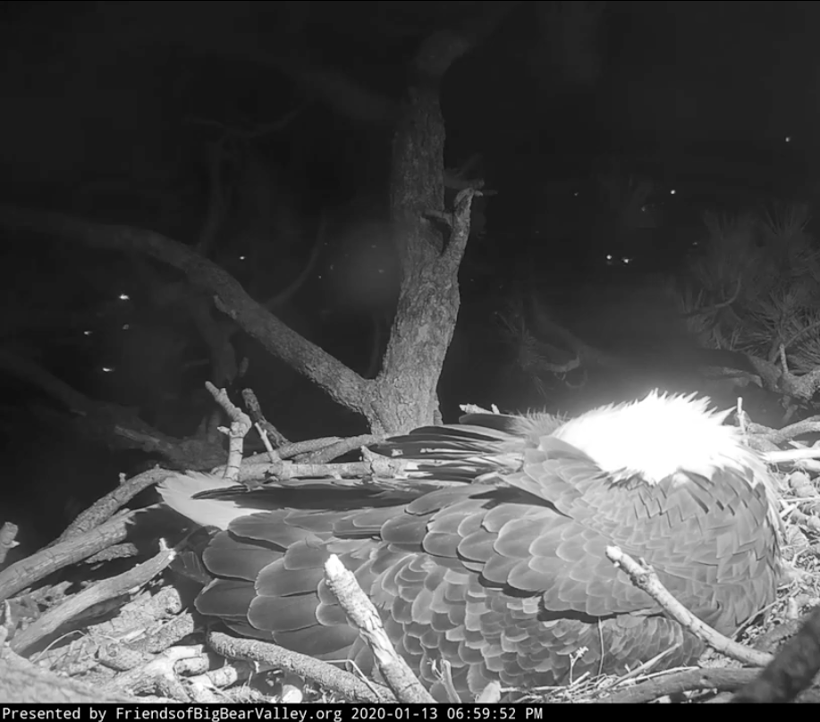

<figure class="figure">
	
	<figcaption>
	
	</figcaption>
</figure>

*In this year unlike any other year, it feels all the more worthwhile to make note of those memorable moments, which, in my experience, were both fleeting and, as it turns out, enduring, simply by virtue of still being in mind at the tail end of 2020. It’s not clear to me what this list actually is a list of, or if it’s really just a diary, but then again, this year has had few rules.*

**Nesting**
My favorite early-2020/pre-pandemic media memory revolved around [two nesting eagles](https://www.youtube.com/watch?v=jWEgPKI3TtI&feature=emb_logo)—Jackie and Shadow—and their egg, nestled high in the trees over Big Bear Lake, in California, watched around the clock by myself and thousands of others courtesy the nesting cam. With a couple of faraway friends (one or Oregon, one in West Virginia), we tracked the birds’ relationship and their domestic dramas; we wondered about their flights from the nest; we learned the terminology of hatching; we worried, as the days—and then weeks—passed without the egg cracking. We texted each other excitedly, or nervously, as we watched. On one of what would be my last trips, in February, I fell asleep in my Chicago hotel room listening to the wind in the trees in the eagles’ nest to the night cam live stream of the sleeping birds.  I was astonished, in May, to read a piece by an Oakland-based writer titled “[How Watching Bald Eagles Build a Nest Prepared Me for the Pandemic](https://www.nytimes.com/2020/05/12/magazine/how-watching-bald-eagles-build-a-nest-prepared-me-for-the-pandemic.html?action=click&module=Features&pgtype=Homepage)” about those very eagles.

**Cabin Fever Playlist(s)**
Early in the pandemic, the Armory Center for the Arts posted a series, the Cabin Fever Playlist. One, in particular, [wedged into my consciousness](https://www.armoryarts.org/about-us/news/armory-arts-home/kate-lains-top-5-films-from-her-cabin-fever-playlist/), by the artist Kate Lain (who I don’t otherwise know), which included a video called *Pull/Drift* by Margaret Rorison (2014), which felt like a revelation, and another, *How to Draw Clouds* by Salise Hughes (2006), which I love for the title alone. I don’t tend to watch art videos at home, but, in Los Angeles, where museums have been closed since March, I’ve had plenty of time to change my habits.

Speaking of new home-viewing habits, on that count I’ve been grateful for the Holt Smithson Foundation, who have released a number of films over the course of the pandemic from those brilliant artists’ archives – favorites have been Nancy Holt’s 1975 *Pine Barrens*, her 1973 *The Making of Amarillo Ramp*, and the couple’s collaborative film *Mono Lake* (1968). I follow them on Instagram but the foundation website also keeps track in their [Weekend Screenings](https://holtsmithsonfoundation.org/news) news feature.

**Stream-of-consciousness**
In April, Jesse Dorris wrote “[Are Virtual Viewing Rooms the Future of Photography](https://aperture.org/editorial/are-virtual-viewing-rooms-the-future-of-photography/)” for *Aperture*, and his vaguely hallucinatory stream-of-consciousness, tracking the fractured mental and emotional response of that month, felt deeply relatable. 

Much of my teaching life (which means, much of my life) was devoted in the spring and fall to navigating my own relationship to the newly configured zoom classroom of students. In April, I put together a set of classes I called “Art in the Era of Social Distancing” and I revised it for the fall into a broader “Together Apart / Apart Together”.  I showed the Rotterdam Philharmonic’s touching collective effort, [*For You, From Us: Beethoven Symphony No. 9*](https://www.youtube.com/watch?v=3eXT60rbBVk), posted March 20, 2020 to YouTube and the LA Dance Project’s connective *12 Variations*, posted on April 5, 2020 to Instagram, and asked the students to think about these kinds of collective performances, featuring the artists’ domestic spaces, and set into the contextual (pre-pandemic) framework of Janet Cardiff’s [*40 Part Motet*](https://www.youtube.com/watch?v=rZXBia5kuqY) (2001), Ragnar Kjartansson’s [*The Visitors*](https://www.youtube.com/watch?v=V49YlyVZddY) (2012), and Mishka Henner’s [*I’m Not the Only One*](https://mishkahenner.com/I-m-Not-the-Only-One) (2015).

**Romance, or, How I Learned to Love Passionflix**
After starting the year with three books I adored ([Lydia Davis](https://www.nytimes.com/2019/11/12/books/review/essays-one-lydia-davis.html), [Ocean Vuong](https://www.oceanvuong.com/copy-of-home), [Bernardine Evaristo](https://bevaristo.com/girl-woman-other/)) I feel into a pretty serious non-reading rut (though [Jesmyn Ward](https://www.nytimes.com/2013/09/18/books/men-we-reaped-is-jesmyn-wards-new-memoir.html) was a brilliant and welcome exception) – and I ended up climbing out of it in the most unexpected way. My neighbor across the street rents his house out to film crews – it seems like something that might be fun, but with a family of four mostly not leaving the house and a big film crew occupying the street while you’re trying not to breathe other peoples’ air, it feels a little bit more like being trapped. But this circumstances of this shoot hit my absurdity bone in an irresistible way: the filming was for the adaptation of a series of romance novels, directed by Tosca Musk (you may have heard of her brother, Elon), for the streaming platform she developed, Passionflix. After falling into a Tosca Musk rabbit hole, I read the first book in the series, and, lo and behold, fell out of my reading funk. (I haven’t seen the movie, nor have I subscribed to Passionflix, nor do I recommend the book, but I’m grateful nonetheless. I’m now halfway through Haruki Murakami’s [*Killing Commendatore*](https://www.harukimurakami.com/book/killing-commendatore-2), which I recommend.

**Photographs of (almost) nothing**
The longer I’ve thought about photography, the more I’m interested in behavior around photography, in the ways that cameras and film and photographs create rituals and affect how we move, gather, and act. I noticed this in acute ways in this strange year of rules around movement. It appeared first in the spring… emerging from the earliest, strictest and scariest period of the Los Angeles “safer at home” order, the first time in months my family went farther than a few blocks was a fevered dash to see the California poppies annual bloom. I knew we were too late, I knew the poppies had mostly already bloomed, away from the prying and trampling human eyes that have come to gobble them up, like clockwork, but especially in years now deemed “superblooms”. We drove the 90 or so miles out to Lancaster, I could feel my brain shifting from the movement alone. There were a few poppies when we got there… and more people than I would have expected. This was before people wore masks. We sat nervously in the car, unsure if we should get out, or, what we should do once we did. I found myself captivated by all the people taking the same poppy pictures they would normally take, but needing to crop the photo as closely as possible to make it appear as if there were more poppies than there really were. People knelt in the mostly bare fields, smiling and posing; they propped their babies and toddlers in the few tiny remaining patches of blooms; they behaved as if there were really poppies there to photograph. The poppies *should* have been there… they *had* been there, but we’d all been at home. It was as if the making of the photograph was the necessary performance of the ritual… even in the absence of a photographic subject. The photographs *would* exist, the ritual must be completed. It felt like a kind of memorial photography, an unconscious marking of absence, of loss – poignant in its way, and, it struck me, strangely fitting to the moment.

Something like this repeated during the strange and remarkable period of bioluminescent waves that visited southern California beaches, also during the period of the pre-masking safer-at-home order. The beaches were closed, and no one was supposed to go to them, anyway, but, that was the moment the waves lit up at night. Photographs in the news and on social media showed a spectral blue light glowing inside the breaking waves – I assumed the photographs were enhanced. But, the night we went… the waves looked just like the photos. It was amazingly beautiful, even though you had to watch from the road. And, the road was packed. Half of Los Angeles had turned out to cruise up and down the coastline, a lucky few parked on the shoulder at the edge of the off-limits beaches (of course, some went to the sand anyway).  I took a few distanced photos from the car, but what I remember most was the strangeness of not being allowed any closer, and the discomfort of finding myself among crowds, mixed with my own awareness of what a photographic event it *would* have been.

Perhaps a footnote… but we also traveled an hour out of town to see the comet through binoculars… another nearly unphotographable event that had pulled us from our home. And, most recently… the extraordinary convergence of Saturn and Jupiter in late December, just after sunset. This time we did go to the beach, and I did take photographs, even if all you could see looked like a tiny dot of light in the picture. Progress.

**Cabins (not cabin fever)**
I’ve never gotten cabin fever in a cabin… in fact, the cabins of 2020 were the best of 2020. I had the joy of watching my friend Jon photograph the huge rock in the Echo Lake cabin. His ongoing project to photograph the cabins at Echo Lake got some [nice press](http://lenscratch.com/2020/11/jonathan-sadler-the-states-project-idaho/). Another cabin, in Humboldt County, introduced me to the redwoods – which affected the way I think about trees. Dorothea Lange photographed remote Pacific ocean cabins in her 1973 book, [*To a Cabin*](https://www.worthpoint.com/worthopedia/1973-dorothea-lange-cabin-photography-1729064269), which I learned about, along with the writing of [Margaretta Mitchell](https://en.wikipedia.org/wiki/Margaretta_Mitchell).

**Love, and loss**
In January, I felt giddy to meet Marvin Heiferman in person, whose spirit for photography, and writing about it, I’ve long admired. I did not meet his partner, Maurice Berger, whose writing on photography I’ve assigned to students for years, though the two were sitting side by side. Berger died soon after, from COVID-19. My first thought was: I remember his last Instagram post. It had featured Marvin, in a bright yellow puffy jacket, taking a picture, and was lovingly captioned. It was posted on March 17th. Since then, Marvin has shared his grief, and, as profoundly, his love, in words and pictures, over months, in post after post, on that very platform. It is, regularly, unbearably poignant. Not many couples share their love through photography as deeply as Marvin and Maurice so clearly did, and, it seems, still do. 

**Christine Sun Kim Rewrites Closed Captions**
It strikes me, writing this last entry, that every entry above could have been a short essay, a *Circulation/Exchange* post. I thought about aspects of each experience in that way, as they were happening. I have to acknowledge that this has been part of this year as well – recognizing things I’d like to write about, and not feeling like I could do it. This last blurb is no different. But, it’s 4:50pm on December 31st, and at least I’m finishing this list. I’ve admired Kim’s work many times before, but [this beautiful and poetic little video](https://www.youtube.com/watch?v=tfe479qL8hg) put it all together for me, in a way that I found nearly staggering. It brought together my long-standing fascinations with text + image, automated captioning, the increasing prevalence of these convergences in the mediations of daily life, and what I suppose I think of as something like sensory flexibility, into 7 min 46 seconds of brilliance. It did all of that both as an aside to, and integrally interwoven with, my own appreciation and awareness of the challenges of closed captions within these contexts. And, to boot, it was an extraordinary example of how both an artist and a venue (Pop Up Magazine) have adapted to 2020 – as optimistic a note to end on as I could hope for.

*Bonus note: Showing Kim’s video in class the same week I was sharing a talk between Isaac Julian and Angela Davis on the occasion of Julian’s exhibition of **Lessons of the Hour** led me to this [ASL interpretation of the 10-screen film installation](https://www.youtube.com/watch?v=ly5owXZknaE).*

~~ Kate Palmer Albers
December 31st, 2020

