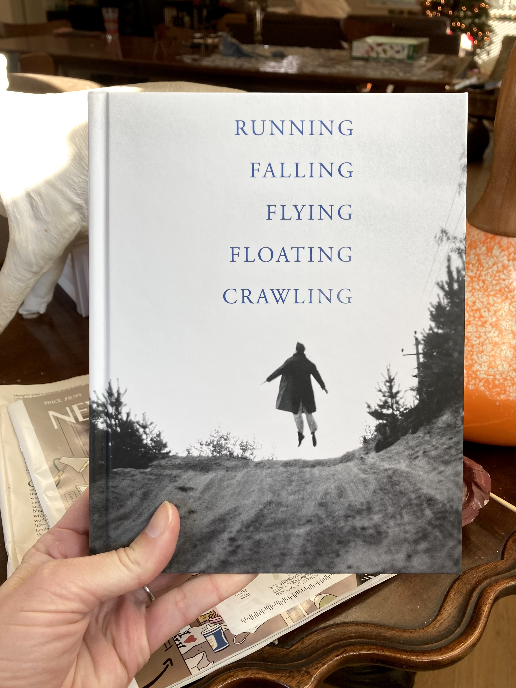
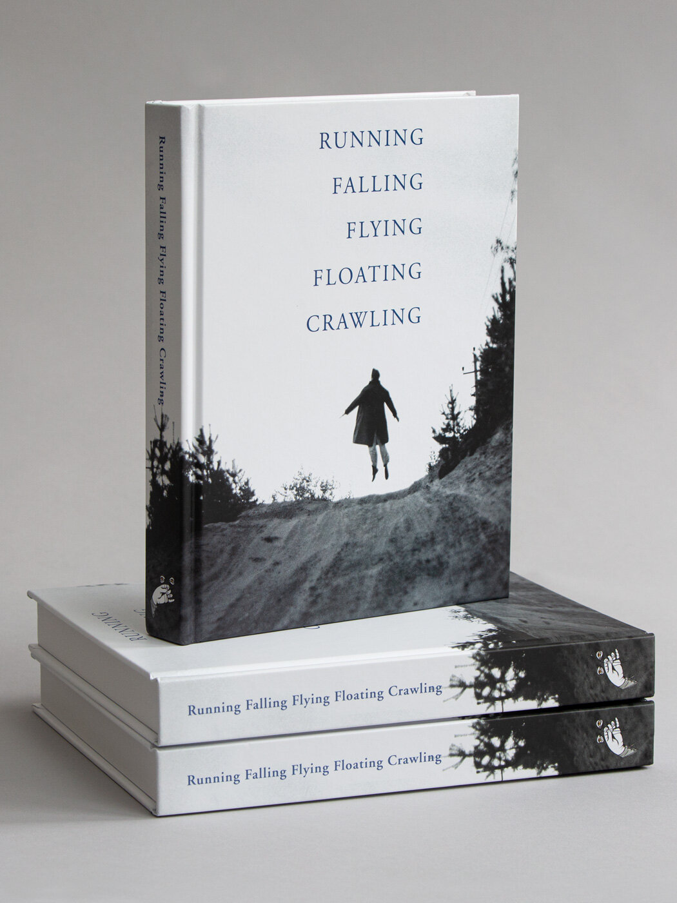

<figure class="figure">
	
	<figcaption>
	Running, Falling, Flying, Floating, Crawling, published in 2020 by Saint Lucy Books
	</figcaption>
</figure>

Ever since I came across [*27 Contexts: An Anecdotal History in Photography*](https://www.saintlucybooks.com/shop/p/h3oaar1buto624t0seccpuujbq0eef) while browsing in Photo-eye Bookstore, I have been a big fan of the artist Mark Alice Durant's writing on photography. So it is a treat to be included in his latest edited publication, [*Running, Falling, Flying, Floating, Crawling*](https://www.saintlucybooks.com/shop/p/h3oaar1buto624t0seccpuujbq0eef-4sg38-rhsxx) (2020, Saint Lucy Books). Writers were paired with photographs depicting one of those five states of being -- as Durant described it: the book "is a loose compendium of photographs and texts that picture, examine, explore, and / or suggest the human body in states of abandon, helplessness, terror, subjugation, serenity, and transcendence."

I, happily, got to dwell on probably the most iconic photograph I've ever written about: [Harry Callahan's photograph of his wife Eleanor, in 1949](https://www.moma.org/collection/works/48484). 

Becuase of the spirit of the prompt, I didn't have to pretend to be a Callahan expert, but instead reflected on my own experiences of floating, memory, trust, what can be photographed, what can't be, and empathy through an image. 

The book is beautiful, and beautifully done, and I'm happy to be part of it. Check it out, and [spend some time on the Saint Lucy site](https://www.saintlucybooks.com/about) while you're at it.

<figure class="figure">
	
	<figcaption>
	
	</figcaption>
</figure>

**Words**: Kate Palmer Albers, Kim Beil, Tessa Berring, Jennifer Blessing, Susan Bright, David Campany, Maud Casey, Leslie Dick, Jean Dykstra, Odette England, Jen Grow, Cig Harvey, Marvin Heiferman, Emily LaBarge, Jane D. Marsching, Carol Mavor, tamara suarez porras, Lia Purpura, Seph Rodney, Roula Seikaly, Diane Seuss, David Levi Strauss, Lynne Tillman, Gilda Williams.

**Images**: Bas Jan Ader, Dieter Appelt, Atul Bhalla, Maura Biava, Anna and Bernhard Blume, Julia Borissova, Chris Burden, Harry Callahan, Henri Cartier-Bresson, Sarah Charlesworth, Denis Darzacq, Maya Deren, Jimmy DeSana, John Divola, Valie Export / Peter Weibel, Allen Frame, Nan Goldin, Cig Harvey, Susan Hiller, Peter Hujar, Aleksei Kazantsev, Martin Kersels, Andre Kertesz, Yves Klein, Stanislava Kovalcikova, William Lamson, Sigalit Landau, Gabby Laurent, Yael Martinez, Rania Matar, Lilly McElroy, Ralph Eugene Meatyard, Raymond Meeks, Susan Meiselas, Gideon Mendel, Ana Mendieta, Andrea Modica, Pablo Ortiz Monasterio, Eadweard Muybridge, Paul Pfeiffer, Steven Pippin, Pope.L, Shawn Records, Alessandra Sanguinetti, Laurie Simmons, Aaron Siskind, Tabitha Soren, Clare Strand, Larry Sultan, Ruth Thorne-Thomsen, David Uzochukwu, Oliver Wasow, William Wegman, Francesca Woodman, Ana Zibelnik.

Edited by Mark Alice Durant

