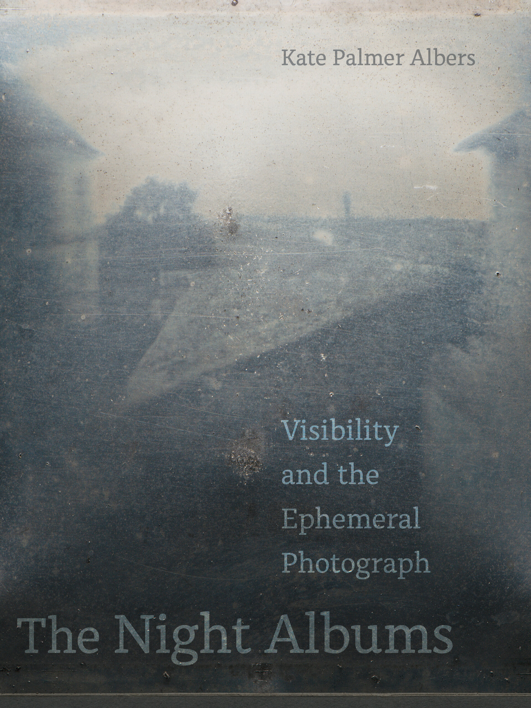

<figure class="figure">
	
	<figcaption>
	
	</figcaption>
</figure>

[*The Night Albums: Visibility and the Ephemeral Image*](https://www.ucpress.edu/book/9780520381544/the-night-albums)

University of California Press, 2021

I am so thrilled to have this book out in the world. And, in so many ways, its origins trace back to essays I wrote for *Circulation/Exchange* -- especially, [*The Value of Ephemeral Photographs, or, Everything I Know about Alec Soth I Learned on Snapchat*](http://circulationexchange.org/articles/ephemeral.html) and [*On Experiential Value and Digital Materiality*](http://circulationexchange.org/articles/digital_materiality.html). Those were from 2015 and 2016, respectively. I was fascinated, in 2015 and earlier, with how photographs disappeared on Snapchat, and I was equally fascinated with how few people I knew seemed to think that was particularly interesting or notable. I began to take seriously the question of how and why photographs disappeared, and how little explanation there was for this in the world of photo theory. 

Ultimately, I got interested in the experiential value of fleeting images, thinking of them as akin to conversation -- also fleeting, and also, clearly, valuable. And, with a complexity that is distinct from a version of photography that rests on understanding its images as stable, lasting, permanent. While I've never been a specialist in 19th century material, I was smitten, early on, with conversations I had with conservators as I began to understand just how fleeting most of the photographs in the 1830s and 1840s really were, and how long the uncertainty about how to "fix" an image persisted: a matter of decades, not years. 

At the same time, I was immersed in understanding photographic images as data, subject to algorithmic interpretation, and to all the precarity and fragililty of loss, disappearance, and inaccessbility in a digital realm. 

So, [*The Night Albums: Visibility and the Ephemeral Image*](https://www.ucpress.edu/book/9780520381544/the-night-albums) became about all of these things.

Here's an excerpt from the Introduction where I describe what I cover in the subsequent sections:

**************

**Part II** highlights four distinct yet interrelated artist’s projects—from the 1970s to the present—that engage with visibility and sight, from **Robert Heinecken’s** instant/durational double-portrait of critic **Susan Sontag**, constructed from a range of options in photographic visibility that correlate to the Zone System; to conceptual artist **Adrian Piper’s** *Food for the Spirit*, which moves literal visibility into the realm of consciousness and identity; to the “protographic” work of **Oscar Muñoz’s** durational and ephemeral viewer-activated engagements with histories of violence and photojournalism; to the performative and fleeting visibility of **Cassils**, foregrounding a vulnerable moment of exposure in order to resist conventions of “fixed” vision. I consider the work and artists in this section to each be making a “night album” of a sort, responsive to the cultural and political moment of each of their geographies, biographies, and aesthetic concerns. 

Artists’ work in and around matters of contemporary technology animate Part III, which moves into future realms of (often) imaginative possibility, following the proposals for potentially dystopian future seeing through the technologically inquisitive practices of **Zachary Norman**, **Trevor Paglen**, and the creators of [**astronaut.io**](https://www.astronaut.io). Each of these artists has speculated either an alternative to a current prevailing norm (such as YouTube) or an imagined future of invisibility in the wake of political and environmental collapse. These, too, are “night albums”, setting new terms for the concepts of photographic visibility and fleetingness, and inviting viewers’ engagement and imagination.

**Part IV** returns to the material realities of photography’s early monuments, offering a coda to this extended reflection on visibility, ephemerality, and the experiential value of photographic images, objects, and futures. This section includes case studies of the current state of objects that have become canonical in the history of photography, and have now largely disappeared themselves (a fact persistently un-recognized in popular histories of the medium): **Nicephore Nièpce’s** c. 1827 Untitled ‘point de vue’ (known previously in English as View from the Window at Le Gras) and **Louie Jacques Mandé Daguerre’s** Intérieur d’un cabinet de curiosités, c. 1837. The unacknowledged—even suppressed—transience of these images, demonstrated by their widespread perpetuation through reproductions that are either enhanced or that show earlier states of more visible imagery, both perpetuates a false foundation for photographic studies and perfectly summarizes the crucial yet internally contradictory role of transitory imagery in the very foundations of the medium of photography. Though the images persist in reproduction, the objects themselves have faded into near- disappearance. 

Finally, in the **Coda**, an extended reflection on **Hank Willis Thomas's** *Retroreflective* series, a work that rests on history, evokes its archives, foregrounds the conditions of visibility, and embodies a politics of visceral engagement; it is a prompt—an offer—for another way of thinking about photographic images and values, an open door leading as much to “old” histories as to new ones.

**************

One aspect of fleetingness is that, for me anyway, I have to think about what I'm seeing, and what I'm not seeing. This experiential specificity of vision itself ties in so closely to older interests of mine that I gesture towards in the Coda—archives and accessibility, whether and how we see marginalized communities and individuals, the potential fraughtness of both being seen and not being seen, and, maybe most of all, what stories, what histories become possible to write or to know based on who or what is seen. 

*The Night Albums: Visibility and the Ephemeral Image* is available in paperback for $30, hardcover for $85, and ebook for $30 from:

[UC Press](https://www.ucpress.edu/book/9780520381544/the-night-albums)

[Photo-eye Bookstore](https://www.photoeye.com/bookstore/citation.cfm?catalog=CA082&i=&i2=9780520381544)

[Amazon](https://www.amazon.com/Night-Albums-Visibility-Ephemeral-Photograph/dp/0520381548)

 

