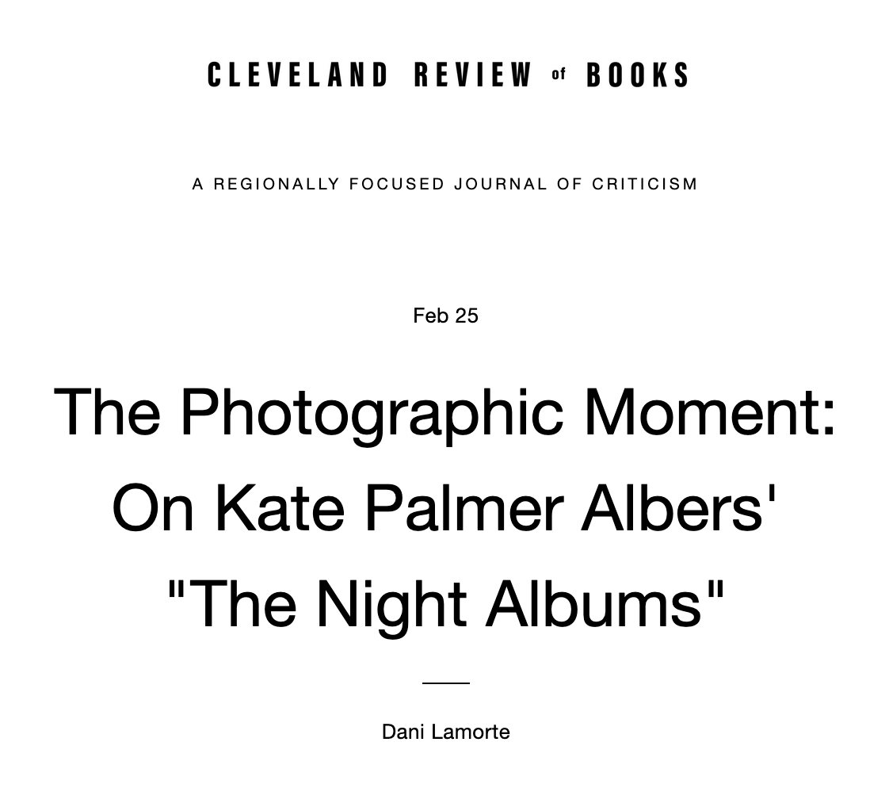

<figure class="figure">
	
	<figcaption>
	
	</figcaption>
</figure>

*"The photo is a wish encoded in an anxious object."*

Reading Dani Lamorte's [review of *The Night Albums*](https://www.clereviewofbooks.com/home/kate-palmer-albers-the-night-albums-review-essay) in the Cleveland Review of Books was a real thrill. It was nice, of course, that Lamorte liked the book, but the real joy was in how he made it his own. A sense of the visceral was important to me throughout the book, and Lamorte opened with the sensation of a sonogram.

**“Breathe normally,” the nurse says to me. When you’re told to “breathe normally,” the phrase itself seems to disappear all normalcy, heighten the oddness of the scene. Between my sternum and navel, she creates indecent trails of lubricant and runs a plastic orb over my chest. Sonic bursts peel off the orb and strike my heart valves, then return back to the orb as newly-pumped data. What appears on the nurse’s console is something like a photograph. Photographs have traditionally been formed from light, but the image she surveys is made of sound. The whole room is sound: the soundwaves of the orb, the click of her image capture button, the thud-woosh of my heart amplified into the room. But it’s the image that matters, and it’s the image that we’re all here for: me as patient, nurse as image technician, doctor as interpreter of the translated sound. The orb lifts from my body and the image disappears. The image is a kind of reference to a photograph that never was, and will become obsolete in time. The file will be stored on a hard drive in the form of 1s and 0s, and recombined into a picture—something like a photograph—only once or twice. It’s a whole process.**

This stunned me, because one of the foundational experiences in my life that led to the thinking in *The Night Albums* was an ultrasound of my own, which featured loss in the form of a fleeting image of an unborn baby, a miscarriage in my body: seen, and then gone. 

Reading *The Night Albums* through a lifelong accumulation of fleeting images of his own heart valve, Lamorte gets right to the heart of the tensions of visibility: **"what we wish would stay, what we wish would leave, what we wish would become visible, what we wish we never saw."**

I have long been drawn to the relationship between photographs, ambiguity, time, and language, and I love the idea Lamorte suggests as being "inside an ambiguity" in both the space of experience and as a photographic image recedes in time, away from the current, the current of the present. Lamorte writes:

**"... my friend, John, keeps a photograph of us on his refrigerator from an early 2000s Pittsburgh Pride event. I’m in a white, mod-cut sleeveless dress with 60’s style flowers and a lacy white hat. Green eyeshadow peeks out at least as much as a beard shadow—and what are you to make of it? Is this transgender representation, or the nonbinary archive? At the time the photo was taken, neither term would have been used by me or those close to me to describe my image. I was inside an ambiguity which is perhaps closing, or perhaps shifting to other locations, as the cultural vocabulary of gender description expands.**

The aptness of this reflection for a current area of focus for me, in how transgender experiences of personal photography unfold and shift over time, is again uncannily spot-on. Fittingly, it seems, the photograph does not appear in the review.

And, finally, one of my intentions with *The Night Albums* was not to answer all the questions but to create a space for later conversation, exchange, and experience. Lamorte has some suggestions, new to me, that I'm happy to pass on:

***The Night Albums* will be of interest to anyone who has read Hervé Guilbert’s essay “Ghost Images” or Caitlin DeSilvey’s 2017 monograph *Curated Decay*. In Guilbert’s essay, he recalls taking an entire roll of photographs of his mother, only to discover that he had improperly loaded the film and no images were captured at all. What results are blank prints—prints onto which his mind projects text or other images. Crucially, it’s the absence of an image that prompts creative action. Likewise, *Curated Decay* documents heritage preservation strategies in the United States and Europe, and notes that it is often in the decay—in the using up—of these sites that memory is sustained. For instance, Mullion Harbor is an official heritage site on the Cornish coast whose breakwaters are routinely damaged by storms. Nearby residents disagreed on the path forward for repairing, abandoning, or replacing the breakwaters. DeSilvey points out that it is the decay of the site, its impending collapse, which prompts locals to discuss, remember, and value the breakwaters’ cultural meaning. Albers’ book makes a similar assertion: that the disappearing image is an opportunity to respond and to sustain memory. Albers tells us that these are also opportunities for performance—that is to say, opportunities for collaborative imagining and responding.**

You can check out *Ghost Images* [here](https://www.google.com/books/edition/Ghost_Image/1LPbAgAAQBAJ?hl=en&gbpv=1&printsec=frontcover) and *Curated Decay* [here](https://www.google.com/books/edition/Curated_Decay/YCl0DwAAQBAJ?hl=en&gbpv=1&printsec=frontcover).

Read Dani Lamorte's full essay, published February 25, 2022 in the *Cleveland Review of Books*, [here](https://www.clereviewofbooks.com/home/kate-palmer-albers-the-night-albums-review-essay). 

<figure class="figure">
	
	<figcaption>
	
	</figcaption>
</figure>

[*The Night Albums: Visibility and the Ephemeral Image*](https://www.ucpress.edu/book/9780520381544/the-night-albums)

University of California Press, 2021

*In the spirit of full disclosure, I know Dani Lamorte from his time in the graduate program in Library Science at the University of Arizona. His creative writing, in the form of an imagined letter from a botanist in the archive, stands as one of my favorite student responses to a prompt and, I have to think, on some level must have inspired my own foray into fictive letters, [A Letter from Violet](http://circulationexchange.org/articles/Hereafter-Institute.html).

**************

*The Night Albums: Visibility and the Ephemeral Image* is available in paperback for $30, hardcover for $85, and ebook for $30 from:

[UC Press](https://www.ucpress.edu/book/9780520381544/the-night-albums)

[Photo-eye Bookstore](https://www.photoeye.com/bookstore/citation.cfm?catalog=CA082&i=&i2=9780520381544)

[Amazon](https://www.amazon.com/Night-Albums-Visibility-Ephemeral-Photograph/dp/0520381548)

 

