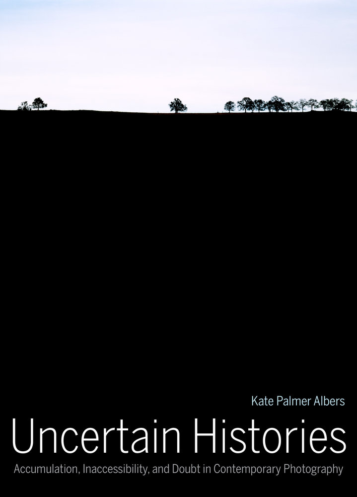

<figure class="profile" style="float:right; margin-left:20px;">
	
	<figcaption style="text-align: center;">
		@katepalbers 
		<a href="https://www.twitter.com/{{ page.twitter }}"><i class="fa fa-twitter" style="vertical-align: middle;"></i></a> | <a href="https://www.medium.com/{{ page.medium }}"><i class="fa fa-medium" style="vertical-align: middle;"></i></a>
	</figcaption>	
</figure>

Kate Palmer Albers is Associate Professor at the [University of Arizona](http://art.arizona.edu/directory/profile?netid=kpalbers), where she teaches history and theory of photography, museum studies, and contemporary art at the graduate and undergraduate level, and has also developed online and hybrid courses. Previously, she worked in the photography departments at the Fogg Art Museum and the Los Angeles County Museum of Art, and taught at Massachusetts College of Art and Boston University, where she earned her PhD in 2008. Her book *Uncertain Histories: Accumulation, Inaccessibility, and Doubt in Contemporary Photography* (University of California Press, 2015) addresses the limits of photography’s ability to narrate the past and argues that doubt and inaccessibility can generate a space for a productive uncertainty that is as culturally valuable as information and clarity. Her recent articles address photography and digital abundance, multi-gigapixel photography, Gerhard Richter’s *Atlas*, and contemporary artists’ archival projects. She has articles and reviews published and forthcoming in *Photographies*, *Afterimage*, *Art History*, *Photography & Culture*, *Environmental History*, *Visual Resources*, and *Exposure*.

Albers’ current work focuses on the intersection of photography, geolocational technology, and landscape, and she is developing new research on photographic communication through social media. She is also interested in the role of digital technologies in art historical research and contemporary practice. She organized the exhibition *Locating Landscape: New Strategies, New Technologies* which looked at the intersection of photography, mapping, technology, and landscape, and appeared at the Sam Lee Gallery in Los Angeles (2009) and the Center for Creative Photography in Tucson, AZ (2010). In 2010 she participated in the NEH Summer Institute Mapping and Art in the Americas at the Newberry Library in Chicago.

### **Books:**

<figure class="figure-sm">
	
	<figcaption>
	
<em>Uncertain Histories: Accumulation, Inaccessibility, and Doubt in Contemporary Photography.</em>

	<ul>
		<li><a href="http://www.ucpress.edu/book.php?isbn=9780520285279">University of California Press</a></li>
		<li><a href="http://www.amazon.com/Uncertain-Histories-Accumulation-Inaccessibility-Contemporary/dp/0520285271">Amazon</a></li>
	</ul>	
	</figcaption>
</figure>

- *Uncertain Histories: Accumulation, Inaccessibility, and Doubt in Contemporary Photography* (University of California Press, 2015).
- *Before-and-After Photography: Histories and Contexts*, co-edited with Jordan Bear, forthcoming Bloomsbury Press (2016).

### **Related Articles and Chapters:**

- “Accessing the Landscape: Photography, Technology and Place Today” in Hans Hedberg, Gunilla Knape, Tyrone Martinsson, and Louise Wolthers, eds., *Broken: Environmental Photography* (Gothenburg, Sweden: Photography at Valand Academy, University of Gothenburg / Hasselblad Foundation and Art and Theory, 2014), 15-33. Projects include Nate Larson & Marni Shindelman, Bruce Myren, and the Degree Confluence Project.
- “Unseen Images: Gigapixel Photography and its Viewers,” *Photographies* special issue on “Surveillance and Place” (published online April 7, 2014; print edition followed)
- “Abundant Images and the Collective Sublime,” *Exposure* 46:2 (Fall 2013), 4-14. Artists include Penelope Umbrico, Gerhard Richter, Erik Kessels, Noah Kalina, Jamie Livingston, Nick Nixon, and Mark Klett & Byron Wolfe.
- “Reading the World Trade Center in Gerhard Richter’s Atlas” *Art History* 35:1 (February 2011), 152-173.
- “It’s Not an Archive”: Christian Boltanksi’s Les Archives de C.B. 1965-1988” *Visual Resources* 27:3 (August 2011), 249-266.
- “Cartographic Postings: GPS, Photography, and Landscape” *Afterimage: The Journal of Media Arts and Cultural Criticism* (March/April 2010). Artists include Andrew Freeman and Frank Gohlke.