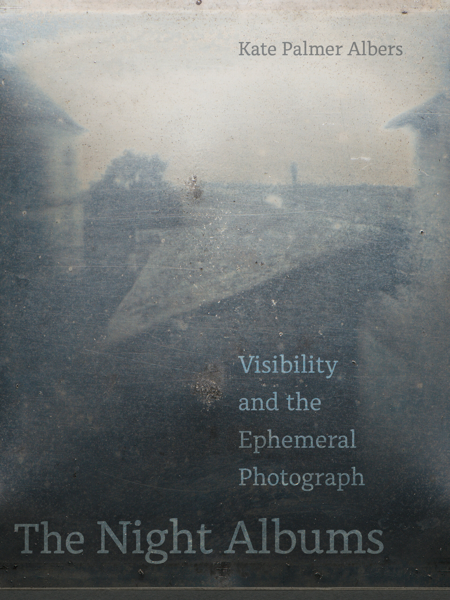
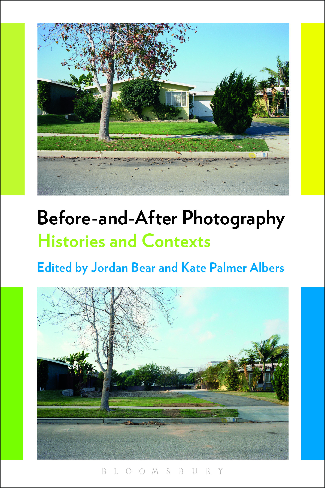

<figure class="figure-profile">
	
	<figcaption>
		<a href="mailto:kpalbers@gmail.com"><i class="fa fa-envelope fa-2x hvr-grow"></i></a> | <a href="https://www.twitter.com/{{ page.twitter }}"><i class="fa fa-twitter fa-2x hvr-grow"></i></a> | <a href="https://www.medium.com/@{{ page.medium }}"><i class="fa fa-medium fa-2x hvr-grow"></i></a>
	</figcaption>
</figure>

Since 2018, I've been Associate Professor of Art History at Whittier College in Los Angeles, where I teach courses on visual culture, new media, contemporary art, and history and theory of photography. Before that, I was on the art history faculty at the University of Arizona for ten years.

My new book is [*The Night Albums: Visibility and the Ephemeral Photograph*](http://circulationexchange.org/articles/Night-Albums.html), published with UC Press in November, 2021. It addresses photographic ephemerality, unseen images, “live” photography, and new forms of latent image—featuring artists’ projects that engage with popular modes of contemporary media technology within a deeply networked culture while also extending back through to the earliest days of the medium. Ultimately, I want to offer a counterpoint to the predominant theoretical modes of understanding the medium and make a case for the experiential value of fleeting images.

I also have an ongoing interest in the roles of narrative, biography, and archive in relation to visual art, particularly around the American writer and curator Nancy Newhall. My current projects include writing a fictional version of *The Night Albums*; a series of essays on "difficult" images that move through different mediums; and research on transgender and non-binary representations in photography.

### **Books:**

<figure class="figure-sm">
	
	<figcaption>
	
<em>The Night Albums: Visibility and the Ephemeral Photograph</em>

	<ul>
		<li><a href="https://www.ucpress.edu/book/9780520381544/the-night-albums">University of California Press</a></li>
		<li><a href="https://www.photoeye.com/bookstore/citation.cfm?catalog=CA082&i=&i2=9780520381544">Photo-Eye</a></li>
		<li><a href="https://www.amazon.com/Night-Albums-Visibility-Ephemeral-Photograph/dp/0520381548">Amazon</a></li>
	</ul>
	</figcaption>
</figure>

<figure class="figure-sm">
	
	<figcaption>
	
<em>Uncertain Histories: Accumulation, Inaccessibility, and Doubt in Contemporary Photography</em>

	<ul>
		<li><a href="http://www.ucpress.edu/book.php?isbn=9780520285279">University of California Press</a></li>
		<li><a href="http://www.photoeye.com/bookstore/citation.cfm?catalog=CA079&i=9780520285279&i2=">Photo-Eye</a></li>
		<li><a href="http://www.amazon.com/Uncertain-Histories-Accumulation-Inaccessibility-Contemporary/dp/0520285271">Amazon</a></li>
	</ul>
	</figcaption>
</figure>

<figure class="figure-sm">
	
	<figcaption>
	
<em>Before-and-After Photography: Histories and Contexts</em>

	<ul>
		<li><a href="https://www.bloomsbury.com/us/before-and-after-photography-9781474253116/">Bloomsbury</a></li>
		<li><a href="https://www.amazon.com/Before-After-Photography-Histories-Contexts/dp/1474253113">Amazon</a></li>
	</ul>
	</figcaption>
</figure>

- *The Night Albums: Visibility and the Ephemeral Photography* (University of California Press, 2021).
- *Uncertain Histories: Accumulation, Inaccessibility, and Doubt in Contemporary Photography* (University of California Press, 2015).
- *Before-and-After Photography: Histories and Contexts*, co-edited with Jordan Bear, (Bloomsbury, 2017).

### **Related Articles and Chapters:**
- "Parafiction and the New Latent Image", chapter in [*Ubiquity: Photography's Multitudes*](https://lup.be/products/130787), eds. Kyle Parry and Jacob Lewis (Leuven: Leuven University Press, 2021)
- “Ephemerality”, chapter in [*A Concise Companion to Visual Culture*](https://www.wiley.com/en-us/A+Concise+Companion+to+Visual+Culture-p-9781119415404) (Wiley-Blackwell, 2020), eds. Joan Saab, Catherine Zuromskis and Aubrey Anable. Addresses the work of Cassils and astronaut.io.
- “Hiding in Plain Sight: Mistakes, Mishaps, and Possibility in Algorithmic Vision”, *Fotografija* special issue: **New Tools in Photography: from Google to the Algorithm** (2018). Edited by Paul Paper. Artists include Jenny Odell, Aaron Hegert, Zachary Norman, Thomas Albdorf, and Indré Šerpytytė.
- “Schematic Traces: Systems of Making”, chapter in [*Constructed: The Contemporary History of the Constructed Image in Photography Since 1990*](https://www.taylorfrancis.com/books/e/9781317299110), eds. Marni Shindelman and Anne Massoni (Routledge, 2018). Addresses the work of Ed Ruscha, James Bridle, Mishka Henner, Taryn Simon & Aaron Swartz, Dina Kelberman, Hasan Elahi, Miranda July & Paul Ford, and The Hereafter Institute.
- “Default Delete: Photographic Archives in a Digital Age”, chapter in [*Photography & Failure*](https://www.bloomsbury.com/us/photography-and-failure-9781474293402/), Kris Belden-Adams, ed. (Bloomsbury, 2016)
- “Accessing the Landscape: Photography, Technology and Place Today” in Hans Hedberg, Gunilla Knape, Tyrone Martinsson, and Louise Wolthers, eds., [*Broken: Environmental Photography*](https://www.photoeye.com/bookstore/citation.cfm?catalog=IB531&i=&i2=9789198087468) (Gothenburg, Sweden: Photography at Valand Academy, University of Gothenburg / Hasselblad Foundation and Art and Theory, 2014), 15-33. Projects include Nate Larson & Marni Shindelman, Bruce Myren, and the Degree Confluence Project.
- [“Unseen Images: Gigapixel Photography and its Viewers,”](http://circulationexchange.org/assets/pdfs/Albers_Unseen_Images_2014.pdf) *Photographies* special issue on “Surveillance and Place” (published online April 7, 2014; print edition followed)
- [“Abundant Images and the Collective Sublime,”](http://circulationexchange.org/assets/pdfs/Albers_Abundant_Images_2013_compressed.pdf) *Exposure* 46:2 (Fall 2013), 4-14. Artists include Penelope Umbrico, Gerhard Richter, Erik Kessels, Noah Kalina, Jamie Livingston, Nick Nixon, and Mark Klett & Byron Wolfe.
- [“It’s Not an Archive”: Christian Boltanksi’s Les Archives de C.B. 1965-1988”](http://circulationexchange.org/assets/pdfs/Albers_Boltanski_2011.pdf) *Visual Resources* 27:3 (August 2011), 249-266.
- [“Cartographic Postings: GPS, Photography, and Landscape”](http://circulationexchange.org/assets/pdfs/Albers_CartographicPostings.pdf) *Afterimage: The Journal of Media Arts and Cultural Criticism* (March/April 2010). Artists include Andrew Freeman and Frank Gohlke.

---

**[Full CV](http://circulationexchange.org/assets/pdfs/Albers_CV_2022.pdf)**  (updated July 2022)

